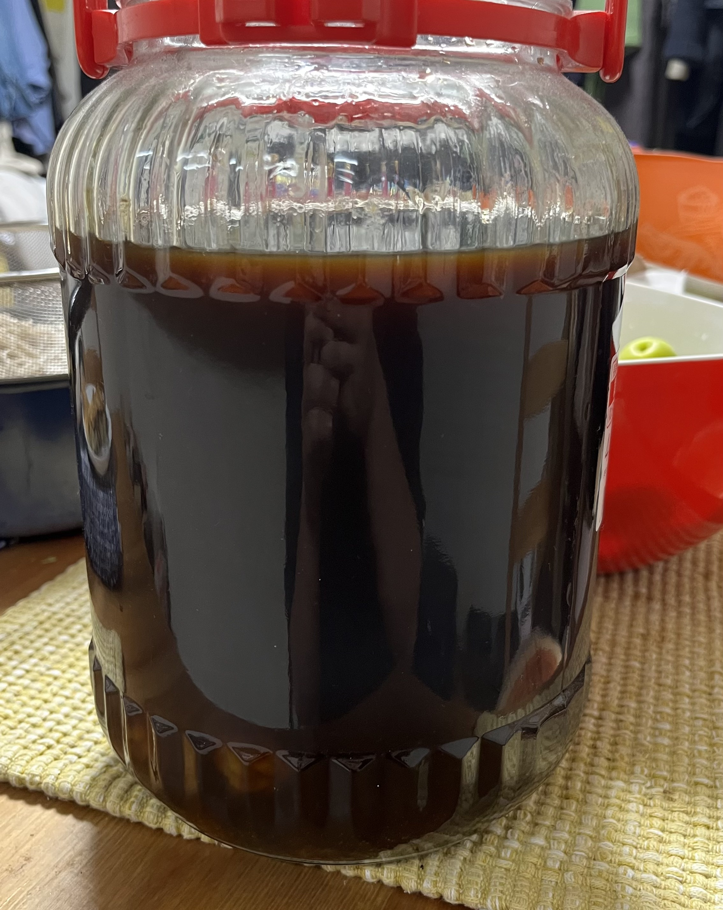
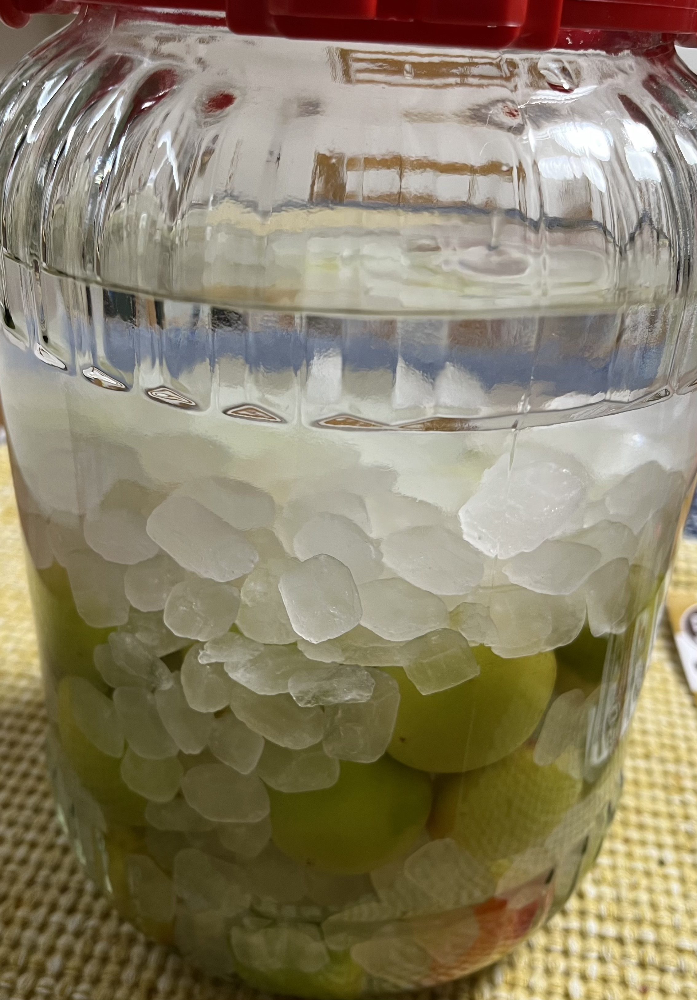

皆さん、6月です。6月と言えば、そう、梅の季節ですね。今年もあちこちで梅が売られており、例に漏れず買ってきて梅酒を漬けました。
今年はちょっと面倒な気持ちになったので、梅シロップは作らない予定です。

[昨年の梅酒](/ume-2022)はこんな感じです。昨年は黒糖を使って漬けたため、色がすごいことになっています。味見をしたところ、もう少し熟成感というか、まろやかになるといいな、という感じでした。

今年は見てのとおり透明です。ここ数年は日本酒を使ったり、泡盛を使ったり、黒糖を使ったりと変わり種の梅酒を漬け続けていましたので、今年はホワイトリカー、氷砂糖という至って普通のレシピで作りました。

また来年お会いしましょう
