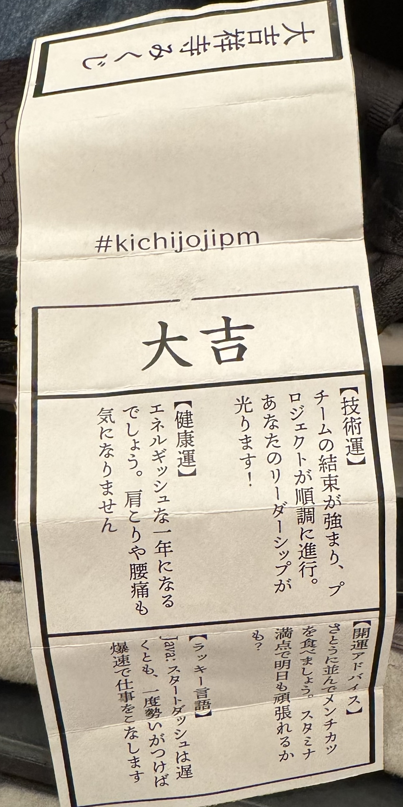
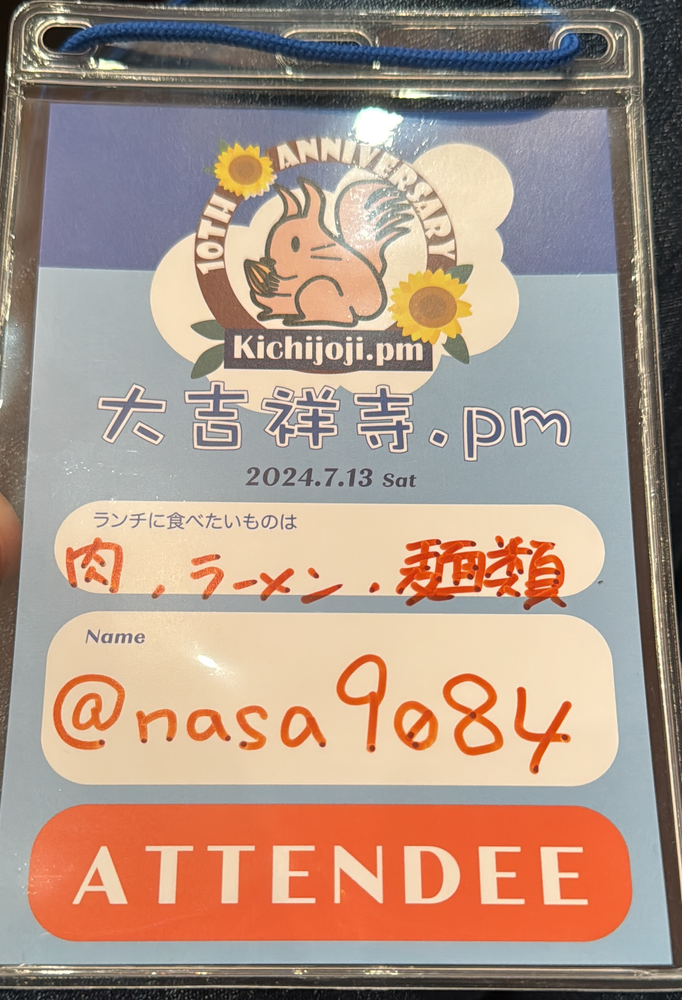
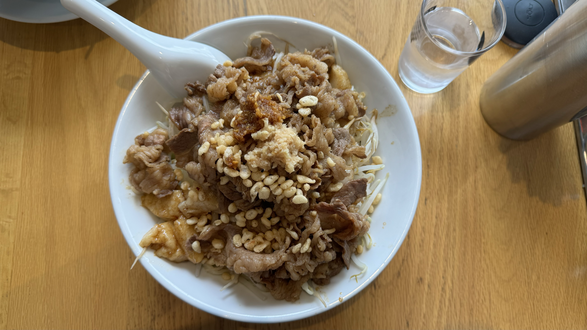
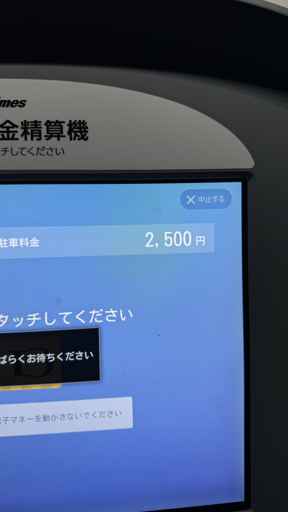

東京都は吉祥寺で開催されているイベント、吉祥寺.pmの10周年記念イベントとして[大吉祥寺.pm](https://kichijojipm.connpass.com/event/314917/)が2024年7月13日に開催されたので、参加してきました。
参加者がたくさんいることももちろんそうですが、10周年というのは本当にすごいですね。

受付をしたら名札とおみくじをもらいました。

ランチに食べたいものを書いておくことで、スタッフの方でよしなにグルーピングをしてくれるそうでした。こういうイベントではなんだかんだ知り合いと話をしてしまいがちなので、新しいコミュニケーションが促進される企画は大変良いモノですね。

全体の内容としては、テーマが「いままでと、これから」ということもあってか、技術をゴリゴリというよりはコミュニケーションやキャリア、歴史といったモノが中心でした。
トークとしては一定のコンテキストで、という感じではあったものの、より広く適用できそうと言うか、上手にコミュニケーションをしていくのが大切ですね、という内容で納得感のあるものでした。

昼ご飯は和牛油そばという奴を食べたんですが、すごく味が濃くて多かったです:

私が現在住んでいる埼玉県朝霞市から吉祥寺は電車だといったん新宿まで出て(右下のほう)、その後吉祥寺に向かう(左)というルートを取る必要があり面倒だったので車で行ったのですが、車だと結構近いですね。
駐車場は多少高いようにも思えますが、上限のある駐車場が結構たくさんあるので、駐める場所にも困りませんでした。
朝から一日大吉祥寺.pmに参加し、懇親会に出て、二次会で深夜まで駐めていても2,500円ということで、終電を気にしたり、暑い中乗り換えをしたり・・・ということを考えれば全然安いかな、と思いました。

というわけで改めて、10年続いているイベントはすごい！
