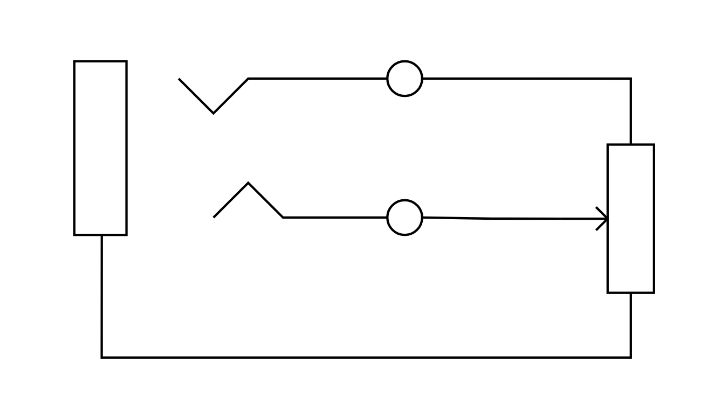
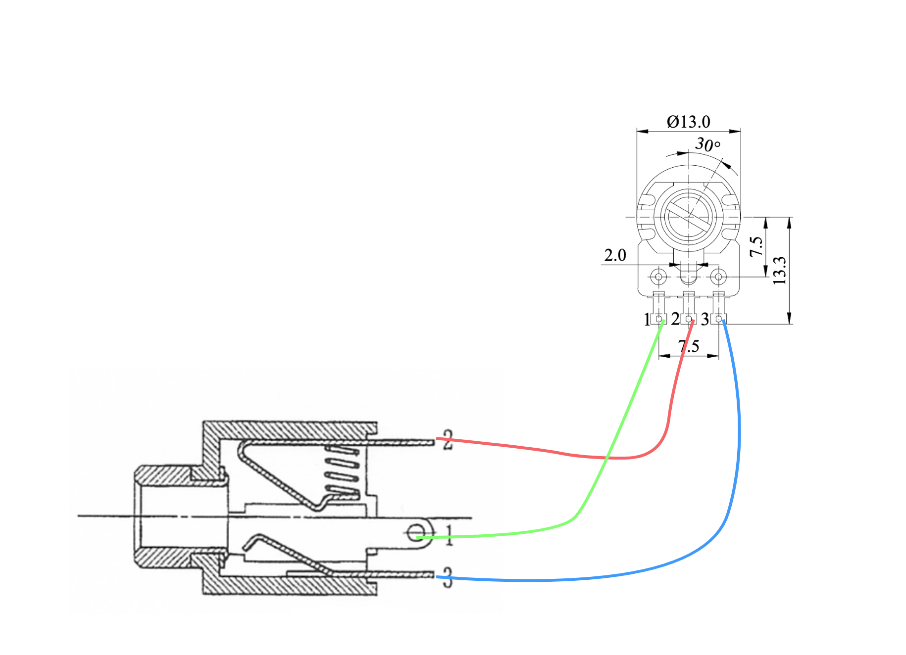

エクスプレッションペダル、というものがありますね。ギター用のエフェクターやその他電子楽器等のボリュームやらパラメータやらを足で操作するためのペダルですが、その中身は非常に単純です。とはいえペダルとして作るには上手く駆動部分を作る必要があって簡単にはいかないのと、足で操作せずとも、マルチエフェクターのフットボリューム機能を使えるとエフェクトループの任意の場所でボリュームを調整できると便利ということがあり、より単純な形として「エクスプレッションノブ」を作成したので記録しておきます。

使った材料は次の通り:
- [可変抵抗/ボリューム (10kΩ/Bカーブ)](https://akizukidenshi.com/catalog/g/g115219/)
- [ボリューム用ツマミ](https://akizukidenshi.com/catalog/g/g100253/)
- [3.5mmステレオミニジャック](https://akizukidenshi.com/catalog/g/g113305/)
- [プラスチックケース (30mm x 40mm x 20mm)](https://akizukidenshi.com/catalog/g/g117121/)

秋月電子で揃えれば260円+送料程度で済みます。後で紹介する既製品だと安くても4,000円程度はしますから激安ですね。

操作対象のエフェクターは[BOSS GT-1000CORE](https://www.boss.info/jp/products/gt-1000core/)です。聞いたところによるとHX STOMPとかはエクスプレッションペダルの仕様が違うようなので注意。

ボリュームは10kΩBのモノであれば多少サイズが違ったりスライドボリュームだったりしても大丈夫なはずですが、端子の仕様が違ったり(多分大体同じですが・・・)、対応しているツマミが違ったりすると思いますので、適宜調整してください。ツマミはお好みのモノを選んでください。

今回は気分で3.5mmのミニジャックを使用しましたが、これもステレオであれば任意のジャックで良いはずです。エフェクター側は基本的に6.3mmの標準プラグだと思うので、6.3mmのジャックだとケーブルが手に入りやすくて便利かも知れません。今回は隙間に突っ込みたかったので小さい端子を選びました。どうせパッチケーブルは自分で作りますし。

ケースも任意のモノで問題ないでしょう。サイズが良い感じだったのと、コントロール信号が通るだけなら良いか、ということで今回はプラスチックケースにしました。

回路図は次の通り:

実体配線図としてはこんな感じ:

その辺にあった適当なケーブルで配線をして、適当にケースに穴をあけ、パーツを組み込んで完成です。穴は適当な細いドリルで下穴を開けた後にステップドリルなどを使ってちょうど良い大きさになるまで穴を拡張するときれいに空けることができます。プラケースなら電動ドリルを買わなくても、手で十分空けることができます。

あとは手頃なステレオケーブル(ヘッドホン用とかがその辺に転がっていますね？ソレを使ってテストをしましょう)でエフェクターと接続して、動作確認をすれば良いでしょう。

まだエフェクターボードには組み込んでいませんが、便利に活躍してくれることを祈っています。

なお、作るのは面倒だけどほしい！という人は既製品も販売されているようです:
- [El Garatge](https://lep-international.jp/products/el-garatge-expression-knob) (5,573円)
- [LAGOON SOUND](https://lagoonsound.com/expv-p/) (3,800円)
- [electro-harmonix](https://www.soundhouse.co.jp/products/detail/item/335349/) (コンパクトエフェクタータイプ 7,680円)
- [Old Blood Noise Endeavors](https://www.soundhouse.co.jp/products/detail/item/279762/) (スライダータイプ 8,250円)

以上です。
