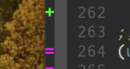
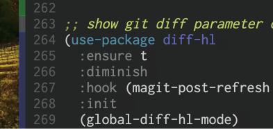
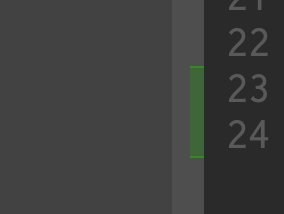

これまで、emacs上で行ごとの変更状況を表示するのに、[git-gutter.el](https://github.com/emacsorphanage/git-gutter)を使用してきました。[約4年前](https://github.com/nasa9084/dotfiles/commit/5aa3c33a095a40e80332607f1f84a71e15761623)から使用しており、今現在でも問題なく動いているため特に不満はなかったのですが、emacs-jpで[diff-hl](https://github.com/dgutov/diff-hl)の話を聞き、見た目が良いな、と思ったのでdiff-hlに移行しました。

git-gutterの見た目:


diff-hlの見た目:


fringeを使用するようになったことでフレームが少しスッキリしました。

問題が一点だけあって、私は普段macOS上で[emacs-mac](https://bitbucket.org/mituharu/emacs-mac)を使用しているのですが、frameを複数に分割したとき、一番左のwindowでは問題なく表示されたのですが、右側のwindowでは縦フチが表示されませんでした。



emacsを起動した後に手動で`(fringe-mode '(9 . 8))`などとしてfringeの幅を広げると上手く表示される一方、`default-frame-alist`に広げた幅を入れても何故か上手く表示がされない状態で起動してきたため、diff-hl-modeを有効化した後に幅を広げないと上手く調整がきかないのか、と思ったので、次のように`diff-hl-mode`を呼び出して`set-frame-parameter`する形で解消しました:

``` emacs-lisp
;; show git diff parameter on fringe
(use-package diff-hl
  :ensure t
  :diminish
  :hook (magit-post-refresh . diff-hl-magit-post-refresh)
  :init
  (global-diff-hl-mode)
  ;; somehow the left line is not drawn well without setting left-fringe
  ;; parameter after diff-hl-mode is enabled
  (diff-hl-mode)
  (set-frame-parameter nil 'left-fringe 9)
  (diff-hl-flydiff-mode))
```

正直イマイチ感がすごいので、良い解決方法をご存じの方がいたら教えてください。
