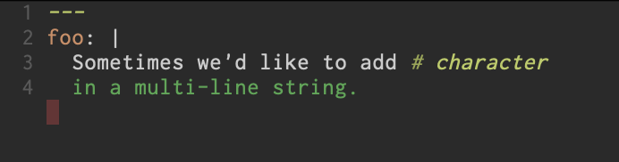
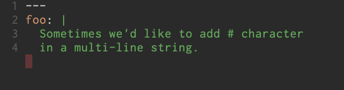

近年、テキストエディタ/IDEの機能はますます複雑となり、プログラミング言語の数は増え、その組み合わせは膨大なものとなっています。元来テキストエディタはそれぞれがそれぞれの実装でそれらの組み合わせを実現してきましたが、自動補完、定義ジャンプ、ドキュメントの表示など、概ねその基本的な機能は同じであるにもかかわらず、すべてのエディタ開発者はそれぞれが車輪の再発明を行う必要があったのです。その問題を解決するために設計開発されたのがLanguage Server Protocol(LSP)であり、ここ数年で多くのテキストエディタが採用したことにより名前くらいは知っているという人も多いのではないでしょうか。

[Tree-sitter](https://tree-sitter.github.io/tree-sitter/)はある意味でLSPあるいはLanguage Serverと呼ばれるものに似ています。Tree-sitterは、プログラミング言語の文法から構文解析器を自動生成するパーサージェネレーターツールであり、またそれを使用した構文解析ライブラリです。

Tree-sitterは任意の言語を解析できる汎用的なツールで、動作が速く、依存が少ないツールです。2018年にGitHubからリリースされ、emacs 29.1ではbuilt-inの機能として使えるようになりました。

## Emacs x Tree-sitterの仕組みと導入

emacsでTree-sitterを使うには、2つの条件があります:

* 使用したい言語のパーサーが実装されている
* Tree-sitterに対応したmajor modeが実装されている

### 使用したい言語のパーサーが実装されている

当然のことながら、Tree-sitter用に文法が定義されている必要があります。使用したい言語のパーサーが既に誰かによって実装されているかは、[available-parsers](https://tree-sitter.github.io/tree-sitter/#available-parsers)のリストを参照すると良いでしょう。概ね、メジャーどころの言語は実装されておりほとんどの場合困ることはないと思います。各言語の文法定義(grammar)はJavaScriptで定義し、tree-sitter CLIを使用してC言語のソースコードに変換し、最終的にはそれをコンパイルして使用します。

emacsの場合、`~/.emacs.d/tree-sitter/`ディレクトリにコンパイルされたダイナミックリンクライブラリを置くことで読み込むことができます。予めコンパイルされたものを置く、でも良いのですが、`treesit-install-language-grammar`を使用すると文法をダウンロードしてきて配置してくれるため簡単です。`treesit-install-language-grammar`を使用するには、まず`treesit-language-source-alist`に言語とgitリポジトリのペアを定義します。その後`treesit-install-language-grammar`に言語を渡すことでgit cloneからコンパイル、配置まで行ってくれます。

例えば、YAML用の文法を導入するには次の様に定義します:

``` emacs-lisp
(setq treesit-language-source-alist
  '((yaml "https://github.com/ikatyang/tree-sitter-yaml")))
```

そして、`(treesit-install-language-grammar yaml)`(もちろんM-xでやっても良いと思います)とするとYAML用の文法がインストールされます。私はこの手のものはemacsの起動時に自動で導入されてほしいので、次の様にしました:

``` emacs-lisp
(setq treesit-language-source-alist
  '((yaml "https://github.com/ikatyang/tree-sitter-yaml")))

(dolist (element treesit-language-source-alist)
  (let* ((lang (car element)))
    (if (treesit-language-available-p lang)
        (message "tree-sistter: %s is already installed" lang)
      (message "tree-sitter: %s is not installed" lang)
      (treesit-install-language-grammar lang))))
```

### Tree-sitterに対応したmajor modeが実装されている

emacsでTree-sitterを使用したい場合、残念ながら、LSPを使用するときのように、単純にパッケージを追加すればすべての言語でよしなに動く・・・という風にはなりません。emacsでは今までのところ、major modeがシンタックスハイライトを提供するためには主に正規表現などが使用されてきました。正規表現を利用したシンタックスハイライトと、Tree-sitterを使用したシンタックスハイライトは大きく違うため、ほとんどのmajor modeではそのままTree-sitterを採用する形にはならず、Tree-sitter専用のmajor modeが提供される形になっています。emacs29ではメジャーどころの言語に対するTree-sitter対応モードが[提供されています](https://github.com/emacs-mirror/emacs/blob/master/etc/NEWS.29#L3016-L3089)。

手動でこれらのモードを拡張子ごとに設定しても良いのですが、`major-mode-remap-alist`を設定することで、従来のmajor modeをそのままTree-sitter対応のモードに切り替えることができます。

例えば、yaml-modeの代わりにyaml-ts-modeを使用する場合次の様に設定します:

``` emacs-lisp
(add-to-list 'major-mode-remap-alist '(yaml-mode . yaml-ts-mode))

;; or

(setq major-mode-remap-alist
  '((yaml-mode . yaml-ts-mode)))
```

この設定によって、yaml-modeでバッファが開かれる場面ではすべてyaml-ts-modeが使用されるようになります。今のところ、hookなどの設定は移行されないため、これらは個別に設定を移行する必要があります。

Tree-sitterは正規表現に比べ、より正確に言語を解析し、正しい構文木を提供してくれるため、ハイライトもより正確になります。YAMLの場合、次の様な構造で正確ではないハイライトがされていました:

``` yaml
---
foo: |
  Sometimes we'd like to add # character
  in a multi-line string.
```

`foo`の値は`|` indicatorにより複数行文字列として取り扱われます。通常使用するyaml-modeでは次の様に表示されます:



私が使用しているテーマでは緑が文字列のハズですが、`foo`の後ろの`|`や一行目が白くなってしまい、さらには途中の`#`がコメントとして解釈されたためにコメントを示す黄色に変わってしまっています。シンタックスハイライトは、どこの部分がどう解釈されるのか視覚的にパッと分からないとあまり意味がありませんから、これでは困ってしまうわけです。

ここで代わりにyaml-ts-modeを使用すると次の様に表示されます:



想定通り、`foo`の値の部分がすべて緑色の文字列として表示されていますね。めでたしめでたし。

こうしてYAMLファイルの表示にTree-sitterを使用することができるようになりました。

