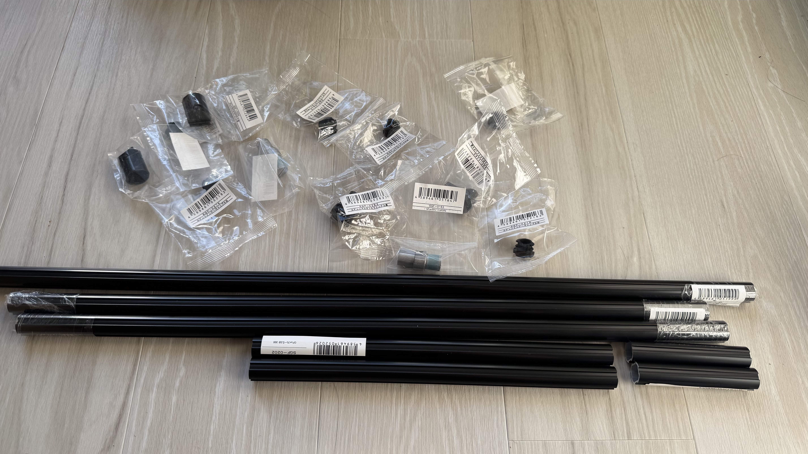
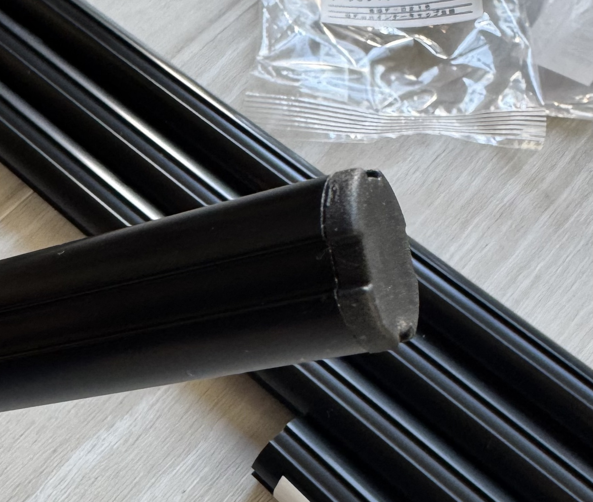
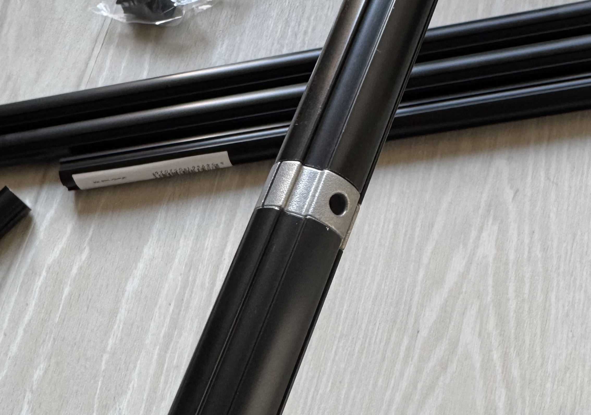
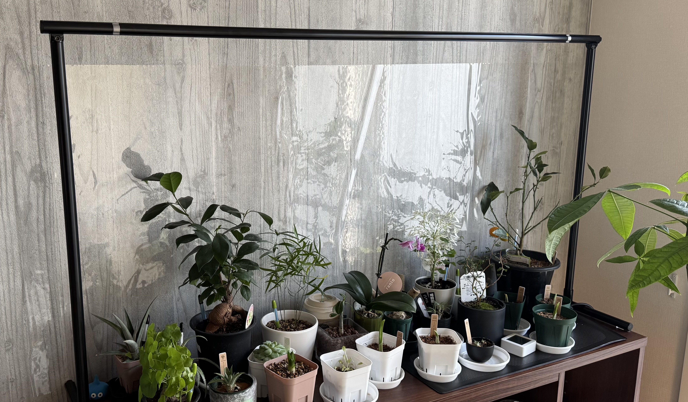
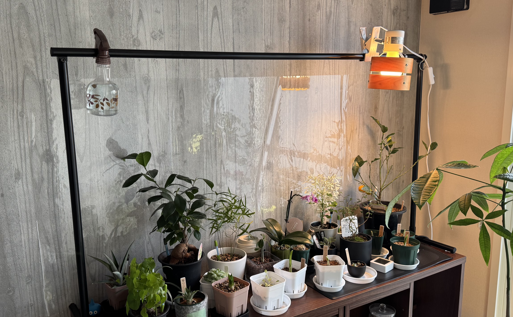

最近園芸にハマっておりまして、鉢植えを本棚の上に置いているのですが、部屋の向きや、季節の都合で日当たりがあまり良くなく、ライトを設置したくなってきました。しかし、本棚の周りにはライトを設置できるような突起物はなく、賃貸であるため壁に穴を空けるのも避けたいところです。ならばスタンドを、というところですが、手頃な値段のモノはサイズが微妙であったり、あるいはオーダーメイドだとサイズはぴったりだけど高い、ということで、手頃な値段でぴったりのモノを手に入れたい、という意志の元、DIYでライトスタンドを作ることにしました。

材料はこちら:

* [フレームS B 1000mm](https://g-fun.jp/products/detail.php?item=SGF-0199)
* [フレーム S B 600mm](https://g-fun.jp/products/detail.php?item=SGF-0200) x2
* [フレーム S B 300mm](https://g-fun.jp/products/detail.php?item=SGF-0202) x2
* [フレーム S B 100mm](https://g-fun.jp/products/detail.php?item=SGF-0203) x2
* [マルチコネクタインナーS B](https://g-fun.jp/products/detail.php?item=SGF-0263) x2
* [マルチコネクタアウターS B](https://g-fun.jp/products/detail.php?item=SGF-0264) x2
* [インナーキャップS B](https://g-fun.jp/products/detail.php?item=SGF-0216) x 6
* [ストレートコネクタインナーS](https://g-fun.jp/products/detail.php?item=SGF-0163) x2

[G-Fun](https://g-fun.jp/)という、アルミフレームの一種で、中空のアルミの棒をコネクタで繋ぐことでいろいろなモノを作れます、という商品です。簡単に組み立てられて、剛性もある、ということで何かと便利な奴です。強度データもすべて揃っており、すべり、引き抜き、モーメントなど、どれくらい耐えられるのかも分かるため、安心して荷重のかかるものを作ることもできます。

今回必要な工具は3mmと4mmのレンチとゴムハンマーです。

今回は何十キロもあるものを乗せる訳ではないため、見た目優先で一番細いSシリーズを選択しました。

本棚の天板サイズが幅1200mm、奥行き339mmなので、1000mm + ストレートコネクタ + 100mm + ストレートコネクタ + 100mmで概ね1200mmということにしました。将来組み替えたり、パーツを他のものに使い回したりする可能性を考慮して、ホームセンターでシュッと買える既製品で組める様にしましたが、よりぴったりサイズのものを作りたい人はG-Funオンラインストアでは切断してもらうこともできますし、専用カッターも販売されています。足は奥行きに合わせた長さ、高さは手元の植物にあわせて600mmとしました。高さは後で変更するかも。

端が露出する部分はキャップをつけて・・・(ここでゴムハンマーを使う)

一番長い棒と短い棒を繋いで・・・(ここで3mmのレンチを使う)

良い感じに組み立てて・・・完成！

あまりにもぴったりすぎて、ちょっとずれただけで足が落ちてしまいそうなので、家にあった[鬼ピタ](https://amzn.to/3Z917Rt)を小さく切って固定しました。ガッチリ張り付いて、かつ剥がしたいときにはきれいに剥がせるので一本持っておくのがオススメです。何かと便利。

実際に電気をつけた様子がこちら:

良い感じですね。Amazonでライティングレールやら何やらを買ったので、後でつけようと思っています。
