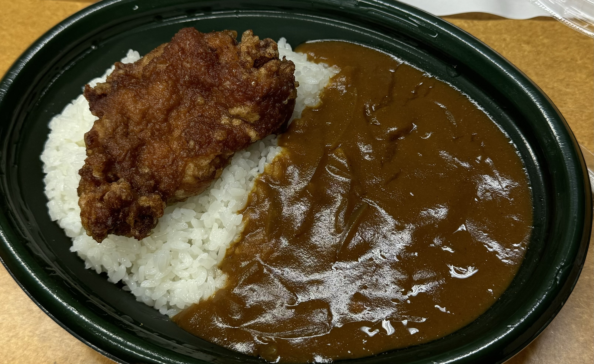
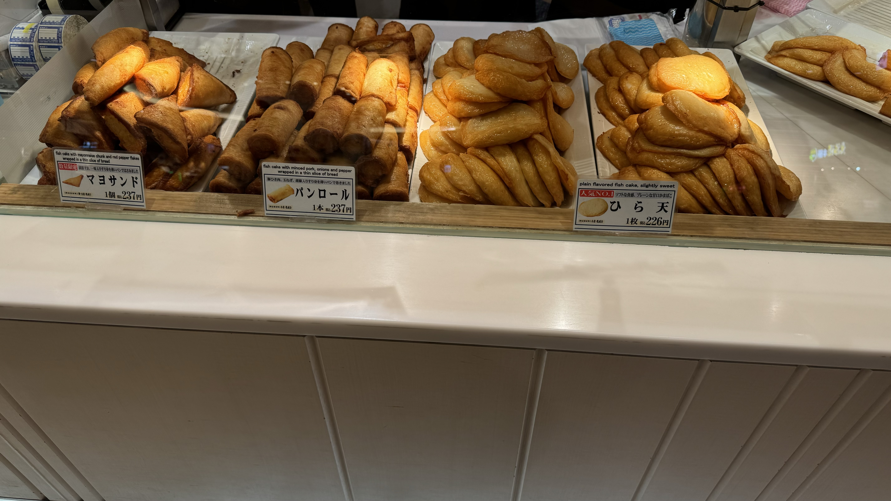

2024年6月29日に開催された[Open Source Conference 2024 Hokkaido](https://event.ospn.jp/osc2024-do/)に行ってきました。

例年参加しているので概ねいつも通り、という感じではあるので一応レポートを残しておきます。

今回は諸諸の都合により前日の日中に札幌入りして、土曜日は本祭、日曜日の昼の便で帰るという弾丸ツアーでした。

金曜日の夜は関係者前夜祭で石鍋亭へ。変わらず美味しいですね

石鍋亭へ向かう途中見てしまったダイコクドラッグの閉店のお知らせ。札幌駅は工事の関係もあってどんどんいろんな店が閉店していてさみしいですね。

当日のブースの様子はこんな感じです。一応Kubernetes SIG Docs Japanese Localization teamとしての参加ということにしてありましたのでスライドを流すなどしていましたが、冷房直撃でちょっと寒かったので、あまりここには座っておらず、その辺をふらふらしていました。
ステッカーの類くらいは作っても良かったかな、と(毎年)思っています。

昼ご飯は特に決めていなかったのでカレーカンファレンスに。

道警さんのブースで投資詐欺に注意！というチラシも配っていました

最後は新千歳空港でかま栄のかまぼこを買って帰りました。本当は大丸で買いたいんだけど、今回は時間が無かったので。。。札幌、あるいは小樽にに行く人は是非買って下さい。

