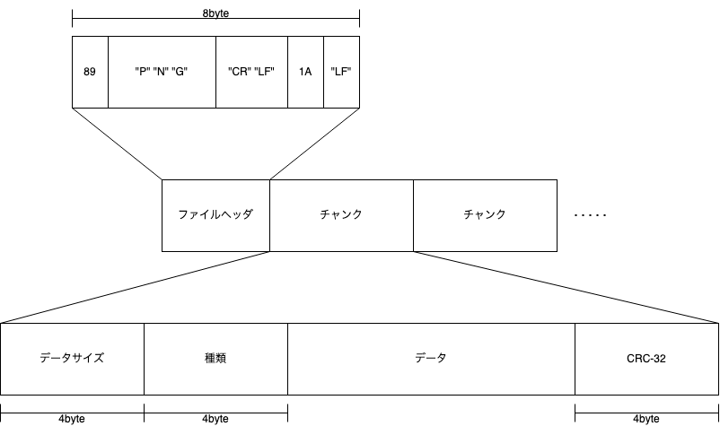

このブログは現在、[Hugo](https://gohugo.io)という静的サイトジェネレータを使用してページを生成しているのですが、このHugoには多くの便利機能があり、そのうちの一つが[Image processing](https://gohugo.io/content-management/image-processing)です。

テンプレートの中で、ほんの数行のコードを書くだけで、画像のサイズを調整したり、切り抜いたり、あるいはぼかしたりすることもできます。これまでのところ、このブログでは画像のサイズは結構適当で、場合によっては表示の幅が変わってしまって見栄えが良くないということが(たまに)ありました。

そこで今回、HugoのImage processing機能のうち、Resizeを使用して、実際にサイトが表示されるときの画像を良い感じにしようと思ったのですが、サイト全体の画像描画部分にhookをかけたところ、エラーが出てビルドができなくなってしまいました。エラーメッセージの大半はファイルパスで、今回は本筋ではない上に長いので端折るとして、重要そうなところを抜き出すと次の様な感じ:

```text
execute of template failed at <$image.Resize>: error calling Resize: 
: resize : png: invalid format: invalid checksum
```

要するに、Resizeしようとしたときに、checksumが合わないので対象のpng画像ファイルがおかしい、ということらしいんですよね。しかしこれまでこのブログを更新してきて、(パスとかが間違っていない場合に)画像が表示されなくて困ったこともないし、そもそもpngファイルにchecksumがあるなんてことも知らないし・・・

[golang/go#43382](https://github.com/golang/go/issues/43382)での会話を見たところによるとどうやら、pngファイルには「チャンク」と呼ばれるモノが存在して、これが無視できることも多い(特に実際に表示する時には不要なモノが多い)けれど、Goのimage/pngは今のところはそれらを無視せず、エラーを吐くことになっている、ということらしい。

エラーの対象となったファイルを、issueの説明に書かれているようにpngcheckにかけてみると次のようにCRCエラーがあることが分かりました:

``` console
$ pngcheck -v arch-1.png
File: arch-1.png (272304 bytes)
  chunk IHDR at offset 0x0000c, length 13
    1082 x 778 image, 32-bit RGB+alpha, non-interlaced
  chunk zTXt at offset 0x00025, length 188903, keyword: mxGraphModel
  CRC error in chunk zTXt (computed c3f0b5f1, expected 1ce878d9)
ERRORS DETECTED in arch-1.png
```

なるほど、zTXtというチャンクがあって、そこのCRCが間違っている、ということらしいですね。キーワードはmxGraphModelということで、分からないけど多分グラフに関連したモノが入っているのでしょう。確かにこのファイルはdraw.ioで書き出したもので、書き出しの時に編集情報のようなものを埋め込むオプションを有効にした気がするので、それがどこかのタイミングで壊れ、今回のエラーにつながった、という流れの様です。

ここで何らかの方法で画像ファイルを修正して(他の方法で一旦違うフォーマットに変換してもう一回pngに変換し直す、とか、illustratorで読み込んで書き出しし直す、とか？)めでたしめでたしとしても良いのだけれども、せっかくなのでpngファイルがどんな構造をしているのか、もう少しだけ深掘りをしていきたいとそう思った次第です。

## PNGファイルの構造



PNGファイルはまず8byteのファイルヘッダとしてマジックナンバーを持ち、その後、任意の数の「チャンク」と呼ばれる塊が並ぶ、という形になっています。

各チャンクはそれぞれ情報を保持していて、必須チャンクと補助チャンクに分けられます。チャンクは最初に8byteのチャンク自体に関する情報をもち、その後実データと、データのCRC-32 checksumがある、という形です。今回のエラーはこのチェックサムが間違っていた、ということですね。

チャンクの種類は4文字のアルファベットで表現され、それぞれの文字が大文字か小文字かで更に情報を表現します。

* 1文字目は必須チャンクか補助チャンクかを表現する: 大文字ならば必須、小文字ならば補助
* 2文字目はチャンクの仕様が公開されているかどうかを表現する: 大文字ならば仕様が公開・定義されているもの
* 3文字目は現在のところ必ず大文字:将来機能拡張をするために使われるかもしれない
* 4文字目はそのチャンクがそのままコピーできるかどうかを表す: 小文字の場合はファイルを変更してもそのままコピーできる

チャンクの種類には例えば次の様なモノがある:

* 必須
  * `IHDR`: 画像のサイズや圧縮形式などのメタデータ
  * `IDAT`: zlibで圧縮された実際の画像データ
  * `IEND`: PNGデータの終端を表す
* 補助
  * `eXIf`: Exifメタデータ
  * `iCCP`: ICCカラープロファイル
  * `iTXt`: UTF-8のテキスト
  * `tEXt`: Latin-1のテキスト
  * `tIME`: 画像の最終更新日時
  * `zTXt`: Latin-1の圧縮テキスト

また、必須チャンクの内`IHDR`はヘッダの直後に、`IEND`はファイルの終端に配置されます。

例えば、次の様なコードを書くと、上記で示した「PNGファイルの構造」の画像ファイルは最初にIHDR、IDATが3つあり、最後にIENDで終わっているという構造が見て取れます:

``` go
package main

import (
	"encoding/binary"
	"flag"
	"fmt"
	"os"
)

func main() {
	filename := flag.String("f", "", "filename")
	flag.Parse()

	f, err := os.Open(*filename)
	if err != nil {
		panic(err)
	}
	defer f.Close()

	f.Seek(8, 1)

	ihdr := make([]byte, 25)
	f.Read(ihdr)

	fmt.Printf("typ: %s\n", ihdr[4:9])

	for {
		chunkSize := make([]byte, 4)
		f.Read(chunkSize)

		chunkType := make([]byte, 4)
		f.Read(chunkType)

		fmt.Printf("typ: %s\n", chunkType)
		if string(chunkType) == "IEND" {
			break
		}

		// chunk data
		f.Seek(int64(binary.BigEndian.Uint32(chunkSize)), 1)
		// checksum
		f.Seek(4, 1)
	}
}
```

実行結果:

```console
$ go run main.go -f png_diagram.png
typ: IHDR
typ: IDAT
typ: IDAT
typ: IDAT
typ: IEND
```

実際にchecksumを計算してみましょう。先ほど`f.Seek`を使用してスキップしていたchunk dataとchecksumの部分を次のコード片で置き換えてみます:

``` go
// chunk data
chunkData := make([]byte, binary.BigEndian.Uint32(chunkSize))
f.Read(chunkData)

// checksum
chunkChecksum := make([]byte, 4)
f.Read(chunkChecksum)

checksum := crc32.ChecksumIEEE(append(chunkType, chunkData...))
if chunkChecksum := binary.BigEndian.Uint32(chunkChecksum); chunkChecksum == checksum {
	fmt.Println("valid")
} else {
	fmt.Printf("invalid: %d != %d\n", chunkChecksum, checksum)
}
```

出力は次の様になります:

```console
$ go run main.go -f png_diagram.png
typ: IHDR
typ: IDAT
valid
typ: IDAT
valid
typ: IDAT
valid
typ: IEND
```

この画像は「正しい」ようですね。では、問題のファイルを同様に読み込んでみます:

``` console
$ go run main.go -f arch-1.png     
typ: IHDR
typ: zTXt
invalid: 484997337 != 3287332337
typ: IDAT
valid
typ: IDAT
valid
typ: IDAT
valid
typ: IDAT
valid
typ: IDAT
valid
typ: IDAT
valid
typ: IDAT
valid
typ: IDAT
valid
typ: IDAT
valid
typ: IDAT
valid
typ: IDAT
valid
typ: IEND
```

`IHDR`の後にある`zTXt`がinvalidである、ということでpngcheckの結果と同様の結果を得ることができました。

## 画像の修正

もしかしたらHugoにも`zTXt`のCRC checkを迂回する方法などがあるかもしれませんが、今回は`zTXt`チャンク以外はchecksumがそのままコピーできるチャンクしかないですし、`zTXt`チャンクの中身は(多分)draw.ioのダイアグラムデータだと思いますので、思い切って`zTXt`チャンクをそのまま取り除くことにします。

さっきのスクリプトをちょっと修正して、`zTXt`チャンク以外を一旦`bytes.Buffer`にためてから別のファイルに書き出す、という形にしてみましょう:

``` go
package main

import (
	"bytes"
	"encoding/binary"
	"flag"
	"fmt"
	"io"
	"os"
)

func main() {
	filename := flag.String("f", "", "filename")
	output := flag.String("o", "", "output")
	flag.Parse()

	f, err := os.Open(*filename)
	if err != nil {
		panic(err)
	}
	defer f.Close()

	var buf bytes.Buffer
	io.CopyN(&buf, f, 33)

	for {
		chunkSize := make([]byte, 4)
		f.Read(chunkSize)

		chunkType := make([]byte, 4)
		f.Read(chunkType)

		// chunk data
		chunkData := make([]byte, binary.BigEndian.Uint32(chunkSize))
		f.Read(chunkData)

		// checksum
		chunkChecksum := make([]byte, 4)
		f.Read(chunkChecksum)

		if string(chunkType) != "zTXt" {
			buf.Write(chunkSize)
			buf.Write(chunkType)
			buf.Write(chunkData)
			buf.Write(chunkChecksum)
		}

		if string(chunkType) == "IEND" {
			break
		}
	}

	o, err := os.OpenFile(*output, os.O_WRONLY|os.O_CREATE|os.O_TRUNC, 0644)
	if err != nil {
		panic(err)
	}
	defer o.Close()

	buf.WriteTo(o)
}
```

実行して:

```console
$ go run main.go -f arch-1.png -o arch_fixed.png
```

pngcheckで問題が無いか改めて確認してみます:

```console
$ pngcheck arch_fixed.png
OK: arch_fixed.png (1082x778, 32-bit RGB+alpha, non-interlaced, 97.5%).
```

問題なさそうですね。順番にこのスクリプトで画像ファイルをなおしていって、問題は解決しました。

ちゃんちゃん。
