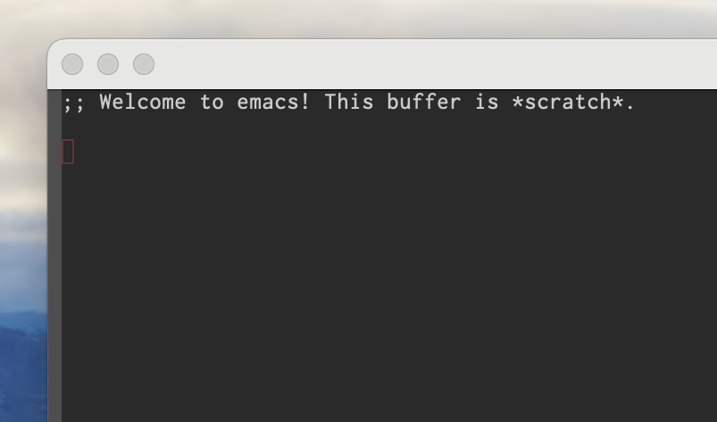

私は普段、[railwaycat/emacsmacport](https://github.com/railwaycat/homebrew-emacsmacport)を使ってインストールした[emacs-mac](https://bitbucket.org/mituharu/emacs-mac/src/master/)を使用しているのですが、何故かmacOSをSonomaにアップグレードしたらタイトルバーが太くなりました。

[macOS SonomaにしたらEmacsのタイトルバーが太くなった...！](https://note.com/5mingame2/n/ne5cb599c0684)によると、次の設定を入れるとなおるようです:

``` emacs-lisp
(tool-bar-mode 1)
(tool-bar-mode 0)
```



うーん、起動も遅くなったっぽいし、workaround感がすごい。わかんないですけどなんかフレームの初期化に失敗しているとかそういう感じなんでしょうか。

[emacs-macの方で修正を入れてくれている様子](https://bitbucket.org/mituharu/emacs-mac/commits/5f6c306095c825eb01708e336f9d03c15271dfe9)なので、リリースされるまではこのworkaroundでしのいでおくくらいしかできなさそうです。
