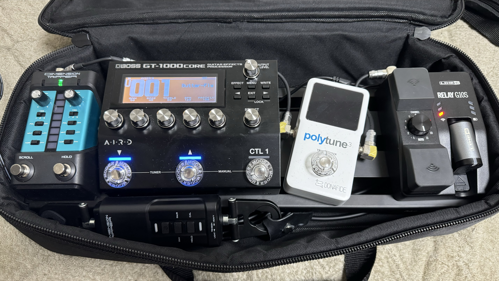

2024年9月8日に新宿SUNFACEで開催されたITエンジニアによるITエンジニアのためのロックイベントTech Rock Festival 2024.09に参加してきました。

イベント自体の開催経緯は[昨年のレポート](/tech-rock-festival-2023/)を参照のこと。

実は今年の開催は7月にもあり、7月は観客として参加する予定だったのですが、ちょうど開催タイミングに新型コロナウイルス感染症に感染し、参加することができず、9月の回のみの参加と相成りました。

## 機材

ギターは昨年に引き続き[YAMAHA PACIFICA 112V](https://jp.yamaha.com/products/musical_instruments/guitars_basses/el_guitars/pacifica/pac_100.html)でした。

弦も変わらずElixir Optiweb 09-42です。今シーズン(?)は弦もいろいろ試しはしたんですが、やはり一番保つのはElixirですね・・・それでも月に一度は換えていますが。他に良い弦があれば教えてください。

エフェクターは昨年使用したZOOM G1 FOURをメルカリで売却し、代わりにGT-1000Coreを導入しました。G1 FOURは同時使用できるエフェクトが5コだったのでかなり縛りがある感じだったんですが、GT-1000Coreは(値段も高いですが)かなり自由に音を作れて楽しいですね。

[GT-1000](https://www.boss.info/jp/products/gt-1000/)はBluetoothも搭載しており、iOSアプリでパッチの編集ができる様なのですが、GT-1000Coreはできず、とはいえこの小さい画面ですべてをいじるのは大変だな、ということで調査をしたところ、MIDIでパッチをいじることができる、しかも[BleutoothでワイヤレスでMIDIをいじれるようにするアイテムもある](https://www.soundhouse.co.jp/products/detail/item/289772/)ということが分かったため、基本的にはこれを使ってiPad miniのGT-1000用アプリでパッチの編集をしていました。

また、クラウドファンディングで入手した[CASIOのDIMENSION TRIPPER](https://www.casio.com/jp/dimensiontripper/)も投入しました。元々[ワイヤレス+チューナー+小型マルチでぴったりサイズのボード](https://www.soundhouse.co.jp/products/detail/item/170995/)を使っていたのでDIMENSION TRIPPERを乗せることができなかったため、[ボード自体](https://www.soundhouse.co.jp/products/detail/item/302589/)も新調しました。

DIMENSION TRIPPERの個人的不満点として、トランスミッターのギターとの接続部がプラスチックで取り付けにくい、傷などが不安という点があります。これを解消するために、部屋のその辺に転がっていたレザーの端切れと適当な金具を使って延長パーツのようなモノを作って接続部としました。便利。

コレをつかって変な音を出そうと画策もしたのですが、結局いい音ができず、これはただの拡張スイッチの様な形式で使用しました。

チューナーはまっすぐ貼り付けたハズだったのに何故か気づいたら曲がっていました。一度直したのに、また曲がったので、こいつは性根が曲がっているのだと思います。もちろんチューナーとしても使っていますが、ミュートスイッチとしても便利に活用しています。

パッチケーブルは引き続き[OYAIDEのソルダーレス](https://www.soundhouse.co.jp/products/detail/item/263398/)ですが、最近は[OAYIDE P-6.3L](https://shop.oyaide.com/products/p-63l_6mm.html)/[OYAIDE P-6.3TL](https://shop.oyaide.com/products/p-63tl_6mm.html)という奴が頭が極小で最高なのでコレを使いたいと思って、DIMENTION TRIPPERの接続はコレを使っています。制御信号なので別にこんなに良いプラグを使わなくても良いのですが、小さいボードとしては小さい頭のプラグは正義です。

パワーサプライは引き続き[VITAL AUDIO VA-05 MkII](https://www.soundhouse.co.jp/products/detail/item/329785/)。GT-1000Coreをメルカリで買った時に[OYAIDEのカレントダブラーケーブル](https://shop.oyaide.com/products/dc-3398_current_doubler_cable.html)が付属していた(正直単体で買うにはたっけえケーブルですね)ので、これを使っていますが問題無く動いています。若干短いので長いものが欲しい気もするんですが、高いので困っています。

エフェクターボードからアンプまではやはり引き続き[CANARE LC03](https://www.soundhouse.co.jp/products/detail/item/23263/)だったか[CANARE LC05](https://www.soundhouse.co.jp/products/detail/item/23269/)だったか(長さが違うだけ)を使いました。

アンプは今回は(他のバンドとの兼ね合いを考慮して)JCM2000でした。今回はGT-1000Coreに音の良いアンプシミュレータが入っているためリターン挿しでアンプに依存しない安定したサウンドを目指しました(というほどがっちり音作りしたわけではないけど)。

ピックは[MASTER 8 JAPAN INFINIX-U JAZZ type with Hard Grip 0.88mm](https://www.soundhouse.co.jp/products/detail/item/277561/)と[PlanetWaves by D'Addario Medium](https://www.yodobashi.com/product/100000001003269103/)を使いました。後者は昔Black ICEという名称で売っていて、すごく好きなんですよね。最近全然手に入らなくて困っていたのですが、秋葉原のヨドバシに何故か在庫があり、購入することができました。

ストラップは[irodori strap -墨-](https://x.com/yujin_imanishi/status/1634479575387492352)というやつを使いました。表がレザー、裏がナイロン、長さ調整はコキカンがついているという、見た目も使用感も良い最高の奴です。クソ高いのと、このモデルはコラボモデル的な奴でもう手に入らないんですが、同じタイプのコラボモデルじゃない奴は[Grande uomo](https://grandeuomo.thebase.in/)さんで買えたり買えなかったりするみたいです。

## バンドと演目

今回は何やら気がついたら2つのバンドを掛け持ちで参加することになっていました。

### Jaz Drivers

ロックイベントだ、といっているのに、何故かジャズのバンドで参加。狭いステージがキツキツになる8人編成、ギターが二本、キーボードにアルトサックス、EVI(電子トランペット的な奴)にサンプラーを使ったパーカッションまでいるという豪華編成でした。

面子:
- つかまん (Dr)
- okd (Ba)
- Shotaro (Gt)
- nasa9084 (Gt)
- Nagao (Key)
- うめちゃん (A.Sax)
- Ohno (EVI)
- 皮しばき (Perc)

曲目は次の通り:
1. Days of Wine and Roses (酒とバラの日々)
2. Feel Like Makin' Love
3. Recorda Me
4. Caravan

うち、Days of Wine and Rosesはサウンド過多のため休憩、Feel Like Makin' LoveとCaravanでアドリブソロをやりました。

#### サウンド

##### Feel Like Makin' Love / Recorda Me

ソロを弾くときはCTL1でCLEAN BOOSTをかける

設定値詳細

- X-COMP
  - SUSTAIN: 50
  - ATTACK: 50
  - LEVEL: 60
  - TONE: 0
  - RATIO: INF:1
  - DIRECT MIX: 0
- DIV
  - MODE: DUAL
  - A:
    - BLUES OD
      - DRIVE: 20
      - TONE: 0
      - LEVEL: 50
      - BOTTOM: 0
      - DIRECT MIX: 0
    - AIRD PREAMP NATURAL
      - GAIN: 10
      - SAG: 0
      - RESONANCE: 0
      - LEVEL: 75
      - BASS: 50
      - MIDDLE: 50
      - TREBLE: 50
      - PRESENCE: 0
      - BRIGHT: OFF
      - GAIN SW: MIDDLE
  - B:
     - AC GUITAR SIM
       - BODY: 25
       - LOW: 0
       - HIGH: 0
       - LEVEL: 50
     - AC RESONANCE
       - TYPE: NATURAL
       - RESONANCE: 50
       - TONE: 0
       - LEVEL: 50
     - AIRD PREAMP TRANSPARENT
       - GAIN: 60
       - SAG: 0
       - RESONANCE: 0
       - LEVEL: 40
       - BASS: 21
       - MIDDLE: 50
       - TREBLE: 50
       - PRESENCE: 0
       - GAIN SW: MIDDLE
     - PARAMETRIC EQ
       - LOW CUT: 400Hz
       - LOW GAIN: -10dB
       - LOW-MID FREQ: 500Hz
       - LOW-MID Q: 1
       - LOW-MID GAIN: 0dB
       - HIGH-MID FREQ: 4.00kHz
       - HIGH-MID Q: 1
       - HIGH-MID GAIN: 0dB
       - HIGH GAIN: 0dB
       - HIGH CUT: FLAT
       - LEVEL: +8dB
- STEREO MIX
  - A LEVEL: 100
  - B LEVEL: 100
  - A/B BALANCE: 100:80
- DIV
  - MODE: SINGLE
  - CLEAN BOOST
    - DRIVE: 50
    - TONE: 0
    - LEVEL: 35
    - BOTTOM: 0
    - DIRECT MIX: 0
    - SOLO SW: ON
    - SOLO LEVEL: 100
- NS
  - THRESHOLD: 85
  - RELEASE: 30
  - DETECT: INPUT
- DELAY
  - TIME: 400ms
  - FEEDBACK: 20
  - HIGH CUT: FLAT
  - EFFECT LEVEL: 2
  - DIRECT LEVEL: 100
- DELAY
  - TIME: 400ms
  - FEEDBACK: 20
  - HIGH CUT: FLAT
  - EFFECT LEVEL: 2
  - DIRECT LEVEL: 100
- PLATE REVERB
  - TIME: 2.0s
  - TONE: +7
  - DENSITY: 6
  - EFFECT LEVEL 3:0
  - PRE-DELAY: 0ms
  - LOW CUT: 80.0Hz
  - HIGH CUT: 8.00kHz
  - LOW DAMP: 0
  - HIGH DAMP :0
  - MOD RATE: 50
  - MOD DEPTH: 0
  - DUCK SENS: 50
  - DUCK PRE DEPTH: 0
  - DUCK POST DEPTH: 0
  - DIRECT LEVEL: 100
- MASTERING FX
  - TYPE: LIVE COMP
  - DYNAMICS: 0
  - TONE: 0
  - NATURAL: 0

##### Caravan

設定値詳細

- CLEAN BOOST
  - DRIVE: 50
  - TONE: 0
  - LEVEL: 50
  - BOTTOM: 0
  - DIRECT MIX: 0
- NS
  - THRESHOLD: 85
  - RELEASE: 30
  - DETECT: INPUT
- BLUES OD
  - DRIVE: 5
  - TONE: 0
  - LEVEL: 40
  - BOTTOM: 0
  - DIRECT MIX: 0
- DIV
  - A
    - AIRD PREAMP MAXIMUM
      - GAIN: 98
      - SAG: +10
      - RESONANCE: 0
      - LEVEL: 40
      - BASS: 50
      - MIDDLE: 50
      - TREBLE: 50
      - PRESENCE: 0
      - GAIN SW: MIDDLE
  - B
    - AIRD PREAMP ORNG STACK
      - GAIN: 60
      - SAG: 0
      - RESONANCE: 0
      - LEVEL: 40
      - BASS: 21
      - MIDDLE: 50
      - TREBLE: 50
      - PRESENCE: 0
      - GAIN SW: MIDDLE
- STEREO MIX
  - A LEVEL: 100
  - B LEVEL: 100
  - A/B BALANCE: 100:100
  - SPREAD: 10
- X-COMP
  - SUSTAIN: 50
  - ATTACK: 50
  - LEVEL: 60
  - TONE: 0
  - RATIO: INF:1
  - DIRECT MIX: 0
- PARAMETRIC EQ
  - LOW CUT: 400Hz
  - LOW GAIN: -10dB
  - LOW-MID FREQ: 500Hz
  - LOW-MID Q: 1
  - LOW-MID GAIN: 0dB
  - HIGH-MID FREQ: 4.00kHz
  - HIGH-MID Q: 1
  - HIGH-MID GAIN: 0dB
  - HGIH GAIN: 0dB
  - HIGH CUT: FLAT
  - LEVEL: -1dB
- NS
  - THRESHOLD: 85
  - RELEASE: 30
  - DETECT: INPUT
- PLATE REVERB
  - TIME: 1.0s
  - TONE: +7
  - DENSITY: 6
  - EFFECT LEVEL: 30
  - PRE-DELAY: 0ms
  - LOW CUT: 80.0Hz
  - HIGH CUT: 8.00kHz
  - LOW DAMP: 0
  - HIGH DAMP :0
  - MODO RATE: 50
  - MOD DEPTH: 10
  - DUCK SENS: 50
  - DUCK PRE DEPTH: 0
  - DUCK POST DEPTH: 0
  - DIRECT LEVEL: 100
- MASTERING FX
  - TYPE: LIVE COMP
  - DYNAMIX: 0
  - TONE: 0
  - NATURAL: 0

### バグ物語

もう一件のバンドはアニソン・ボカロバンドということで組まれたバンドですが、結果としてはほぼアニソンバンドでした。こちらもキーボードあり編成ということで豪華目の編成です。

面子:
- tanayan (Vo)
- nasa9084 (Gt)
- うつぼ (Dr)
- kidochan (Ba)
- たっち (Gt)
- Hano (Key)

曲目:
1. Butter-Fly
2. メリッサ
3. ロストワンの号哭
4. 花になって
5. 君の知らない物語

#### サウンド

##### Butter-Fly

バッキングパート、イントロ4小節のみCTL 1でAIRD PREAMPのSOLO SWをオンにして音量を上げる形

設定値詳細

- X-COMP
  - SUSTAIN: 50
  - ATTACK: 50
  - LEVEL: 60
  - TONE: 0
  - RATIO: INF:1
  - DIRECT: MIX 0
- DIST+
  - DRIVE: 40
  - TONE: +15
  - LEVEL: 50
  - BOTTOM: 0
  - DIRECT MIX: 15
- AIRD PREAMP NATURAL
  - GAIN: 30
  - SAG: 0
  - RESONANCE: 0
  - LEVEL: 50
  - BASS: 45
  - MIDDLE: 60
  - TREBLE: 50
  - PRESENCE: 40
  - BRIDHGT: ON
  - GAIN SW: MIDDLE
  - SOLO LEVEL: 85
- NS
  - THRESHOLD: 85
  - RELEASE :30
  - DETECT: INPUT
- GRAPHIC EQ
  - LEVEL: +6dB
  - 他はすべて0dB
- SPRING REVERB
  - TIME: 1.0s
  - TONE: 0
  - DENSITY: 5
  - EFFECT LEVEL: 30
  - PRE-DELAY 1ms
  - LOW CUT: FLAT
  - HIGH CUT: FLAT
  - LOW DAMP: 0
  - HIGH DAMP: 0
  - MOD RATE: 50
  - MOD DEPTH: 0
  - DUCK SENS: 50
  - DUCK PRE DEPTH: 0
  - DUCK POST DEPTH: 0
  - DIRECT LEVEL: 100
- MASTERING FX
  - TYPE: LIVE COMP
  - DYNAMICS: 0
  - TONE: 0
  - NATURAL: 0

##### メリッサ

アコギパート

設定値詳細

- PARAMETRIC EQ
  - LOW CUT: 125Hz
  - LOW GAIN: -6dB
  - LOW-MID FREQ: 250Hz
  - LOW-MID Q: 1
  - LOW-MID GAIN: -4dB
  - HIGH-MID FREQ: 6.30kHz
  - HIGH-MID Q: 4
  - HIGH-MID GAIN: -5dB
  - HIGH GAIN: -4dB
  - HIGH CUT 12.5kHz
  - LEVEL: 0dB
- AC GUITAR SIM
  - BODY: 90
  - LOW: 0
  - HIGH: -12
  - LEVEL: 100
- AC RESONANCE
  - RESONANCE: 24
  - TONE: -19
  - LEVEL: 50
- NS
  - THRESHOLD: 85
  - RELEASE: 30
  - DETECT: NS INPUT
- AIRD PREAMP TRANSPARENT
  - GAIN: 50
  - SAG: 0
  - RESONANCE: 0
  - LEVEL: 50
  - BASS: 50
  - MIDDLE: 50
  - TREBLE: 50
  - PRESENCE: 0
  - GAIN SW: MIDDLE
- NS
  - THRESHOLD: 85
  - RELEASE: 30
  - DETECT: INPUT
- GRAPHIC EQ
  - LEVEL: +7dB
  - 他はすべて0dB
- ROOM1 REVERB
  - TIME: 0.6s
  - TONE: 0
  - DENSITY: 5
  - EFFECT ELVEL: 64
  - PRE-DELAY: 30ms
  - LOW CUT: 125Hz
  - HIGH CUT: 8.00kHz
  - LOW DAMP: 0
  - HIGH DAMP: 0
  - MOD RATE: 50
  - MOD DEPTH: 0
  - DUCK SENS: 50
  - DUCK PRE DEPTH: 0
  - DUCK POST DEPTH: 0
  - DIRECT LEVEL: 100
- MASTERING FX
  - TYPE: NATURAL COMP
  - DYNAMIC: 0
  - TONE: 0
  - NATURAL: 0

##### ロストワンの号哭

バッキングパート

設定値詳細

- X-COMP
  - SUSTAIN: 50
  - ATTACK: 19
  - LEVEL: 67
  - TONE: 0
  - RATIO: INF:1
  - DIRECT MIX: 0
- BLUES OD
  - DRIVE: 40
  - TONE: +10
  - LEVEL: 50
  - BOTTOM: 0
  - DIRECT MIX: 20
- DIV
  - MODE: DUAL
  - A
    - AIRD PREAMP X-HI GAIN
      - GAIN: 4
      - SAG: 0
      - RESONANCE: +6
      - LEVEL: 50
      - BASS: 50
      - MIDDLE: 50
      - TREBLE: 50
      - PRESENCE: 0
      - GAIN SW: MIDDLE
  - B
    - AIRD PREAMP X-CRUNCH
      - GAIN: 20
      - SAG: 0
      - RESONANCE: +10
      - LEVEL: 50
      - BASS: 50
      - MIDDLE: 50
      - TREBLE: 50
      - PRESENCE: 0
      - BRIGHT: OFF
      - GAIN SW: MIDDLE
- STEREO MIX
  - A LEVEL: 100
  - B LEVEL: 100
  - A/B BALANCE: 40:100
  - SPREAD: 0
- GRAPHIC EQ
  - 31.5Hz: -8dB
  - 63Hz: -6dB
  - ほかはすべて0dB
- NS
  - THRESHOLD: 85
  - RELEASE: 30
  - DETECT: INPUT
- SPRING REVERB
  - TIME: 0.9s
  - TONE: 0
  - DENSITY :5
  - EFFECT LEVEL: 30
  - PRE-DELAY: 0ms
  - LOW CUT: FLAT
  - HGIH CUT: FLAT
  - LOW DAMP: 0
  - HIGH DAMP: 0
  - MOD RATE: 50
  - MOD DEPTH: 100
  - DUCK SENS: 50
  - DUCK PRE DEPTH: 0
  - DUCK POST DEPTH: 0
  - DIRECT LEVEL: 100
- MASTERING FX
  - DYNAMICS: 0
  - TONE: 0
  - NATURAL: 0

##### 花になって

イントロメロはCTL 1を踏みながらでスライサーをオンにして演奏。Bメロの伴奏はDIMENSION TRIPPERで歪みを切って演奏。

設定値詳細

- DIV (CTL2/DIMENSION TRIPPER)
  - MODE: SINGLE
  - A
    - X-DIST
      - DRIVE: 35
      - TONE: 0
      - LEVEL: 25
      - BOTTOM: 0
      - DIRECT MIX: 20
- DIV
  - MODE: DUAL
  - A
    - AIRD PREAMP X-HI GAIN
      - GAIN: 4
      - SAG: 0
      - RESONANCE: +6
      - LEVEL: 50
      - BASS: 50
      - MIDDLE: 50
      - TREBLE: 50
      - PRESENCE: 0
      - GAIN SW: MIDDLE
- STEREO MIX
  - A LEVEL: 100
  - B LEVEL: 100
  - A/B BALANCE: 40:100
  - SPREAD: 0
- GRAPHIC EQ
  - 31.5Hz: -8dB
  - 63Hz: -6dB
  - ほかはすべて0dB
- NS
  - THRESHOLD: 85
  - RELEASE: 30
  - DETECT: INPUT
- SPING REVERB
  - TIME: 0.9s
  - TONE: 0
  - DENSITY: 5
  - EFFECT LEVEL: 30
  - PRE-DELAY: 0ms
  - LOW CUT: FLAT
  - HIGH CUT: FLAT
  - LOW DAMP: 0
  - HIGH DAMP: 0
  - MOD RATE: 50
  - MOD DEPTH: 100
  - DUCK SENS: 50
  - DUCK PRE DEPTH: 0
  - DUCK POST DEPTH: 0
  - DIRECT LEVEL: 100
- DIV (CTL1)
  - MODE: SINGLE
  - B
    - X-COMP:
      - SUSTAIN: 60
      - ATTACK: 50
      - LEVEL: 46
      - TONE: 0
      - RATIO: INF:1
      - DIRECT MIX: 0
    - PITCH SHIFTER
      - VOICE: 1VOICE
      - PS1:PITCH: +12
      - DIRECT LEVEL: 40
      - PS1:LEVEL: 10
      - PS1:MODE: FAST
      - PS1:FINE: 0
      - PS1:PRE-DELAY: 0ms
      - PS1:FEEDBACK: 0
    - SLICER
      - PATTERN: P1
      - RATE: 75
      - EFFECT LEVEL: 100
- MASTERING FX
  - TYPE: NATURAL COMP
  - DYNAMIX: 0
  - TOEN: 0
  - NATURAL: 0

##### 君の知らない物語

バッキングパート

設定値詳細

- X-COMP
  - SUSTAIN: 50
  - ATTACK: 91
  - LEVEL: 67
  - TONE: 0
  - RATIO: INF:1
  - DIRECT MIX: 0
- BLUES OD
  - DRIVE:40
  - TONE: +10
  - LEVEL: 50
  - BOTTOM: 0
  - DIRECT MIX: 20
- DIV
  - MODE: DUAL
  - A
    - AIRD PREAMP X-HI GAIN
      - GAIN: 4
      - SAG :0
      - RESONANCE: +6
      - LEVEL: 50
      - BASS: 50
      - MIDDLE: 50
      - TREBLE: 50
      - PRESENCE: 0
      - GAIN SW: MIDDLE
  - B
    - AIRD PREAMP X-CRUNCH
      - GAIN: 20
      - SAG: 0
      - RESONANCE: +10
      - LEVEL: 50
      - BASS: 50
      - MIDDLE: 50
      - TREBLE: 50
      - PRESENCE: 0
      - BRIGHT: OFF
      - GAIN SW: MIDDLE
- STEREO MIX
  - A LEVEL: 100
  - B LEVEL: 100
  - A/B BALANCE: 40:100
  - SPREAD: 0
- GRAPHIC EQ
  - 31.5hz: -8dB
  - 63Hz: -6dB
  - ほかはすべて0dB
- NS
  - THRESHOLD: 85
  - RELEASE: 30
  - DETECT: INPUT
- SPING REVERB
  - TIME: 0.9s
  - TONE: 0
  - DENSITY: 5
  - EFFECT LEVEL: 30
  - PRE-DELAY: 0ms
  - LOW CUT: FLAT
  - HIGH CUT: FLAT
  - LOW DAMP: 0
  - HIGH DAMP: 0
  - MOD RATE: 50
  - MOD DEPTH: 100
  - DUCK SENS: 50
  - DUCK PRE DEPTH: 0
  - DUCK POST DEPTH: 0
  - DIRECT LEVEL: 100
- MASTERING FX
  - TYPE: NATURAL COMP
  - DYNAMIX: 0
  - TONE: 0
  - NATURAL: 0

## 次

冬(いつ?)にスタジオ配信ライブをやるらしいです
