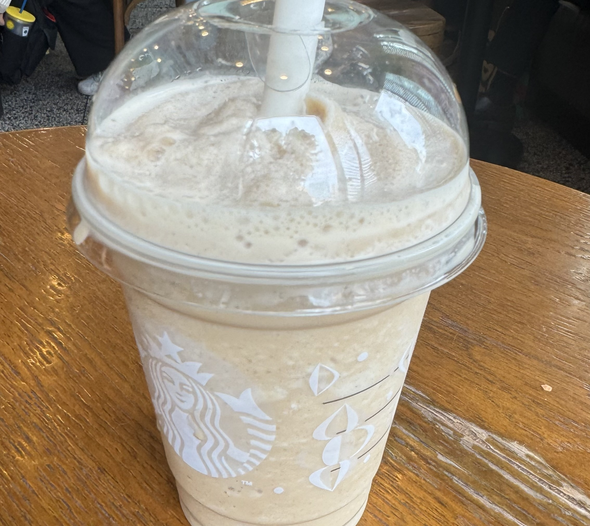
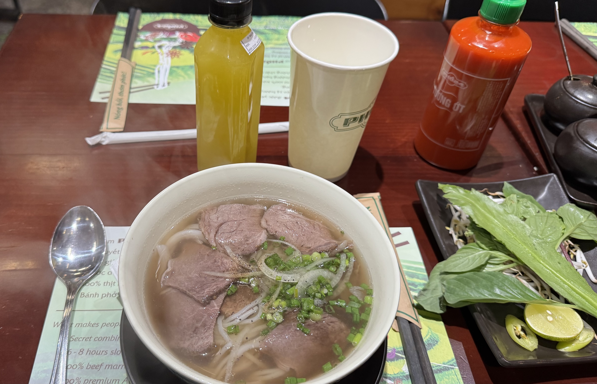
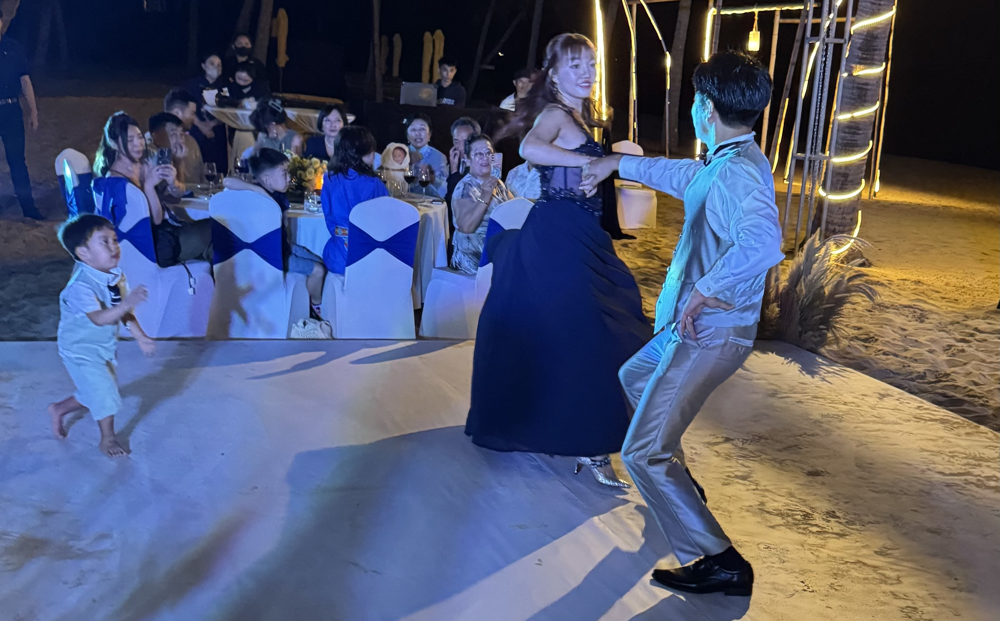
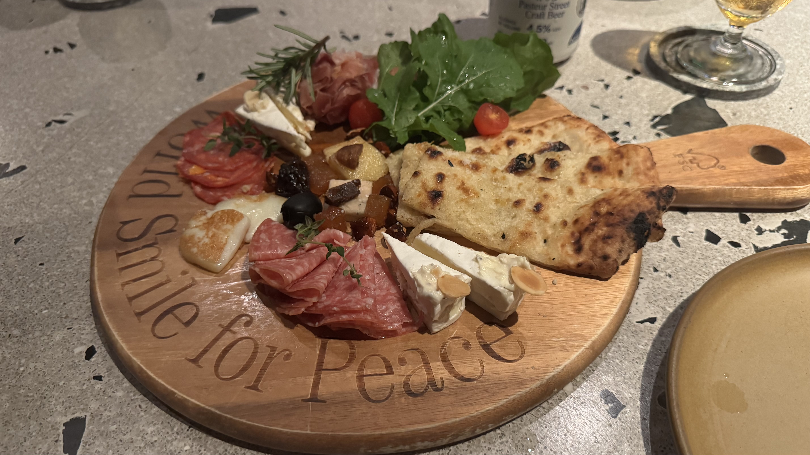
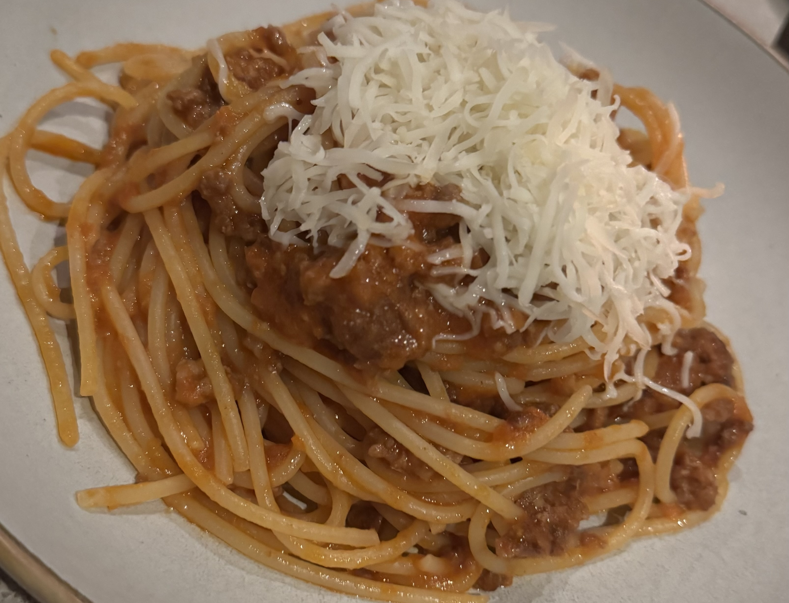
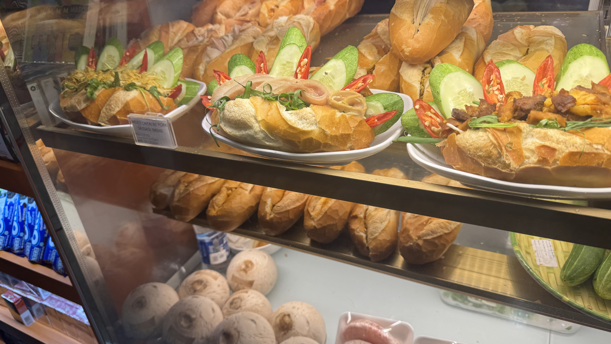

標題の通り、ベトナムに行ってきました。主目的は学生時代からの付き合いであるところの[@chamaharun](https://x.com/chamaharun)と[@ne_saya](https://x.com/ne_saya)の結婚式ですが、ベトナムまで行ってそれだけというのもアレなので、多少観光もしてきました。

## 0日目: 札幌→東京→ホーチミン

先日札幌に引っ越したため、結婚式会場のフーコック島までは、新千歳→羽田→ホーチミン→フーコックという経路でした。
乗り継ぎの都合なども勘案して、21:15新千歳発、深夜に羽田発、早朝ホーチミン着という計画としたため、せっかくなのでホーチミンで一泊することとしました。
新千歳をでるときはなんとなくおなかが空いていなかったので夕食抜いてしまおうか、と思ったのですが、なんだかんだ羽田で飛行機を待っていたらおなかが空いたので、お値段が手頃だったうどんを食べました:

国際線ではエコノミーでも酒が飲めるんだった、ということで、寝酒に梅酒をもらったのですが、十分にエアコンが効いてるし、と思ってストレートで頼んだら、結構多くて結局ちびちびやっていたら飲みきれませんでした:

機内食で朝食、パンケーキですって声も聞こえていた気がしたけど、手元に来たのはフレンチトースト:

## 1日目: ホーチミン

ホーチミンまではJAL便だったので、ギリギリまで日本語で楽ちんでした。

ホーチミンに早朝について、ホテルのチェックインもできないので、フロントの人に「どうしたら良いと思う？」と聞いたところ、すぐ横にカフェがあるから、いったん休憩して、その辺散歩してきたら良い感じにホテルからのシャトルバスがでるから、それで観光行ってきたら良いんじゃない？ということだったので、それに従うことにしました。

まずはすぐお隣のHIGHLANDS COFFEEで一発目のベトナムコーヒー:

HIGHLANDS COFFEEはチェーンで、ベトナムでは割とどこにでもあるというか、スタバのようなモノらしい。スタバはスタバで同様にその辺にあるけど。全然数が違う。日本で言うと、ドトールとかその辺かな、と思いました。

35k VND==大体200円くらい。安い。氷がやばい。

そして道路。噂に聞いていたベトナムの原付。やばい。

散歩していたら見つけたミニストップ。おでん(という名前の多分別の食べ物)が売られていたけど、この気温で食べる奴おるんか、とは思いましたね:

そうこうしている間に良い感じの時間になったので、ホテルに戻ってシャトルバスに乗車。
行き先一覧に高島屋があって、安心感ありそうだったし、ユニクロとかが入っていて、現地限定のやつとかあるのかしら、と気になったのでいったん高島屋へ。
見慣れたロゴで安心感がすごい:

限定のTシャツはあったけど、日本でＴシャツ買うのと変わらない値段で悩んでいる間に買ってくるのを忘れました。

高島屋は安心感がありまくって、ロイズがあったり:

白い恋人があったり:

で、ちょっと安心感がありすぎるくらいでした。

一通り高島屋を見た後は徒歩で無印良品へ。株主なので。(特に関係ないけど)

無印では限定のトートバッグが売っていて、これは結構安かったので買いました:

79k VNDなので、日本円だと500円弱くらい。

他にもダイソーがありました:

店頭のポップ、日本語で書かれていたけど誰が読むのか。

マツモトキヨシがあったり:

焼き肉ライクがあったり:

ビアードパパがあったり:

日本のお店がそこここにあるので、気持ち的にはすごくなんか安心感(?)がありました。

一発目のベトナム飯はコムタムという奴にしました。肉が美味そうだったので。

結果としてはあまり好みではなく、肉は固く、完食できませんでした。すまん。
お値段としては800円くらい？ベトナムの飯としてはちょい高めかもしれないですね。

お口直しにスタバ。strawberry açaí with Lemonade 75k VND。まぁ、日本とあんまり変わらない値段設定ではありますね。普通に美味しい。安心。

その後時間も余っておりせっかくなので定番観光地らしきサイゴン中央郵便局を見に行き:

暑かったのでワンモアスタバ:

430k VND。

14時になったのでホテルチェックイン:

部屋まで荷物を運んでくれる、は初めての経験でした。
安心安全のために多少高かったけど日系のホテルを選んだので、ウォシュレットもついていたし、トイレットペーパーは三角に折られていました:

流石に移動が多すぎて疲れたので休憩して、夜になったら夜ご飯にフォーを食べました:

PHO24というところが観光客向けで安心ということだったので、アクセスが良さそうだったPHO24 158D PASTEURへ。

<iframe src="https://www.google.com/maps/embed?pb=!1m18!1m12!1m3!1d6097.221525407996!2d106.69264729190465!3d10.77667294111412!2m3!1f0!2f0!3f0!3m2!1i1024!2i768!4f13.1!3m3!1m2!1s0x31752f3648071ad5%3A0xabb602980edd971d!2sPH%E1%BB%9E%2024%20-%20158D%20PASTEUR!5e0!3m2!1sja!2sjp!4v1734618816031!5m2!1sja!2sjp" width="600" height="450" style="border:0;" allowfullscreen="" loading="lazy" referrerpolicy="no-referrer-when-downgrade"></iframe>

フォーは美味しかった。金柑ジュースがオススメだよ、ということでコレも頼んだんですが、なんかすごく砂糖甘かったので、あまりオススメはしないかも。

食べ終わった後はホテルに戻・・・る前に、ホテルすぐ横のHIGHLANDSのすぐ横のPHUC LONG COFFEE & TEAでPHUC LONG MILKTEAを買ってみました:

何も考えずにsignatureっぽい奴を買いましたが、ウーロン茶のミルクティーでした。びっくり。美味しかったけど。50k VND。
PHUC LONGもチェーンであちこちにある様子です。

部屋に戻ったら、ホテルからチョコレートがおいてありました:

コレめっちゃ美味しかった。どこかで買えるものなのか聞けば良かったな。

あと、どうでも良いけど部屋の目覚ましは無印の目覚ましでした。すごく見やすかったけど、少なくとも日本国内の現行品ではなさそう。

# 2日目: ホーチミン→フーコック

翌朝の朝食はHIGHLANDS COFFEEへ。高いから朝食なしプランでホテル取ったので。Bánh Mì Que (Gà Phô Mai)というやつ。なんかシーチキンみたいな鶏のパテ？の様なものとチーズが挟まった長いパン。美味しかった。

フーコック島へ向かう途中、空港の待ち時間にもう一度PHUC LONGへ。今度はピーチティーを頼みました:

いかにも缶詰の黄桃、という奴が入っていてうまい。

フーコック島でのホテルチェックイン時にくれたウェルカムドリンクは美味しかったけど、なんのジュースなのかは不明でした。
すごく丁寧に持ってきて、丁寧においてくれたのに、注ぐ時点で失敗していたのか、外側にもジュースがついていたのがアンバランスでウケた。

フーコックでの宿はPullman Phu Quocというリゾートホテル。

バルコニーからの景色がいかにもリゾートって感じでアガる。

その後暇だったのでとりあえず海へ。

曇っていたので最高にきれい、ではなかったけど、それでもきれいだったのですごい。
あと、砂浜におかれたイスに寝ているおじさん、という、リゾート地の定番みたいな人を初めて見ました。

謎の果物がなっている木などもあり:

これはなんなんですかね？知っている人は教えてください。

うろうろしていたら土砂降りに遭ってしまいビタビタになったので昼飯はチャーハンと生春巻きをSEN Restaurantというところで:

<iframe src="https://www.google.com/maps/embed?pb=!1m18!1m12!1m3!1d3927.610414954689!2d103.9831818!3d10.1309404!2m3!1f0!2f0!3f0!3m2!1i1024!2i768!4f13.1!3m3!1m2!1s0x31a7930a67a7acf5%3A0x265672917e50765a!2sSEN%20Restaurant!5e0!3m2!1sja!2sjp!4v1734688702658!5m2!1sja!2sjp" width="600" height="450" style="border:0;" allowfullscreen="" loading="lazy" referrerpolicy="no-referrer-when-downgrade"></iframe>

量が不安だったけど、二人で腹がパンパンになるくらいでした。

晩飯はナイトマーケット方面のXin chaoという店で海鮮を少々。

<iframe src="https://www.google.com/maps/embed?pb=!1m18!1m12!1m3!1d7853.355452965681!2d103.95687614869024!3d10.206804859637638!2m3!1f0!2f0!3f0!3m2!1i1024!2i768!4f13.1!3m3!1m2!1s0x31a78c8835caefcd%3A0x91f937387f0cad2d!2sXin%20Chao%20seafood%20restaurant!5e0!3m2!1sja!2sjp!4v1734689028854!5m2!1sja!2sjp" width="600" height="450" style="border:0;" allowfullscreen="" loading="lazy" referrerpolicy="no-referrer-when-downgrade"></iframe>

エビも頼んだつもりだった(けど注文が通ってなくてこなかった)のでちょっと足りなかったけど、味は満足。
ホタテのチーズ焼き？は自分でも作れそうだな、とは思ったけど。

ナイトマーケットを冷やかして:

謎の日本語フォント。いいですね。

## 3日目: フーコック

フォーが美味しかった。

この日は結婚式当日ではあるものの、結婚式は夜だったので、日中はフーコック観光をしました。2日目にホテルより北の方をちょっと見たので、この日は南の方へ。

途中暑かったのでライチティーを買いましたが、美味しかった。ストローにスプーンをぶっさすスタイルが面白かった。

ホテルに戻って少し休憩しつつ、雲行きが怪しかったのでてるてる坊主を作るなど:

ところで、てるてる坊主って日本国外でも有効なんでしょうか？
何に祈っているのか、とかにもよりそうですが、なんとなく日本の神様って人間に近いっぽいというか、土地の神様っぽい感じが強くて、海外では力を発揮しないような気がしました。知らんけど。

ここで、バルコニーから景色でも見ながらぼーっとするかと思ってバルコニーにでたら、なんとちょうど今回の主役が前撮り(?)をし始めるところだったので、バルコニーからヤジを飛ばしつつ写真を撮るなどしました:

iPhoneってすごいよね。適当に撮っても良い感じの写真が撮れます。

そして迎えた結婚式:

二次会もやって、ホテルの部屋に戻ったのは朝4時でした・・・

## 4日目: フーコック→ホーチミン

朝食は一応食べたけど、若干具合が悪かった。

ホーチミンに戻ってホテルにチェックインした後、友人Tと合流してピザを食べに行きました:

Pizza 4P'sという店で、東京にもあるらしい、ということを入店後に知ったので一瞬失敗だったかな、と思ったけど、東京の店は高そうだし、めちゃウマだったので大満足。

<iframe src="https://www.google.com/maps/embed?pb=!1m18!1m12!1m3!1d24530.87243378541!2d106.67318528639302!3d10.768060292943963!2m3!1f0!2f0!3f0!3m2!1i1024!2i768!4f13.1!3m3!1m2!1s0x31752fa20abaf647%3A0xe37a2b206b3e930c!2sPizza%204P&#39;s%20Vincom%20Plaza%203%2F2!5e0!3m2!1sja!2sjp!4v1734691001203!5m2!1sja!2sjp" width="600" height="450" style="border:0;" allowfullscreen="" loading="lazy" referrerpolicy="no-referrer-when-downgrade"></iframe>

ただ、男二人で雑な服装で入ると言うより、気合いを入れてデートで行く、みたいだったのでちょっと居心地は悪かった(店が悪いわけではない)。
金があって興味がある人は東京で行ってみたらいいかも。大変美味しかったので。

昼過ぎの便だと、基本飛行機を待って、飛行機に乗って、という感じでメシ以外は特筆すべきことは無し。

## 5日目: ホーチミン→東京→札幌

朝・・・はあまり食べる気が起きなかったものの、なんやかや10時くらいには何かを食べたいな、という気にもなり、本旅行中実に三度目のスタバ。

Chicken Teriyaki Panini:

ショーケースに入っているときはもっとペタッとして見えたんだけど、暖められたらすごくふっくらして、美味しかったがボリュームが結構あった。
日本でも売ったら良いのにな、とは思いますね。

ベトナムで[amaï](https://amaisaigon.vn/)という食器ブランドが観光客に人気、という噂で、調べると大変形が可愛いので、歩いて買いに行きました。
特に、Saigon Centre/高島屋の向かいあたりにgrade bという、アウトレットというか、B級品の様なものを売っている店舗があって、ここだとかなりお安くなっているということなので、Dong Khoi通りにある通常価格店舗を見た後、行ってみました。
写真は撮り忘れたけど、いずれもおしゃれですし、カップもすごく可愛いのでオススメ。プチプチでめっちゃ厳重に包んでくれるので、飛行機でもまぁ割と安心です。

そして昼ご飯。車で30分くらい行ったところにおしゃれ丸亀製麺があるということで、ジャパニーズUDONを外国で食べてみるのも面白かろうと思い、Grabを呼んで向かいました:

BEST SELLERだというので、Udon Bò Kakeを選びました。
89,000VNDなので、日本円で550円くらい、日本国内の丸亀だと焼きたて肉うどんが790円ですが、それよりは肉が少なそうなので、まぁ日本人としては妥当な金額かな？といったところですかね？
ベトナム価格としては・・・現地のフォーとかに比べれば高いかもしれないですがとは言え日本食ですからね。
どうでしょうか。やっぱり妥当っぽい気もしますね。

天ぷらなどのシステムは日本と同様です。

会計後のトッピングコーナーも日本と同様にありますが、ネギの他にパクチーもかけ放題です。

実際のうどんがこちら:

お味は、若干、本当にほんのちょっとだけ甘い気がしましたが、肉の味付けがちょっと甘かったのかも知れません。
日本の焼きたて肉うどんも肉が甘めに味付けされていますし。
全体としては日本の丸亀と同じ味がすると言って差し支えないでしょう。
意外だったのがパクチー。かけうどんとパクチーはめっちゃ合いますね。
過去に食べたパクチーの食べ方の中で一番美味しかったかもしれないし、これからかけうどんを食べるときにパクチーが欲しくなってしまうかもしれないな、とちょっと思いました。

なお、かけ放題である必要はありません。ちょっとで十分です。

半熟卵天もしっかり半熟でした。外国でコレは良いのかな、とちょっと思いましたが。

食べ終わって扨どうしようかな、と思ったのですが、なんと丸亀製麺のすぐ近くにもamaïとgrade bがあるということで、せっかくなので(&時間が余っていたので)行きました。

時間があるのであれば、Saigon Centre近くのgrade bよりこっちがオススメです。品数が全然違うように感じました。

更に更に、近くにmori coffeeというカフェがあり、そこで近年話題(?)のfine robustaという、いいロブスタ(ロブスタは安い、強い、エグい、みたいに言われることが多い)を出すカフェがあるということなので、そこまで歩きました。

美味しかったので豆も買ってきました。

その後いったんホテルに戻って荷物を受け取り、空港へ行き、永遠とも思える時間を待ち、最後に、そういえばbánh mìを結局食べなかったな、と思って空港の待合すぐ近くにあったbánh mìを買って食べて、帰ってきました。

