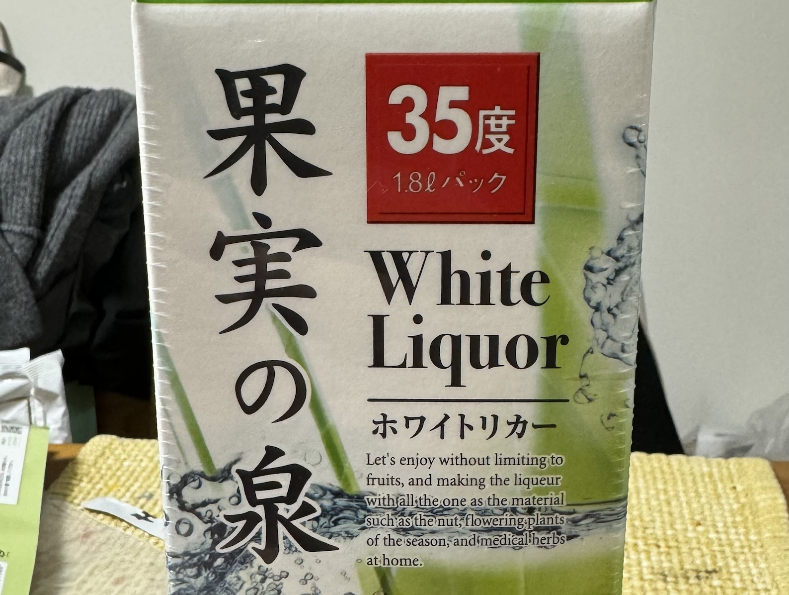

6月ですよ！今年も梅酒を漬けましたので記録をしておきます。

今年の材料は以下の通り:

- 梅: ヤオコー和光丸山台店で売っていた南高梅1袋。多分1kgくらい。
- 砂糖: 日新製糖の中ザラ糖1kg。中ザラ糖でつけるのは2020年以来ですね。
- 酒: 美峰酒類製造、酔仙酒造販売のホワイトリカー「果実の泉」1.8L

今年はカインズで[PET製の果実酒瓶](https://www.p-life-house.jp/goods_HB-6936.html)が売っていたので、そちらを使用しました。丸いガラス瓶は「ぽい」んですけど、割れそうで気を遣うし、床面効率も良くないんですよね。

最後にテプラでレシピを記録。これまで買っていたガラス瓶はだいたい説明書にメモを書いておく欄があって、それを切って使っていたのですが、今回はなかったのでテプラでメモをすることにしました。

[昨年の梅酒](/ume-2023)はこんな感じになっていました:

昨年はホワイトリカーに氷砂糖という、かなり標準的なレシピで作りましたので、ザ・梅酒という感じのスッキリとした味でした。

また来年お会いしましょう！
