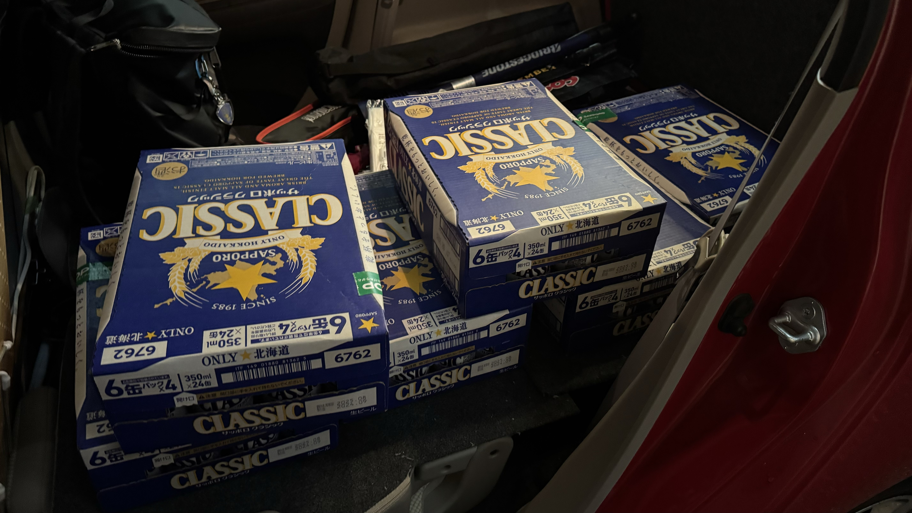
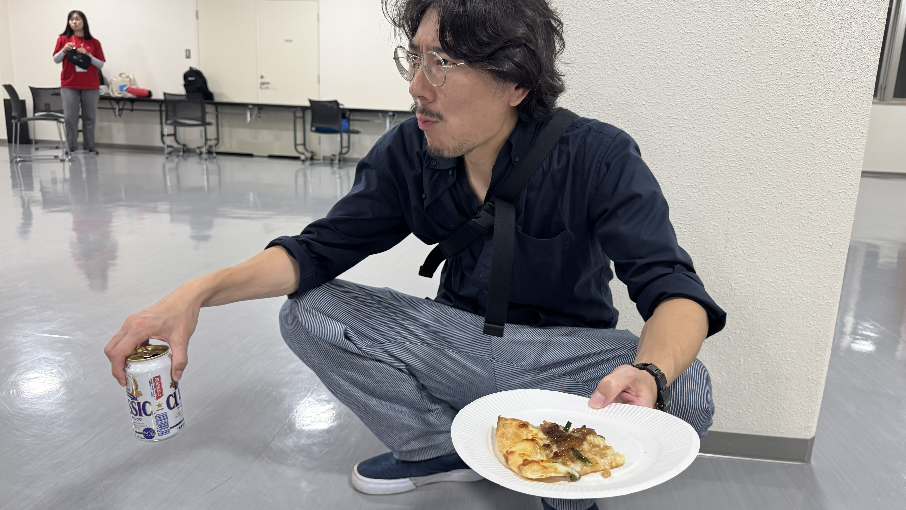
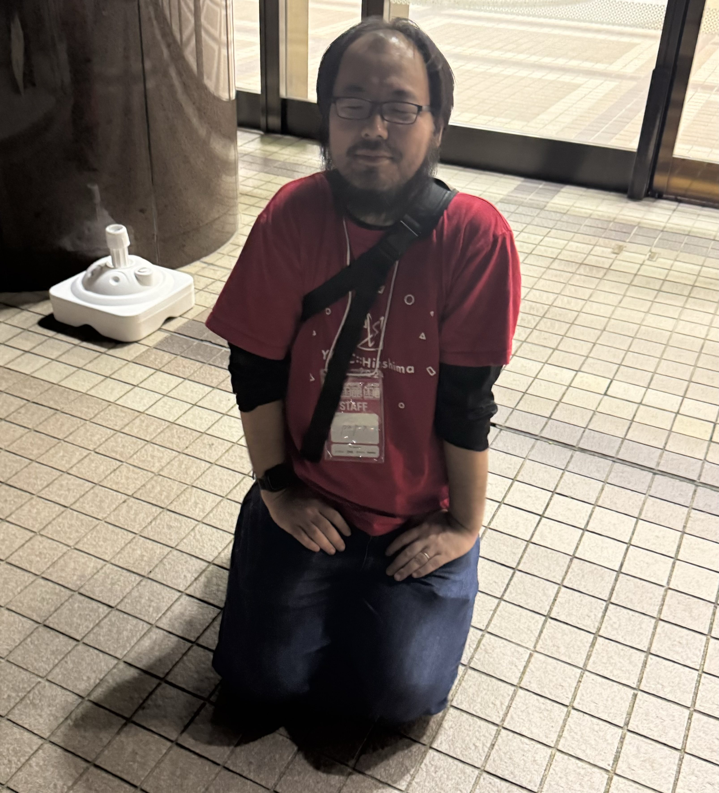

今月の頭に北海道は函館市で開催された[YAPC::Hokkaido](https://yapcjapan.org/2024hakodate/)に参加してきました。

YAPCはPerlのイベントで、“Yet Another Perl Conference"の略です。twitterハッシュタグは前回に引き続き[#yapcjapan](https://twitter.com/hashtag/yapcjapan)でした。

前回の[広島](/yapc-hiroshima-2024/)に続いて、2024年二度目のYAPCで、北海道では[2026年の札幌](/yapc_hokkaido_2016/)以来の開催ですね。

生まれ/親の実家が函館ということで個人的にはなじみのある土地で、いつも通り個人スポンサーで一般参加の予定だったんですが、[@karupanerura](https://x.com/karupanerura)さんからお誘いを受けたので、まぁせっかくならということで、いつぶりか分からない、当日スタッフとしての参加でした。担当としては「広報」という名前ではあったものの、札幌からの参加(先月末に埼玉から札幌に引越をしました)で車があること、カンファレンススタッフ経験がありなんとなくで動けること、コアスタッフがバタバタしていて上手く役割分担ができなかったこと、などから実際には買い出しやら遊撃やらをするような感じのムーブをしました。

## 前夜祭

前夜祭は函館市民会館での開催でした。久々にチラシのトートバッグ詰め作業をしたり、[@papix](https://x.com/__papix__)さんとともに[寿司](https://www.hk-r.jp/)や[やきとり弁当](https://www.hasesuto.co.jp/)を受け取りに車で回ったり、ビールが足りなかったので買いに行ったり。

皆さん寿司は食べることができましたか。私は食べられませんでした。割とこういう場面ではメシが余っている印象がありますが、即完売でしたね。。。

スタッフでも腹を空かせている人がそこそこいたようで、追い出し後にピザを注文するなどの一幕もありました。以下は治安の悪い顔でピザとビールを摂取するカメラマンの様子です:

## 本祭

本祭ははこだて未来大学で開催され、参加者の皆さんは専用のバスがチャーターされたようです。はこだて未来大学は車がないと厳しいですからね・・・

当日スタッフとしては朝はスポンサーブース設営手伝い、受付手伝い、うろうろしてブースの写真を撮ってDiscordに流す、ゴミ袋やスケッチブックを買いに行く、問題がありそうなところの報告や、人手が足りないところの手伝いをする、などをしました。

トークプロポーザルは残念ながら通らなかったのですが、それをそのまま突っ込んだLTプロポーザルは通り、それなりにウケたので大変良かったですね。

<iframe class="speakerdeck-iframe" style="border: 0px; background: rgba(0, 0, 0, 0.1) padding-box; margin: 0px; padding: 0px; border-radius: 6px; box-shadow: rgba(0, 0, 0, 0.2) 0px 5px 40px; width: 100%; height: auto; aspect-ratio: 560 / 315;" frameborder="0" src="https://speakerdeck.com/player/07ecbdcb9e4341e4a7f310ab52d9d23b" title="e-book title normalization" allowfullscreen="true" data-ratio="1.7777777777777777"></iframe>

終わった後は最終居残り組として残って、余ったノベルティを懇親会場に運ぶ、ということで車を積極活用しました。

## 懇親会

車を運転して懇親会場に向かいましたが、[JPA](https://japan.perlassociation.org/)が運転代行代を持ってくれるということで、懇親会でビールなどを摂取することができました。助かりますね。

運転代行って初めて使ったんですが、なかなか面白い経験でした。

懇親会後、案の定(?)papixさんはベロベロでした:

風物詩という感じがしてわびさび(?)ですね(?)

当日スタッフは大変久々ではありましたが、たのしかったですね。
