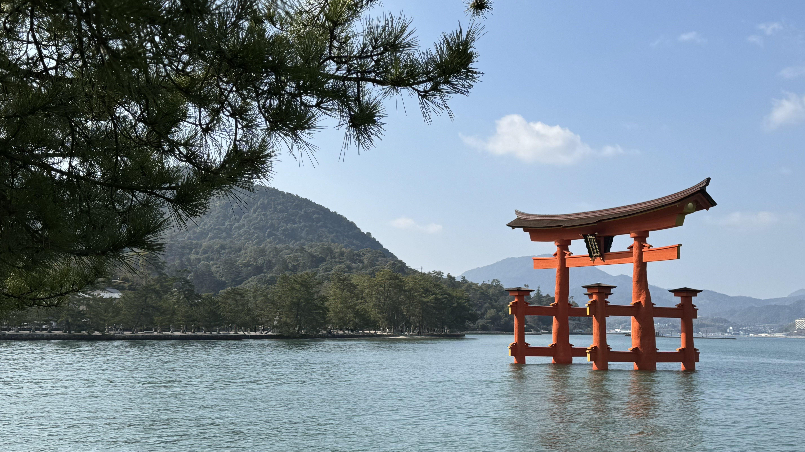

2024年最初のテックカンファレンスとして、[YAPC::Hiroshima 2024](https://yapcjapan.org/2024hiroshima/)に参加してきました。

YAPCはPerlのイベントで、“Yet Another Perl Conference"の略です。twitterハッシュタグは前回に引き続き[#yapcjapan](https://twitter.com/hashtag/yapcjapan)でした。

広島に来たのは2017年に[OSC2017 Hiroshima](https://www.ospn.jp/osc2017-hiroshima/)以来2度目です。前夜祭、アフターイベントがあるうえ三連休に絡んでいるということで、木曜日の午後に広島入りして、月曜の夜に帰るという4泊5日という計画としました。なお、弊チームではPerlを使用していないため業務ではなく趣味なのですべて自費です。

## 前夜祭

前夜祭は本編と同じ会場で、2本のトーク(?)と番宣リレーという企画がありました。以下ハイライトです:




そーだいさんクラスになると登壇しながら資料を書ける、学びですね(?)

## 本編

本編は3トラックで開催されました。次のセッションを聞きました:

* コミュニティと共に生きる - キャリアの螺旋と人生を変えた瞬間
* (再演) 関数型プログラミングと型システムのメンタルモデル
* Blogを作り、育み、慈しむ - Blog Hacks 2024
* 非同期な開発体制を支えるドキュメント文化
* PerlでつくるフルスクラッチWebAuthn/パスキー認証
* 平成のエンジニアから令和のエンジニアへの遺言〜技術情報を伝達する手段の変遷〜
* ライトニングトーク
* キーノート

どのセッションももちろん最高だったんですけど、やはり最高of最高はとほほさんによるキーノートでした。

正直これまでカンファレンスで話を聞いたどのレジェンドよりも「実在の人物だったんだ・・・」感がありました。いやまぁそりゃ、実在の人物でしょうけれども。

個人スポンサーノベルティはこてでした。SmartHRさんもこてを配っていたのでもらいました。右手と左手で、ひっくり返すのに便利かとおもったので。この時はまさかあんなことになるとは思ってもいなかった・・・！

### 懇親会

今回はなんと懇親会あり。YAPCとしては実に5年ぶりの懇親会だそうです。永遠に時間が足りないですね。困った。

### 二次会

各社による半公式二次会があるのも知ってたんですが、なんとなくまぁ申し込みをしないでおいたんですよね。野良二次会やりたくて。なので野良二次会をやりまして、同じ会社の人と実質初めましてですね、Slackではお世話になってます的な話をするなどしました。

## YAYAPC::Hiroshima

アフターイベントとして[YAYAPC::Hiroshima](https://connpass.com/event/300500/)にも参加しました。なんだかんだ三日間。すごい。

テーマは"What you live"ということで、オフラインだからこそ話せること、ということで、まぁTwitterを見てもらうとわかるのですが、インターネットで共有はできないものの、みんなわかる・・・！という感じで、うめき声みたいなツイートが発生していました。

ぼーっとしている間にLT枠が埋まってしまっていたので、応募すればよかったかな〜などと思っていたのですが、当日、タイムテーブルミスったからLT枠がある、ということで飛び入りで怪しい話をさせていただき、なんと賞まで頂戴いたしまして、結果的に個人スポンサーノベルティのこてが2本と相成りました。いやー、これにはびっくり。大変ありがたいことです。

終わった後は12人ほどで飲みに繰り出しまして(17時頃)、途中人が多少入れ替わりつつ飲み続け、23:30頃に解散しました。



そして解散した後は深夜だというのに一人でお好み焼きを食べるなどしました。お好み焼き美味しい。

## 時系列記録その他広島観光など

### 1日目: 2月8日(木)

16:15に広島空港についたので、そこからホテルに一旦チェックイン、ちょっと散歩をした後[@mihyaeru21](https://twitter.com/mihyaeru21)とお好み焼きを食べに行きました。場所はそーだいさんおすすめのねぎ庵。

おいしかった。おすすめ。

### 2日目: 2月9日(金)

この日は前夜祭がある日でしたが、夕方までは空いていたので、ホテル近辺の珈琲屋を回りました。

朝起きて、まず前日の散歩で気になっていた[麻里布珈琲](http://campagne.co.jp/marifu-coffee/)へ。奇跡の厚切りカツサンドなるモノをたべました。

カツもうまいし、挟んでるパンもうまかった。コーヒーも美味しかったけど、ソレよりカップに蓋がついているのが気になりました。

その後BAGTOWN COFFEEへ。お姉さんのオススメに従い雲南省モウレン地区Tian yu農園のコーヒーを100gと、グァテマラアンティグアLa Colina農園のゲイシャを100g買いました。後者はCOEで4位を取ったやつだそうです。

その次はprogress life style coffeeへ。コロンビアを一杯いただき、ちょっと迷ったものの豆は買わずに店を出ました。

BAGTOWN COFFEEに行ったとき、三越でコーヒーのイベントをやっているよ、と教えてもらったのでそっちにも行きました。3杯試し飲みセットが1200円ということでチケットを購入し、3杯飲みました。このあたりから胃の心配をし始めます。

一旦ホテルに戻って休憩し、カドモト珈琲によってハウスブレンドを100g購入、そのまま前夜祭の会場に向かいました。

途中そーだいさんに出会い、会場まで連れて行ってもらい、(そーだいさんはしゃべる側だったので)別れ、そして会場に併設されていたカフェでウインナーコーヒーを飲みました。何故・・・

いや、言い訳をすると、時間を潰さなければならなくて、しかしもう歩きたくなくて、ブラックはもう胃が死ぬと思ったのでクリームが入っているモノを選んだのです。

そして前夜祭パートへつづく。

### 3日目: 2月10日(土)

YAPC::Hiroshima 2024本編。

### 4日目: 2月11日(日)

YAYAPC::Hiroshima

### 5日目: 2月12日(月)

<del datetime="2024-02-13">明日です。</del>

<ins datetime="2024-02-13">2024年2月13日追記:</ins>

寿屋珈琲で朝飯を食べ、

コーヒー豆を買い、宮島へ向かいました。

iPhone(というか最近のスマホ全般？)は適当に取っても良い写真が撮れて大変良いですね。

ところで、こんな写真を撮りまして:

iPhoneの写真Appでちょっと色味やらなんやらを調整すると:

こんな、何やら旅行会社の広告やパンフレットに表紙っぽい写真になりました。もうiPhoneの写真Appだけで編集まで簡潔で良いのでは・・・。(余談ですがスライドを作るときに画像にモザイクをかけたいときはAdobe Illustratorを使っています。macOSの純正写真編集などでできる方法があれば教えてください)

厳島神社で令和のお清めを観測しました:

鹿の写真を大量に撮るなど:

博多屋の「宮島でがんす」が今回食べたがんすの中で一番うまかった:

ところで実は宮島に行った最大の理由は厳島神社ではなく、[スタバの宮島限定コーヒーアロママグ](https://menu.starbucks.co.jp/4524785291430)という奴を手に入れるのが主目的だったのですが、無事売り切れておりました。が、これを作っている[対厳堂](https://miyajimayaki.jp/)の工房が宮島口の近くにあったので、行って、買ってきました。

お値段6,000円(税別)ということで、食器はすべて食洗機にいれて生き残ったモノを使うという我が家のストロングスタイルでも、流石に食洗機に淹れるのはためらわれますね・・・

最後に、羽田空港の駐車場4泊5日の料金は以下の通りでした。ご査収ください。

## まとめ

やはりカンファレンスに行くと気分が盛り上がり、頑張らねばならぬな、と思いますね。2024年の私に乞うご期待下さい。

もう深夜2:50分なので寝ます。

こちらからは以上です。
