今年は主に園芸と料理の年でした。また、[2024年9月末から札幌で一人暮らしを始めた](/move-to-sapporo/)ので、自分で選んだ日用品が増えた年でもありました。
2024年に買って良かったものブログを書かなかったので、2024年に買って、今でも買って良かったな、と感じているものも入れておきます。

# 園芸

## 道具・資材

* [KINGJIM テプラ ハーフカッター](https://www.kingjim.co.jp/products/detail/RH24.html)
  * ハーフカット機能がついていない機種を使っているテプラユーザは全員買った方がいい。剥離紙を剥がすときのストレスがないのはもちろんのこと、きれいに剥がれることで、貼った後に剥がれにくくなる。
* [Kaiju Plant 園芸シート](https://amzn.to/3MFVp6Y)
  * 室内で植え替えをするには必須と言っても良い。
* [ベラボン・プレミアム](https://store.fujick.co.jp/?pid=147482344)
* [竹炭畑](https://shop.takii.co.jp/products/detail/MDH367)
  * 用土は主に、ベラボン・プレミアムと竹炭畑、軽石、ゼオライトを混ぜたものを使っている。ベラボン・プレミアムが高いのと、竹炭畑がその辺ではあまり売っていないのが難。

## 植物

### 斑入りバオバブ

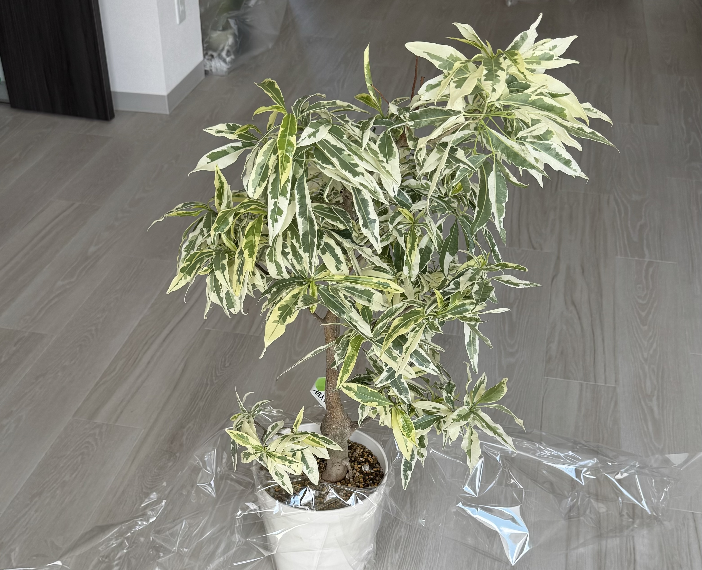

初めて買った高級めな植物で、今でも我が家の中で最も高級な植物。のはず。シマムラ園芸で購入。
昨年の冬は見るも無惨なほどに落葉してしまったけど、夏ごろ、また葉が吹いてくれた。

いまはまた冬なのでちょいちょい落葉している。多分年末年始に函館に帰省したタイミングで、室温がグッと下がる見込みなので、がっつり落葉すると思われる。

### アングレカムディスティカム

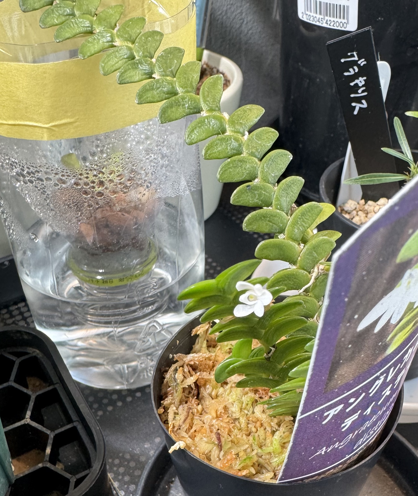

洋ランの一種。葉っぱを見てるだけでも可愛いし、気が向いたら花も咲かせてくれる。
サンシャインシティ世界のらん展2025で、ナーセリーイデさんから購入。

### ドリナリア リギデュラ

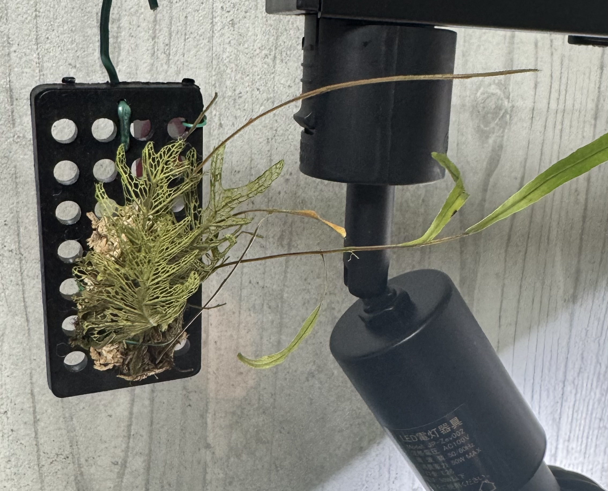

着生シダの一種らしい。枯れ葉のような部分と、細長い茎的な部分の2パートがあり、ちょっとかわってる。
板付だと乾かしすぎてアレだったので、今は鉢に植えた状態でつるしている。
サンシャインシティ世界のらん展2025で、Tropical Exotiqueさんから購入。

これでドリナリアが好きになり、他の品種も買ってしまいました。

### アスパラガス プルモーサス ナナス

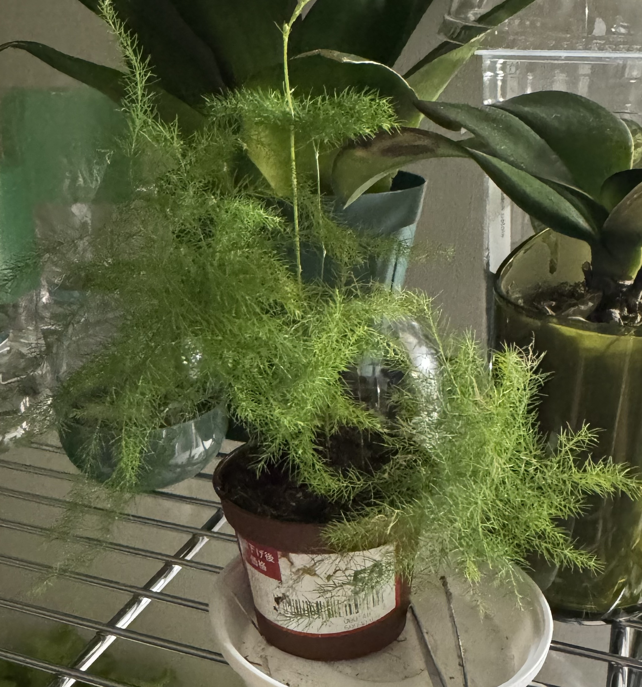

購入時はおつとめ品で、50円とかだった。カインズで購入。

### カンパニュラ ダークゲットミー

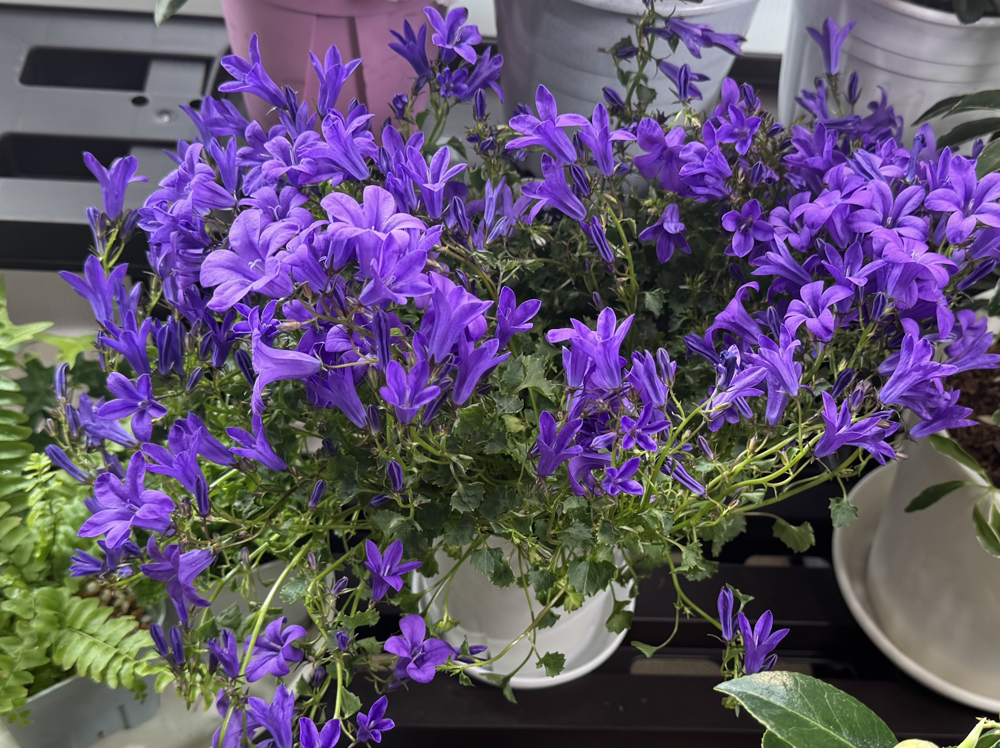

めっちゃ咲いてくれて、満足度が高かった。ジョイフルエーケーで購入。
枯れずに元気なので、またたくさん咲いてくれることに期待している。

### ネメシア グッピー

こちらもめっちゃ咲いてくれて満足度が高かった。香りも良い。
ジョイフルエーケーで購入し、こちらもまたたくさん咲いてほしい。

### カーネーション ピンクアンドプラウド

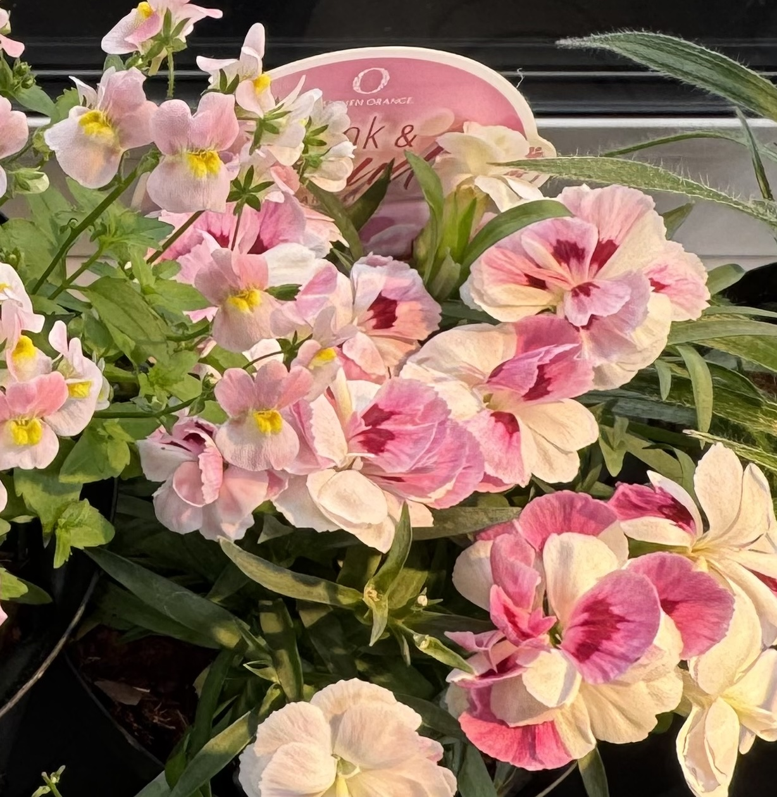

カーネーション、と言いつつ花は小さめ。
花の色がかわっていて、濃いピンクと薄いピンクが入り交じった花を咲かせる。
割と最近の品種っぽい。
百合が原公園ガーデンショップで購入した。

### サニーレタス(のタネ)

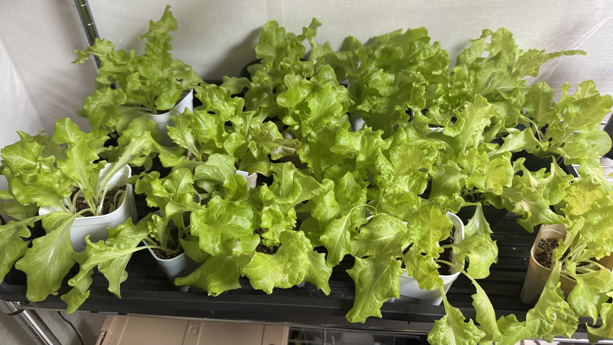

2024年末くらいからサニーレタスを実生で育てた。多分ジョイフルエーケーで購入。
室内にサニーレタス栽培エリアがあると、葉物野菜をいつでも摂取できるという点がものすごく良い。
もちろんスーパーとかでサニーレタスを買ってくることもできるけど、近年は野菜が高いし、何より葉物野菜は日持ちしないので。。。

全盛期は、取っても取っても食べきれないくらいだった。

### モンステラ デリシオーサ 'タウエリー'(のタネ)

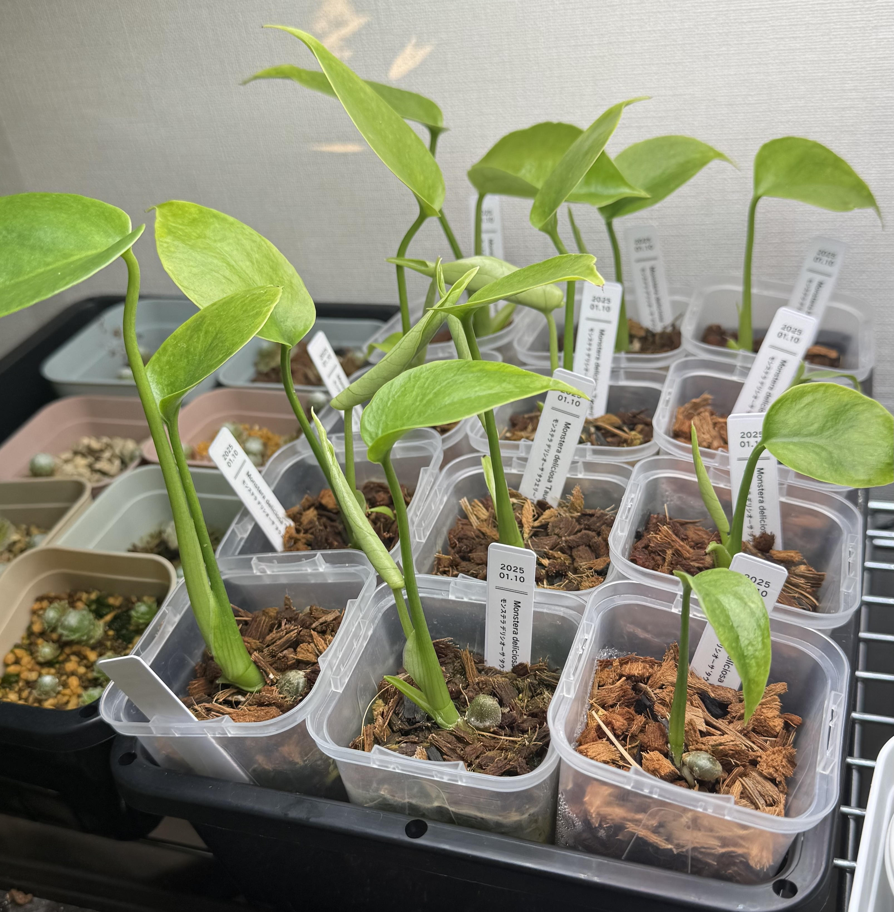

モンステラの矮性品種。発根済みの状態で購入したので、ほぼ100%発芽して元気に育っている。
適当なところで何株かはフリマサイトで売ろうかと思っていたけど、それなりに伸びてきてしまったので、発送などを考えると面倒だな、という感じにはなっていて、困った。
SEEDSTOCKから購入。

# 料理

## 調理機材・キッチン用品

* [東芝 石窯ドームER-YD5000](https://www.toshiba-lifestyle.com/jp/microwaves/er-yd5000/)
  * 最高で350℃まででるオーブンレンジ。オーブン料理が好きなので、オーブンはよく使うが、350℃は連続で出せないので、意外と使わない。
* [ブリキパイ皿](https://tomiz.com/item/00686400)
  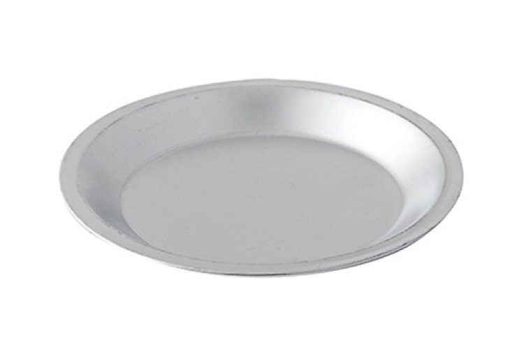
  * オーブン対応のバットでも良いんだけど、ブリキのパイ皿は安いので、雑に使いやすくてオススメ。バット代わりにしてもいいし、適当にものを乗せてオーブンに突っ込んでも良い。パイを焼くのに使ったことはないです。
* [ソメイエ 砥石台](https://amzn.to/49TVCxe)
  * 正直皆さんがどれくらい「包丁を砥石で研ぐ」ということをやっているのかわからないのですが、研いでいる人は買った方が良いです。
    砥石がずれなくて大変研ぎやすいし、蛇口から水をそのままかけられるし、何より調理台が汚れなくて良いです。別にメーカーはコレじゃなくても良いと思うけど。
* [CB Japan解凍プレート](https://www.biccamera.com/bc/item/13384077/)
  * 冷凍してある肉その他を爆速で解凍できる板。マジでシュッと溶けるのですごい。
* [wakiyaku シリコン ゴムべら(小)](https://amzn.to/4ovGeKS)
  * 良くあるようで意外と売っていない小型のゴムべら。辛子マヨの様なものを作るときとか、普通のゴムべらじゃでかすぎるんですが、小型のものがあると非常に便利です。もう一本欲しい。
* [HARIO 漬物グラス](https://amzn.to/4ryPfpl)
  * 適当な野菜を冷蔵庫で適当に漬けるのに便利。フタ以外はすべて食洗機に入れてOKなのも助かる。
* [Microplane おろし器](https://amzn.to/3XQUPGd)
  * 定番商品ではありますが。[コストコで買った個包装のパルミジャーノレッジャーノ](https://costcotuu.com/20180531/post_102019.html)をコレで削ると大変に良いです。
* [売ってる食パンに限りなく近い理想の食パン型1斤](https://amzn.to/3Xtx9r9)
  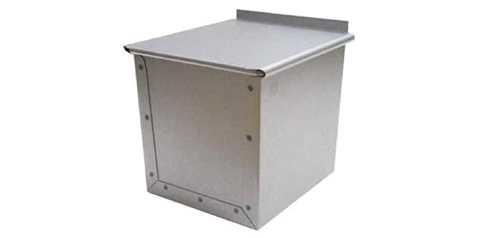
  * 名前の通りの食パン型。だいたい1斤の食パン型、断面積(?)が市販の食パンより小さい直方体型をしている。なんで？この型は本当にその辺で売っている食パンとだいたい同じサイズ・形の型なので、家庭で使うのにちょうど良い。シリコン加工タイプもあるらしいので、店頭に行ける人や、通販在庫があるタイミングならそっちの方が便利かもしれない。
* [ニトリ 洗えるレバーキャニスター (L 2500)](https://www.nitori-net.jp/ec/product/8931106s/)
  * 市販の食パン1斤がぴったり入る。市販の食パンは別にキャニスターに入れなくても良いと思うけど、自分で焼いたら袋には入っていないので(当然であるが)、ぴったり収納しておけるのは便利。最初はジップ付きの袋に入れていたけど、ごちゃごちゃするし、入れたり出したりしづらいので。価格もお手頃。
* [キッチンエイド アルチザン スタンドミキサー](https://www.costco.co.jp/c/KitchenAid-Artisan-Stand-Mixer-48L/p/38700)
  * 今年は結構パンを焼いたので、途中でこねるのが辛くて購入。最高なんだけど、置く場所がないので出したりしまったりする必要があり大変。世のみんなはコレをどこに置いてるの？
* [marna ウォーターピッチャー 1L](https://amzn.to/3KH2DqO)
  * 1L、口を開けたり閉めたりとかの機能が無いシンプルなウォーターピッチャー。お茶のパックとかってだいたい1Lで分量が書いてあるのに、世の中のピッチャー/お茶ポットってだいたい訳の分からんサイズじゃ無い？なんでなの？
* [山崎実業 シリコーン菜箸トング](https://amzn.to/4pbMOrc)
  * パスタをソースと和えたりする時に、デカピンセットとかを使うと便利なんだけど、テフロン加工のフライパンとかでは使いづらい。そんなときに便利な、シリコン加工デカピンセット的なトング。コレを買ってから普通のタイプのトングは使わなくなった。
* [エリエール キレキラ! キッチンクリーナー](https://amzn.to/4pz9VfL)
  * キッチン清掃用のウェットティッシュ。油でギトギトになったガスコンロとかも簡単にきれいになって、使った後は捨てることができるので便利。
* [GreenPan Mini](https://www.amazon.com/dp/B08CJBDV72)
  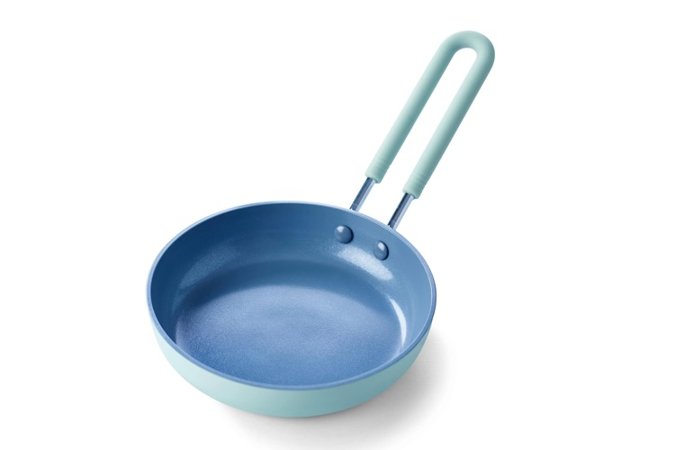
  * 同じものを使用していたけど、コーティングがダメになってきていたので購入。国内ではもう手に入らなさそうだったので、やむを得ずamazon.comから入手。次回以降のために複数購入しておいた。

## 食品

* [森永のれん乳味ホットケーキミックス](https://www.morinaga.co.jp/company/newsrelease/detail.php?no=2786)
  * 期間限定だったのが惜しい。
* [リグォーリ パッケリ](https://www.kaldi.co.jp/ec/pro/disp/1/8008912012090)

  * ゆで時間が結構かかるけど、モチモチとした食感で美味しい。
* [無印良品 焙煎スパイスのごろり牛肉カレー](https://www.muji.com/jp/ja/store/cmdty/detail/4550584464690)
  * レトルトカレーとしては高価だけれど、レトルトカレーではないといわれても信じちゃいそうな味。
* [ふるさと納税 山梨県北杜市 大玉西洋梨](https://www.satofull.jp/products/detail.php?product_id=1347672)
  * 一人で消費するのはちょっと大変な量ではあるんだけど、そのまま食べてよし、製菓に使ってよしの大変美味しい洋梨でした。
* [ふるさと納税 鹿児島県南九州市 味なとり レア炭火焼き](https://www.satofull.jp/products/detail.php?product_id=3019792)

# 日用品

* [タオル研究所 フェイスタオル 10枚セット](https://amzn.to/3K79NEM)
  * 手洗い後に手を拭くタオルとして使っている。10枚あると、洗濯を多少サボっていてもさっと交換できるので便利。
* [タオル研究所 エクストラバスタオル 2枚セット](https://amzn.to/4awMQoZ)
  * 世の中ではフェイスタオルみたいな小さいタオルをバスタオル代わりに使うというのが流行っているらしいという噂も聞くけど、バスタオルなんてでかければでかい方が良いでしょ、と思っている。これは世のデカ目のバスタオルより更にでかい。
* [cado baton](https://cado.com/pages/baton_lp_001)
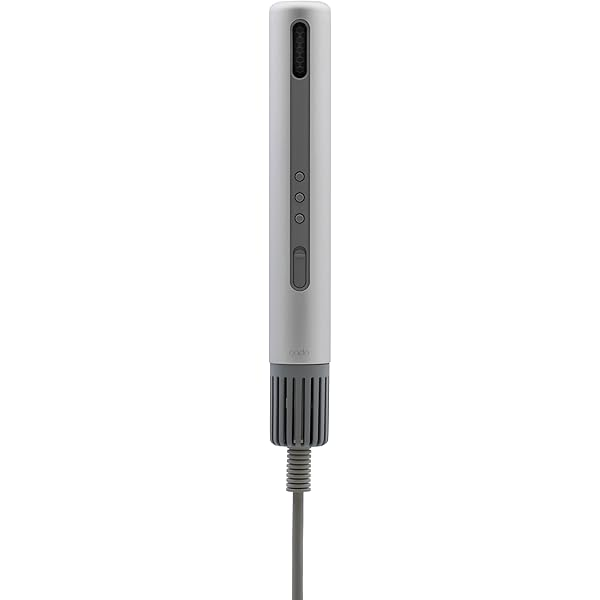
  * 世にも珍しき(?)棒状のヘアドライヤー。まぁまぁいい値段はするんだけど、ドライヤーなんてそんなに買い替えるモノでもないので、奮発した。マイナスイオンがどうとかとは言うけど、その辺りは正直どうでも良くて、持っている部分から自分に向けて筒が伸びていない、というのがすごくいい。ドライヤーは頭から20cm離した方がいい、らしいんだけど、普通の形のドライヤーの送風口を頭から20cm離そうと思うと持ち手部分は結構遠くに持っていく必要があって腕がしんどかった。その点この形状だと、20cmといったら20cm離せば良いので、非常に楽。[ヘアアイロンケース](https://amzn.to/4prDu2s)に挿しておくことで収納もスッキリして取り出しやすいのでとても良いです。
* [ネピア からだ想いのトイレットロール ４枚重ね](https://amzn.to/48KnXF7)
  * 脅威の4枚重ねトイレットペーパー。ウォシュレット直後でも破れる心配が皆無です。お値段はまぁ高いっちゃ高いんだけど、男性一人暮らしで使うトイレットペーパーの量なんてたかが知れているし、誤差かな、というところ。肌触りも大変良く、Amazonでセール対象になっていることもあるし、その辺のドラッグストアでも意外と売っていて入手性も高い。一度お試しあれ。
* [Bambu Lab A1](https://amzn.to/4atVyEz)
  * 実際ちゃんと使うかな〜どうかな〜と思いながら買った3Dプリンタ。使ってます。鉢皿を刷ったり、良い感じの収納ボックスを刷ったり、ふと必要になったS字フックを刷ったり。なんやかんやと便利ですね。
* [Bambu Lab マット PLA チャコール スプール無し](https://amzn.to/4rF1rFe)
  * 一番使っているフィラメントはこの、Bambu Lab公式のマットPLA黒。Bambu Labのフィラメントはスプールなしでの販売があって、使い終わったリユーザブルスプールを再利用できるという設計。そうするとお値段もお安くて、セールの時だと2000円を切る位で、まぁ最安値クラスと要っても良さそうな値段で買うことができます。
* [MATECH MagOn Ultra Slim 5000](https://amzn.to/3KECgSr)
  * とにかく薄いMagSafe対応モバイルバッテリー。正直MagSafeで使っていると発熱するし、充電速度もさほどではないけれど、それを補って余りある薄さ。使用しながらそのままジーパンのポケットに入れることだってできちゃう。
* [サンプラテック ポリプロピレン手付きビーカー 3L](https://amzn.to/4pJ2iCN)
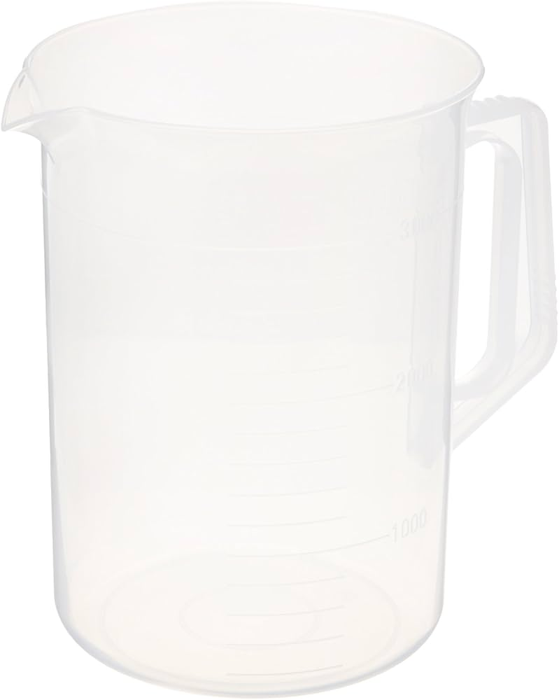
  * ポリプロピレン製のでかビーカー。加湿器に水を補充するときなど、家の中でそれなりの量の水を持ち運ぶ必要があるときに便利。
* [SwitchBot CO2センサー](https://amzn.to/4oD8oE7)
  * みんな大好き(?)SwitchBotのCO2センサー。Bluetooth/HTTP API経由で気軽にデータが取れるCO2センサーは多分これだけじゃないかと思う。
* [エアバングル](https://airbangle.com/products_cate/all/)
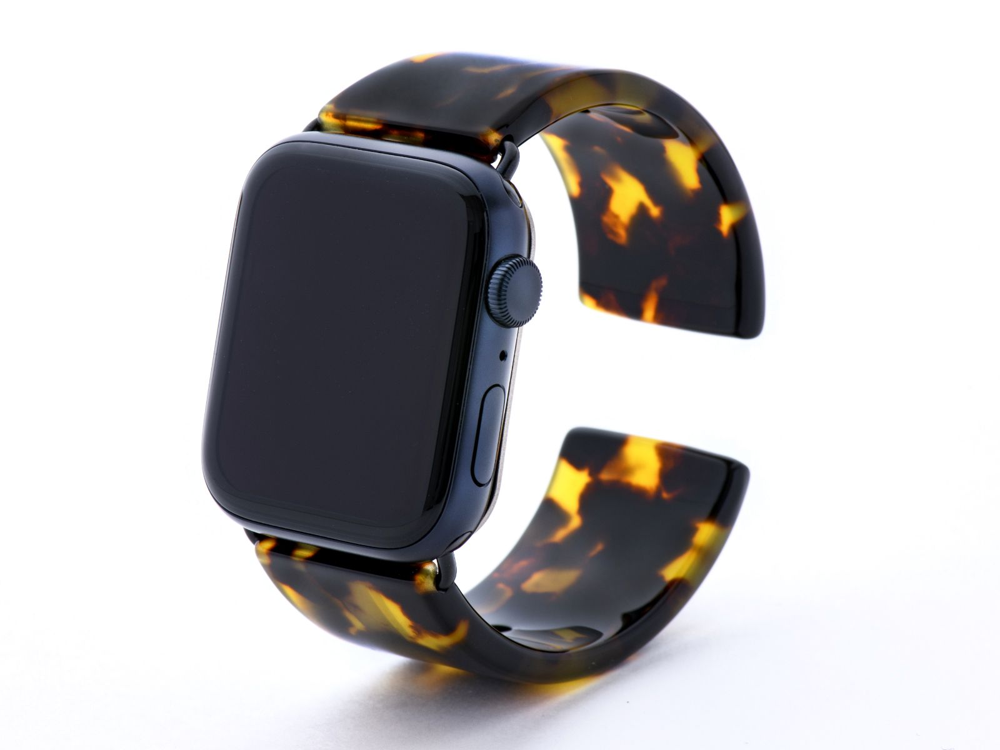
  * バングルタイプのApple watchバンド(バンド?)。これも他では見たことがないタイプで、とても気に入っている。最初はべっこうの奴を買って使っていたんだけど、腕につけると案外べっ甲柄が分からないな〜、と思っていたところ、[より明るいタイプ](https://airbangle.com/products/classic/)がでたのでもう一本買った。新しい色が出る度に欲しくなる程度にはお気に入り。

# 音楽

* [XVIVE U4 インイヤーモニター ワイヤレスシステム](https://amzn.to/3McTjvo)
  * [今年は初めてボーカルをやった](/tech-rock-festival-2025-11-22/)ので、新機材として購入。楽器隊の音で自分の声が聞こえなくなるので、初心者ほどあると助かると思います。
* [BOSS GT-1000 CORE](https://www.soundhouse.co.jp/products/detail/item/283458/?srsltid=AfmBOorGb9_z7bICjgI3XVIiWf06W9LfMl_g5Aru8QmxCpO78227gLdd)
  * メルカリで買った。いい値段はするんだけど、良いです。
* [CASIO DIMENSION TRIPPER](https://www.casio.com/jp/dimensiontripper/)
  * クラウドファンディングで購入した、激尖り機材。[2024年の本番](/tech-rock-festival-2024-09/)で使った。
  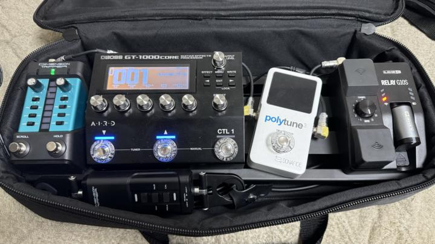
* [ROCKBOARD by Warwick エフェクターボード RBO B 2.1 DUO](https://amzn.to/4plWRdo)
* [HERCULES ストラップ＆ヘッドホンホルダー HA700](https://amzn.to/3KwJLuw)
  * ギタースタンドにギターを置いたとき、ストラップがたれるのが微妙で購入。
* [Lomicall 三脚](https://amzn.to/48l7Eyx)
* [Lomicall タブレット ホルダー](https://amzn.to/4pRVlj6)
* [LEKATO ページターナー](https://amzn.to/3YdC13L)
  * iPad Proで楽譜を表示して、ページターナーで譜めくりをして、iPad miniでエフェクターの設定をいじる、という構成。
* [CME WIDI ジャック](https://amzn.to/4rDK7Aa)
  * Bluetoothに対応していないMIDI DeviceをBluetooth経由で操作するためのインターフェース。GT-1000用のアプリでGT-1000coreの設定をいじることができるようになり、捗ります。
* [高級アルトベンリ](https://www.soundhouse.co.jp/products/detail/item/258879/)
  * アルトベンリは安いものが多いですが、安物とは違いますね。
* [KORG KDM-3](https://www.korg.com/jp/products/tuners/kdm_3/)
  * アナログメトロノームっぽい形をしたデジタルメトロノーム。メトロノームなんていまどきスマホでも鳴らせるけど、具体物としてボタンやらなんやらがついているほうがやはり使いやすい。これまでは[YAMAHA TDM-70](https://jp.yamaha.com/products/musical_instruments/winds/accessories/tuners/tdm-70/index.html)を使っていたけど、流石に古すぎてスピーカーの調子が悪くなってきていたので買い替えることにしました。ヤマハの後継機でも良かったんだけど、現行機種のデザインがなんとなく好きになれなかったのでKORGのこちらを購入。結果満足です。

# 書籍

主にコミック。小説とか雑誌も買って読んではいるけど、まぁ、紹介はしなくても良いかな。

* [フードコートで、また明日。](https://amzn.to/44MVZpM)
* [Artiste](https://amzn.to/4pKGg2A)
* [波よ聞いてくれ](https://amzn.to/48OPCEM)
* [ひまてん！](https://amzn.to/3XzDC3N)
* [その時の彼女が今の妻です](https://amzn.to/3KudoN2)
* [もやしもん＋](https://amzn.to/4pJrWaB)
* [志乃と恋](https://amzn.to/4pf72Af)
* [好都合セミフレンド](https://amzn.to/48NAEPr)
* [パリピ孔明](https://amzn.to/4pP89H0)
* [永世乙女の戦い方](https://amzn.to/4iyWFom)
* [宇崎ちゃんは遊びたい！](https://amzn.to/4phFJVZ)
* [宙に参る](https://amzn.to/3KHhJwz)
* [不器用な先輩。](https://amzn.to/48OJyfA)
* [ルリドラゴン](https://amzn.to/3XwvBN9)
* [幼女戦記](https://amzn.to/3MjlfO8)
* [ドカ食いダイスキ！ もちづきさん](https://amzn.to/4pOy95h)
* [ヤンキー君と科学ごはん](https://amzn.to/4pilbwF)
* [鹿楓堂よついろ日和](https://amzn.to/48RrelW)
* [めんつゆひとり飯](https://amzn.to/4izTfBQ)
* [埼玉の女子高生ってどう思いますか？](https://amzn.to/4awwtsD)
* [のあ先輩はともだち。](https://amzn.to/44DhPMq)
* [うちの会社の小さい先輩の話](https://amzn.to/48AAWbm)
* [イケメン彼女とヒロインな俺!?](https://amzn.to/48QXKon)
* [ｍｏｎｏ](https://amzn.to/3MmRUlS)
* [尾守つみきと奇日常。](https://amzn.to/4rHLJcs)
* [弱虫ペダル](https://amzn.to/4ozIktl)
