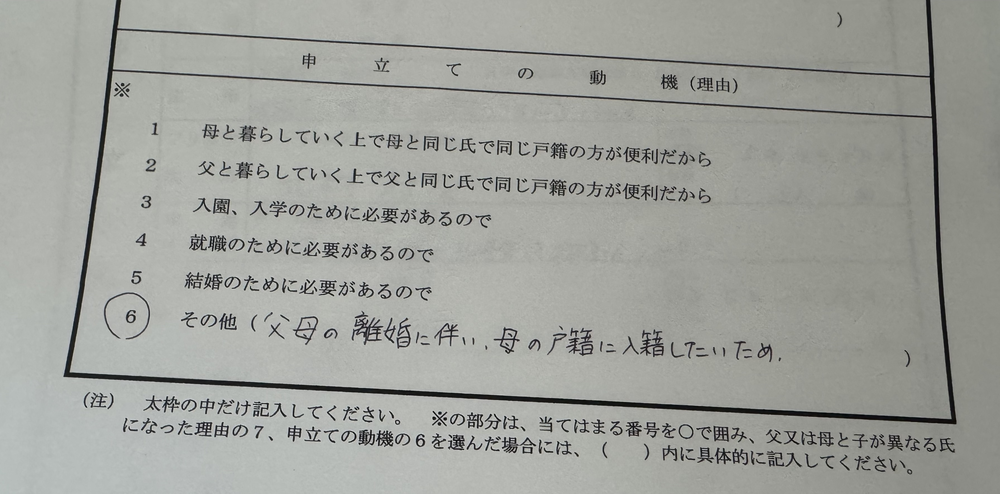
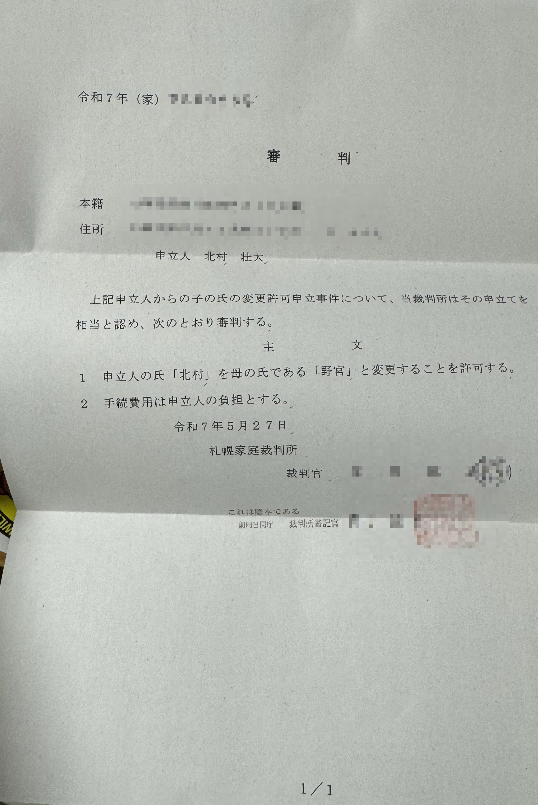

社内を含めて、私のことを実名で呼ぶ人は片手で数えられる程度しかいないので、実際問題として影響はほぼないのですが、6月2日付けで苗字が変わりました。

なお、結婚ではありません

多分ほとんどの人がやったことがない/やることがない手続きなので、ネタとして記録しておきます。

## 経緯

というほど経緯は特にないのですが。

* 両親が離婚した
* 父方の親戚とは疎遠/あまり関わりたくない
* 母方の親戚とは仲が良い
* 結婚したとしても(一般に)男性側の姓に揃えることが多そうなので、自分の姓を変更する、という機会の発生率が低そう
  * そもそも結婚の予定はない
* 結婚/離婚を伴わない改姓の手続きをやったことがある人は少なそう
  * 多少調べたけど、あんまり個人のブログ記事とかでの情報は無い
  * ブログネタとして面白そう
* 母方の氏の方が珍しい
  * 珍しい名字の方が強い(?)
* 実生活で苗字で呼ばれることはほぼないので影響が少なそう
  面白半分でやってもまぁ大した問題はない

ということで改姓に至りました。

## 手続き

改姓の手続きは大きく分けて2ステップで、まず家庭裁判所の許可を得て、その後住んでいる場所の市区町村役場で手続きをする、という形です。

家庭裁判所からの許可は、[子の氏の変更許可](https://www.courts.go.jp/saiban/syurui/syurui_kazi/kazi_06_07/index.html)から書式をダウンロードして、記入して、収入印紙、返信用切手、戸籍謄本と併せて住所地の家庭裁判所(私の場合は札幌地方・家庭裁判所)に送るだけです。
概ね悩まずに記入できるとは思いますが、「申し立ての動機」だけちょっと悩みました。が、結果としては大した理由は必要無くて、「父母の離婚に伴い、母の戸籍に入籍したいため」で十分でした。

氏の変更手続き、とは言うものの、氏は戸籍に紐付いたラベルの様なものであるため、氏を変更する==父の戸籍から抜けて、母の戸籍に入るor自分の戸籍を別途立てる、という形になるようでした。

一度自分の戸籍に分けてしまうと、母の戸籍に入ることはできないようで、私はどっちでも良いな、と思ったため、後で選択がきく、母の戸籍に入る、を選択しました。

家庭裁判所に送る戸籍謄本はは、自分の戸籍謄本と父母の戸籍謄本と記載がありますが、父の戸籍に入っている状態では、自分の戸籍謄本(全部事項証明書)に父の情報も入っているため、父に別途戸籍謄本を取ってもらう必要はありませんでした。

また、兄弟姉妹まとめて手続きをする場合、兄弟姉妹の情報も入っているため、複数戸籍謄本を取る必要はありませんでした。

つまり、まとめると、
* 子の氏の変更許可申立書 x 1
  * 変更をしたい人数 x 800円の収入印紙を貼る
* 自分の戸籍謄本(全部事項証明書) x 1
* 母の戸籍謄本(全部事項証明書) x 1
* 返信用郵便切手 変更をしたい人数 x 封筒の切手代

を封筒に入れて家庭裁判所に送れば良い、です。

問題が無ければ(私は妹の前科前歴がない、の記入漏れがあったため電話が来た)、2〜3日で許可するよ〜というお手紙が届きます。

そのお手紙を持って市区町村役場(私の場合は札幌市東区役所)の戸籍関連手続きをする窓口に行けばシュッと手続きしてくれます。
そんなに回数こなす手続きでもなさそうなのに、スムーズに対応してくれました。

場合により戸籍情報の更新に少し時間がかかるらしく、1週間以上経ってからマイナンバーカードの上書きをしにきてね、ということだったので、翌週もう一度区役所に行きました。

## その他変更の手続き

結婚した人がよく言っていることでもありますが、氏が変わると当然クレジットカードなどの名義変更も必要です。
これが面倒だよ！ということだったのですが、マイナンバーパワーなのか、単に時代が良くなっているだけなのか、web/アプリで完結するものも多く、思ったよりは面倒では無いな、という印象でした。

一部住民票等を求められるものもありましたが、片手で数えることができる程度でしたし、住民票はコンビニで発行することもできるので、まとめて印刷して、封筒に入れて、まとめて送るという感じで、それほど手間ではありませんでした。

免許証の変更手続きも、警察署に行かなければならないのは若干面倒ではあるものの、窓口でほとんどの情報を印刷した書類を発行して、わずかな部分をちょちょいと記入して提出するだけでした。

便利な世の中になったものですね。
