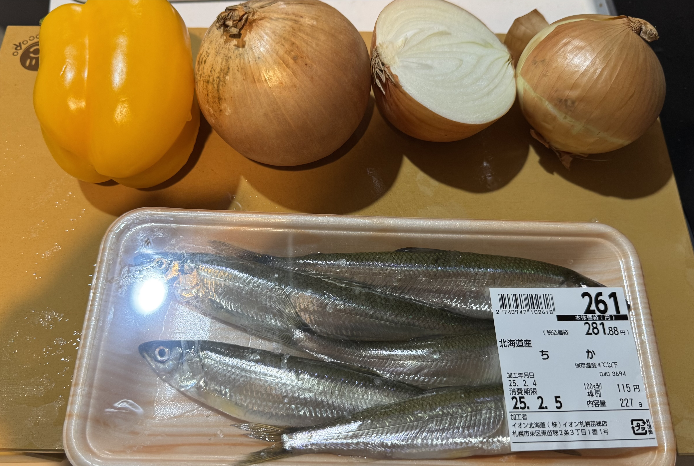
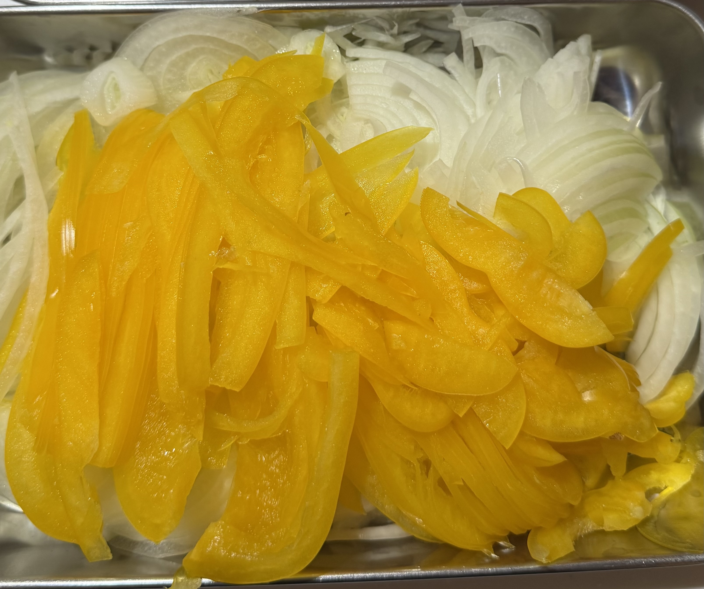
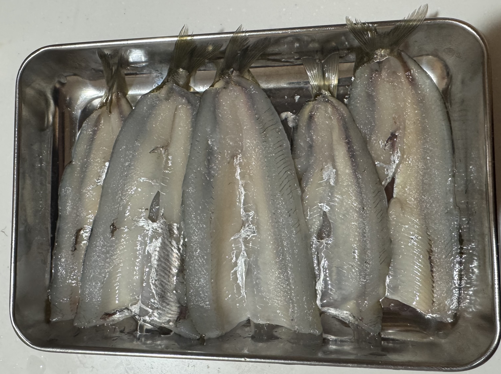
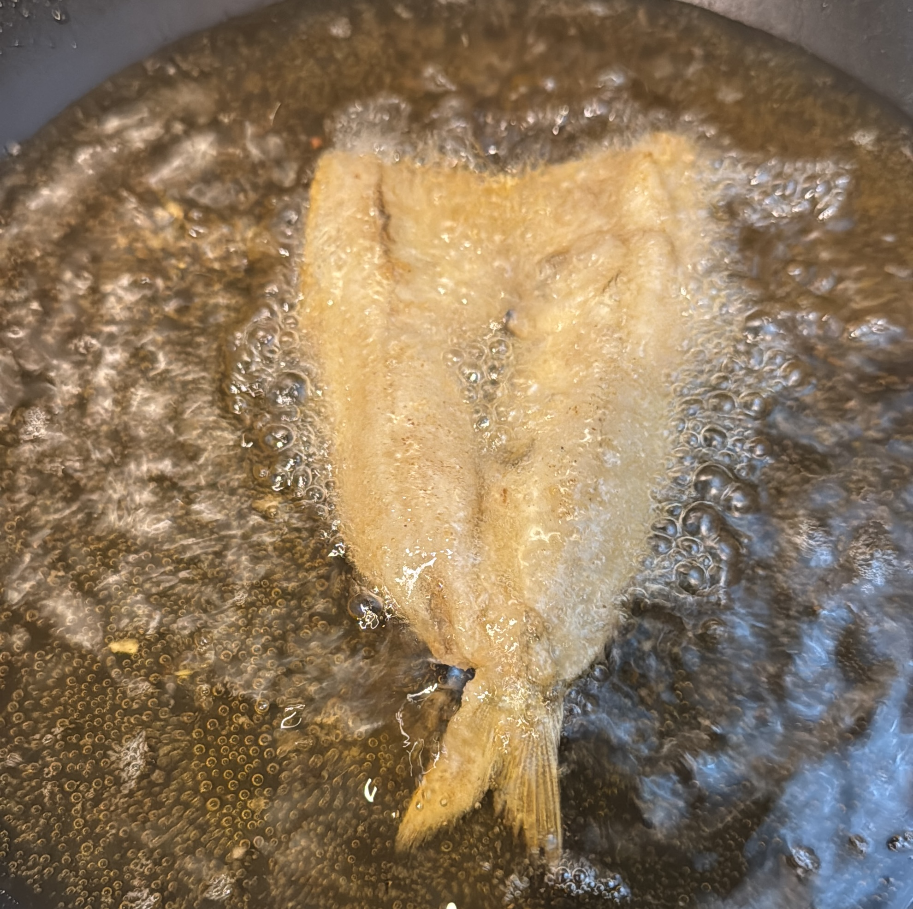
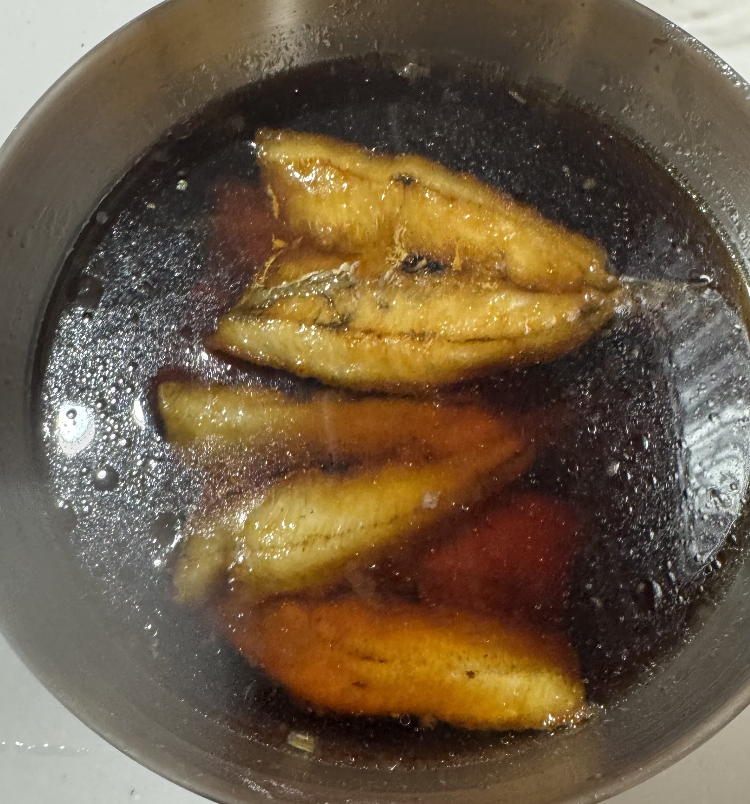
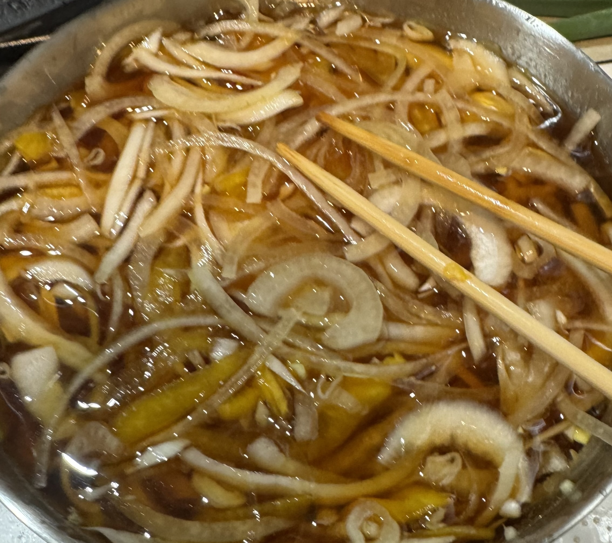
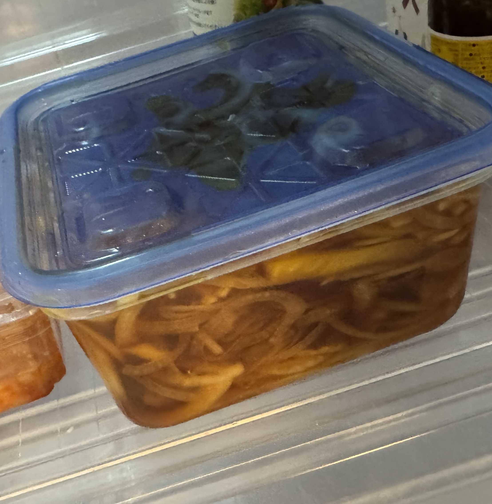

この季節一番美味い魚といえば、そう、チカですね。私はチカを見たら買わないではいられないという奇病にかかっているため、今シーズンは既に3〜4回購入しています。

チカはワカサギを少し大きくしたような小型の魚で、今時期は比較的大型のものが安価に販売されています。
[Wikipedia](https://ja.wikipedia.org/wiki/%E3%83%81%E3%82%AB)によるとチカは20cmほどに育つ、ということですが、今回買ったチカはおおよそ全長13cm程度でした。

当然(?)チカは南蛮漬けにしていきます。

材料はこちら:

チカ、玉ねぎ、などです。今回は彩りに玉ねぎを入れました。パプリカは高いので、玉ねぎのみとすると経済的です。
我が家では地獄の様な量の玉ねぎを入れます。
今時期の札幌で販売されている玉ねぎは大変大きく、写真では玉ねぎ2.5個が映っていますが、実際のところ流石に多いな、と思ったので1つ減らしましたが、それでもかなりの量です。

また、漬け地として、
* 酢 1cup
* 砂糖 大さじ6
* 醤油 大さじ8
* 出汁 2cup
* 唐辛子小口切り 適量
を混ぜておきます。野菜の量を抑えれば半分でも良いです。
また、私は出汁パックをつかって出汁を引きますが、面倒であれば出汁の素を湯で溶いたものを使用しても良いと思います。
その場合、出汁の素は塩や砂糖が含まれている場合が多いと思いますので、適宜醤油や砂糖の量は調節してください。
面倒であれば気にしなくても誤差だとは思います。

まずは野菜をスライスしていきます。以下は前回作ったときの玉ねぎスライス動画です:

この時は小ぶりな玉ねぎだったので、10個ほど投入した気がします。

野菜スライスのコツは、包丁を十分に研いでおく、という点にあると思います。前の日までに研いでおいてください。

次にチカの処理をします。
流石にこのサイズになると[以前やったように](/tika-no-nanbanduke/)単に揚げてはい終わり、というわけにはいかず、うろこを取り、頭を取り、背から開いてワタと背骨を取ります。
Youtubeで調べると解説されている動画もあるので参考にすると良いと思います。
やはりコツは包丁をよく研いでおくということです。

あとの手順は小さいチカやワカサギで南蛮漬けを作るのと同様です。

片栗粉をつけて揚げて:

漬け地に突っ込んで:

野菜も入れて:

適当な容器に入れて一晩冷蔵庫で寝かせます:

この量だと、一人だと2~3日はこれを食べ続けることになります。ご注意ください。
