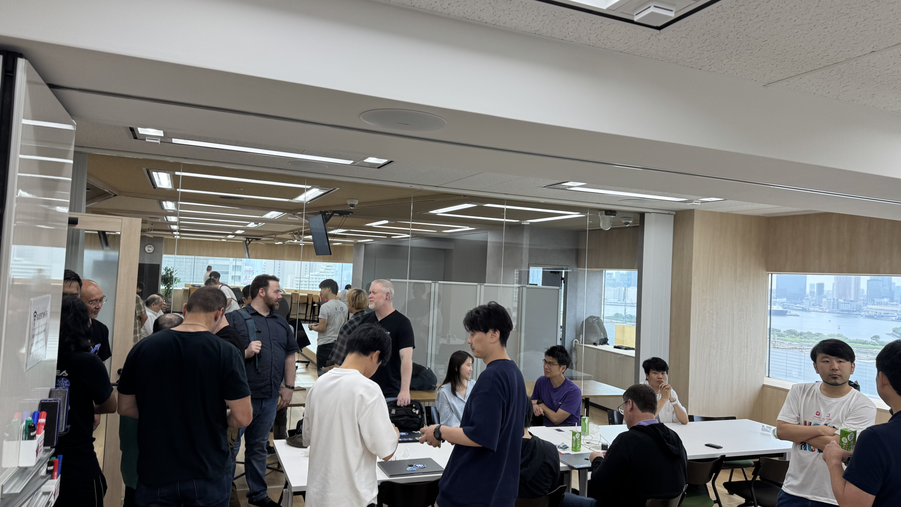
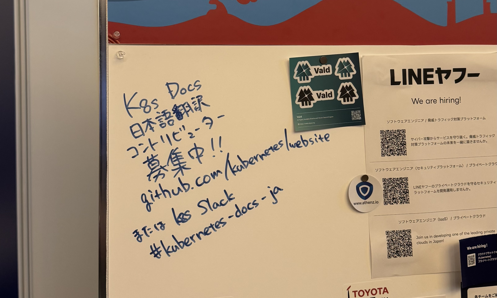

2025年6月17日/18日に開催された[KubeCon + CloudNativeCon Japan 2025](https://events.linuxfoundation.org/kubecon-cloudnativecon-japan/)に参加してきました。
また、その前日16日にCo-located Eventとして[Japan Community Day](https://events.linuxfoundation.org/kubecon-cloudnativecon-japan/features-add-ons/co-located-events/#japan-community-day)の一部としてDoc Sprintというイベントを実施しました。

KubeConは[Kubernetes](https://kubernetes.io)のイベントで、Cloud Native Computing Foundation (CNCF)が主催しています。
日本での開催は初めてということで、コミュニティからの期待も大きかったのですが、結果としては大盛況で、1500枚のチケットが完売だったということです。

## Doc Sprint

本祭の前日に、Co-located eventという形で、会場の近く、NTT DOCOMO Open Lab in OdaibaでJapan Community Dayが開催されました。
Japan Community Dayでは、いくつかのセッションがあったほか、Kubernetes Upstream TrainingとDoc Sprintを開催しました。

Doc SprintはKubernetesのドキュメント(の、特に日本語翻訳)にコントリビュートしよう！というイベントで、私や、[@junya__okabe](https://x.com/junya__okabe)がKubernetes SIG Docs日本語localizationチームapproverとして初めてのコントリビュートをサポートするという企画でした。

当日はめちゃ簡単good-first-issueを用意することに成功したのもあって、実際に4人のnew contributorが誕生しました。

景色も大変良く、大変良い会場でした。

## KubeCon本祭

本祭は概ね廊下をうろうろして知り合いと話したり、ブースを冷やかしたりしていました。
ヘイシャもプラチナスポンサーということで、なかなか大きなブースを出していました:

Job boardもあり、ペンが置いてあったので、コントリビューター募集のメッセージを書いておきました("Job"ではないけど・・・):

あんまりたくさんのセッションは聴かなかったのですが、一番面白かったのは初日の最後のコマに発表のあった、[2-Node Kubernetes](https://kccncjpn2025.sched.com/event/1x716/2-node-kubernetes-a-reliable-and-compatible-solution-xin-zhang-guang-hu-microsoft?iframe=yes&w=100%&sidebar=yes&bg=no)というセッションでした。
要するに、HA構成K8sが3ノード以上必要なのはetcdが3ノード必要だからで、etcdは3台あっても1台までしか落とせないので、ならば(leader electionさえなんとかすれば)耐故障性は3ノードと変わらないし、edgeでコストを落とすこともできてハッピーじゃん、という話でした。

2日目の昼には、Kubernetes Upstream Training Japanの一員として、発表をすることもできました。
個人のプロポーザルは通らなかったんですけど、パネルディスカッションのプロポーザルが通って本当に良かった。

来年もKubeConを日本でも開催するということなので、なんとかプロポーザルが通るように頑張っていきたいですね。
