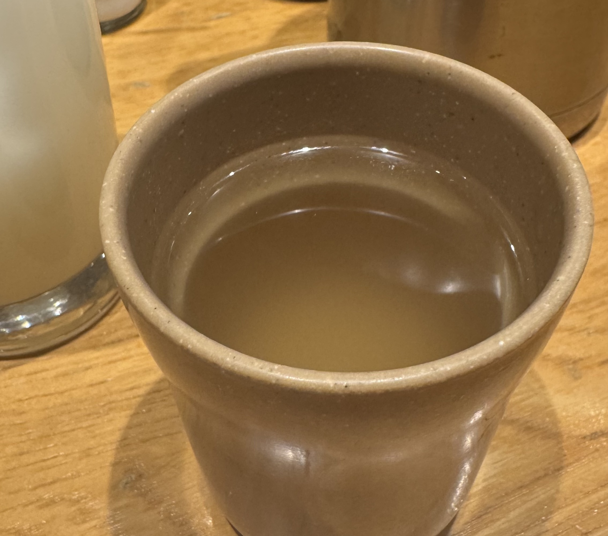
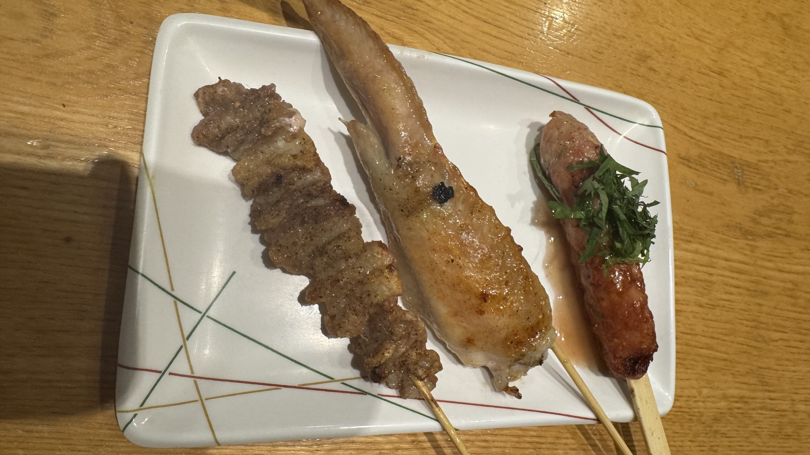
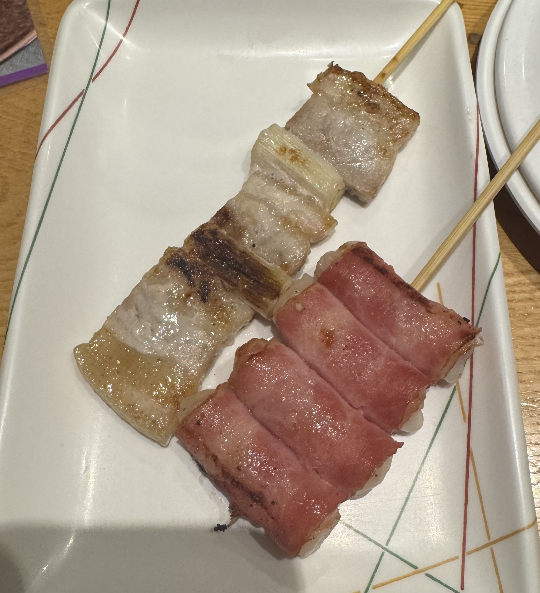
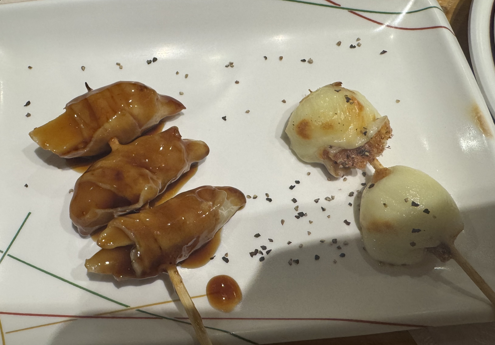
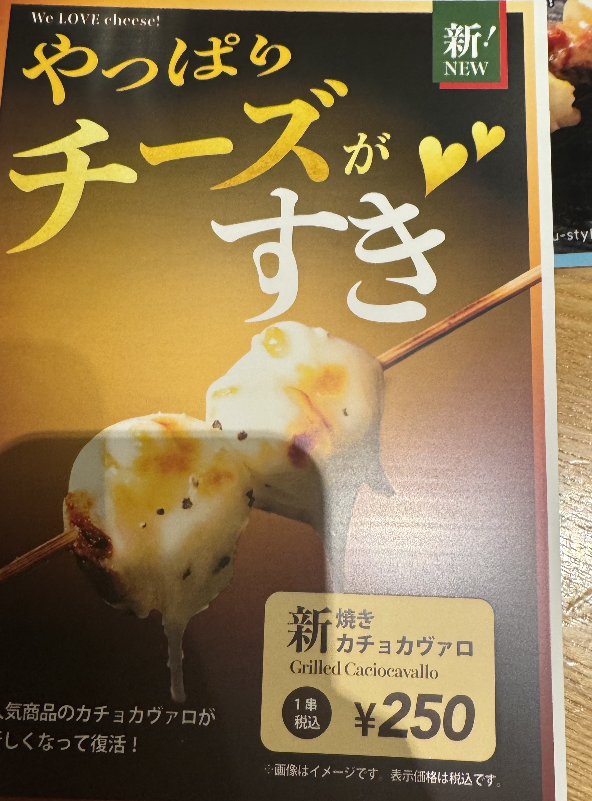
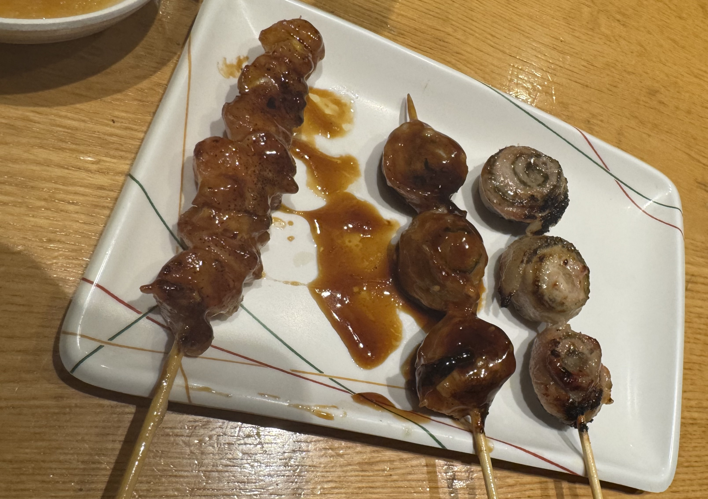
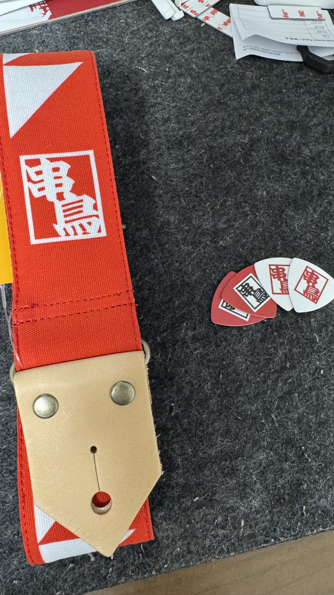

本記事は[吉祥寺.pmについての25個の小さな話、またはMagnolia.Kの雑記 Advent Calendar 2025](https://adventar.org/calendars/11865) 2日目の記事です。
昨日はKaitouさんの[大吉祥寺.pmのPCが入るサコッシュを勝手に作ったお知らせ #kichijojipm](https://kaitou.hatenadiary.com/entry/%E5%A4%A7%E5%90%89%E7%A5%A5%E5%AF%BApm2025_%E3%82%B5%E3%82%B3%E3%83%83%E3%82%B7%E3%83%A5)でした。
吉祥寺.pm、ロゴが可愛いのでサコッシュになっても映えますね。ちょっとほしいけどPCをサコッシュに入れて持って歩くことはなさそう・・・

扨、実は吉祥寺.pmは[昨年の大吉祥寺.pmに行った](/dai-kichijoji-pm/)だけで、通常の吉祥寺.pmに行ったことも無く、吉祥寺自体も大吉祥寺.pm以外に1回行ったことがあるかないか、というレベルなのですが、[吉祥寺.pm公式のX Post](https://x.com/kichijojipm/status/1987871600092610748)によれば、吉祥寺の美味しいもの情報でも可、ということなので、吉祥寺の美味しいものとして[串鳥](https://kushidori.com/)をご紹介いたします。



## 串鳥

串鳥は北海道札幌市に本社を置き、本日時点で北海道に31店舗、仙台に5店舗、そして吉祥寺に店舗のある焼き鳥チェーン店です。
なお、筆者は現在北海道札幌市在住で、前述の通り吉祥寺にはほとんど行ったことがないため、串鳥吉祥寺南口店にも行ったことがありません。
本記事中の写真は串鳥東区役所前店で撮影しました。

まさか誰も、吉祥寺.pmのアドベントカレンダーの2日目にして札幌の焼き鳥屋の話を書くとは思わなかろう。

[噂](https://maps.app.goo.gl/M9yKLssBvjC35ocA9)によれば、吉祥寺南口店は駅から武蔵野公会堂方面に出た時、駅前すぐにあるようです。

以下、串鳥で食べたものの写真を掲載します:

串鳥といえば鶏ガラスープ。これはサービスで出てくるもので、ポットで出てくるので好きなだけ飲めます。
写真を撮るのを忘れたのですが、お通しとしてこれとともに大根おろしが出てきます。

噂によると吉祥寺南口店では大根おろしが出てこないという話もあるので、一度確認しに行きたいところです。

ひな皮、手羽先、つくね(梅しそ)。
これは東区役所前店特有のやつだとおもうんですが、「店長のおまかせセット」なるものがあり、この日はそれが少し安いです、ということだったので頼みました。
もちベーコン、串鳥以外で見たことない気がする。

岩下の新生姜豚巻き、焼きカチョカヴァロ。
チーズが焼かれてるとなんか食べたくなりますよね。

ぽんぽち、豚味噌海苔巻き、豚しそ巻き。
豚を巻いた、豚味噌海苔巻きと豚しそ巻きも串鳥といえば、のメニューの一つですね。

鳥ももハニーマスタード、チキン南蛮。チキン南蛮はなんかフェアメニュー的なやつでした。

## コラボグッズ

最近、串鳥と[島村楽器](https://www.shimamura.co.jp/)のコラボアイテムが発売されまして、地元企業とのコラボグッズは嬉しいな〜など思いながら買いました:

改めて島村楽器のお知らせ一覧を眺めていると、ここ最近で九州乳業やら矢場とんやらとのコラボもやっているらしく、各地元企業がフィーチャーされるというのは良いことだな、と思います。

## 締めの一句

しってるか  
吉祥寺にも  
串鳥が
