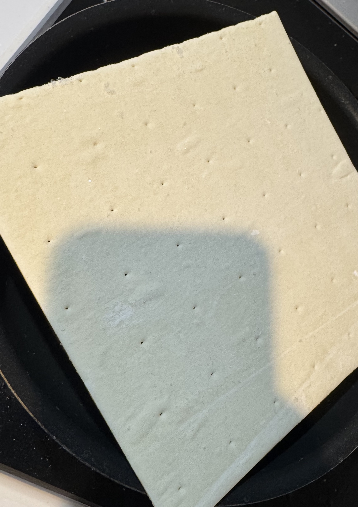
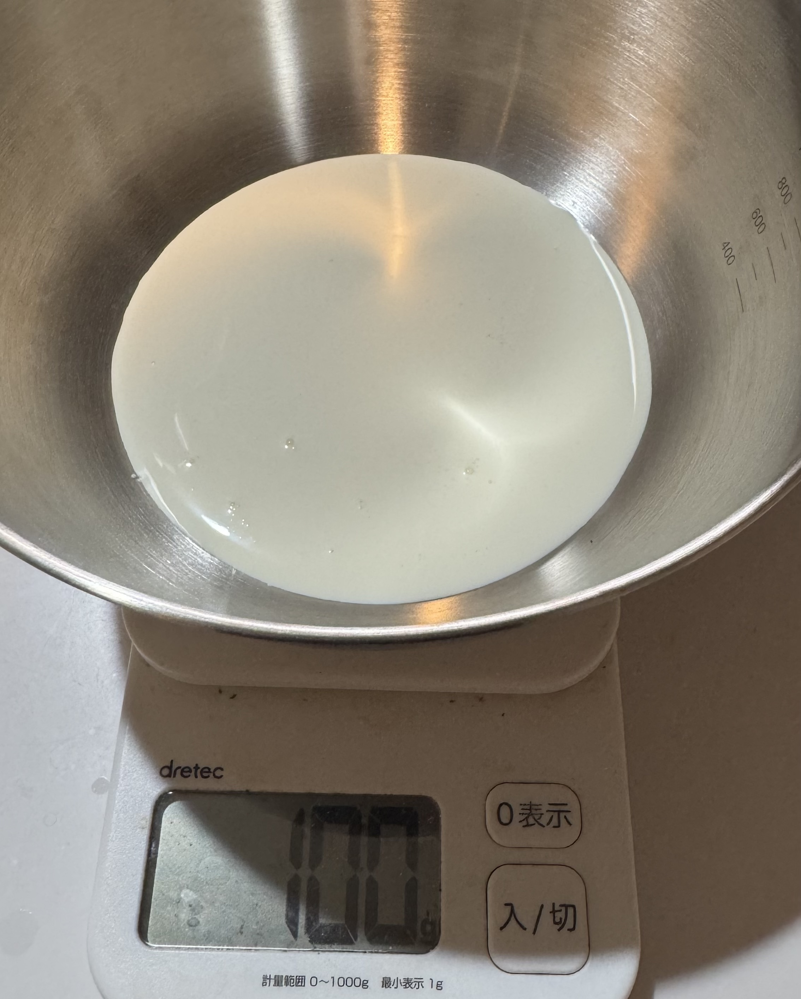
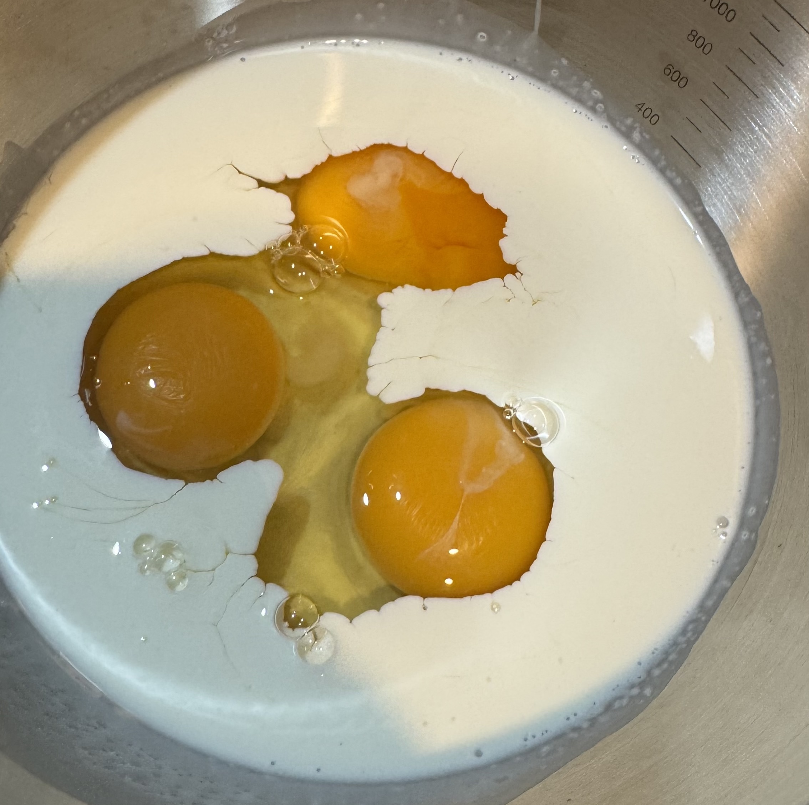
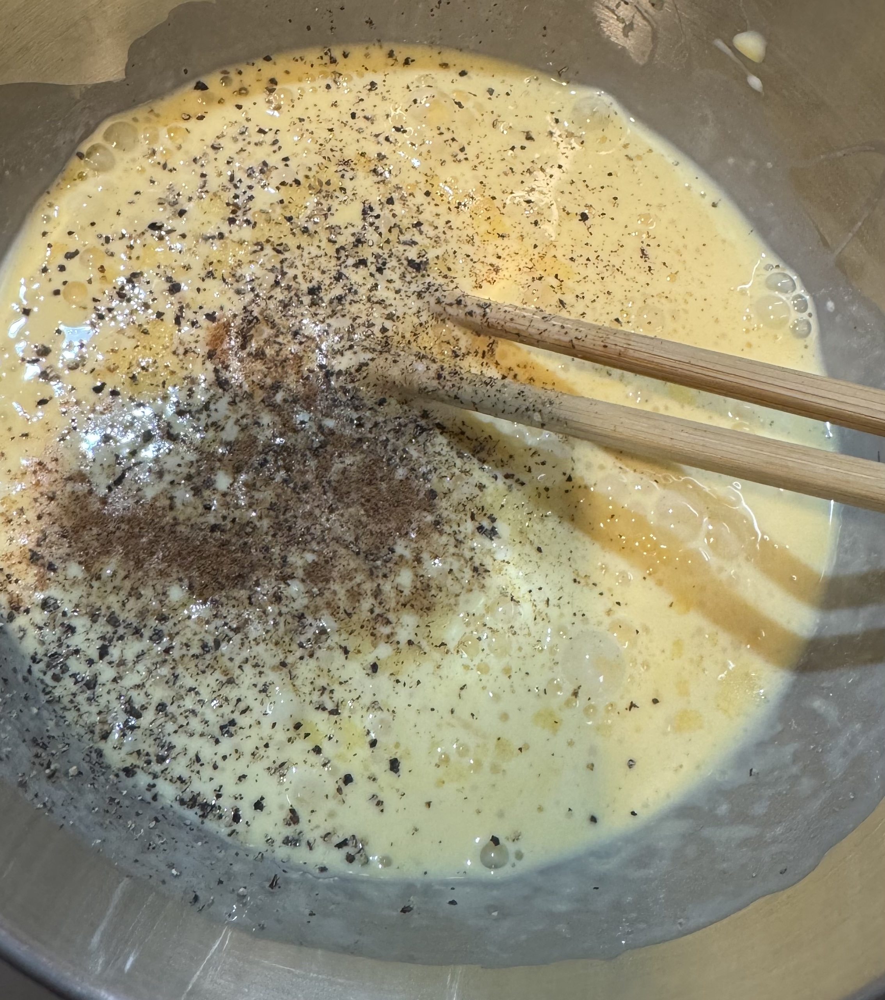
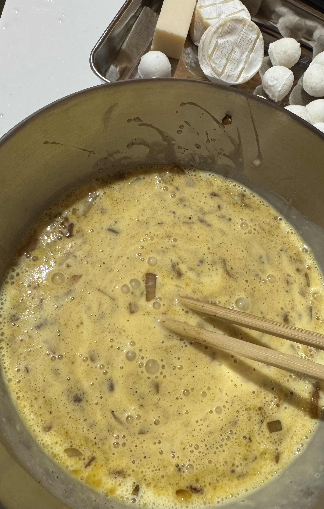
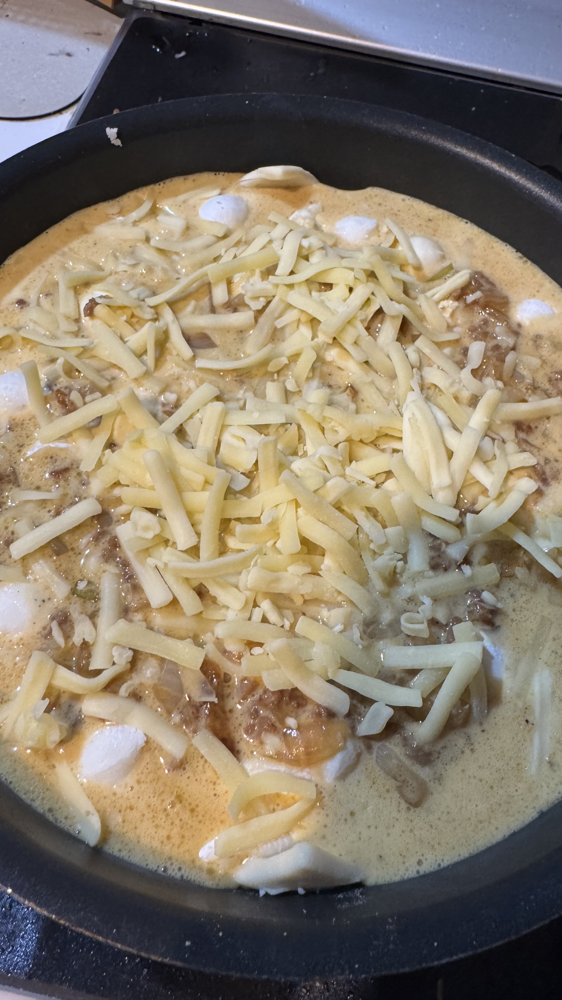
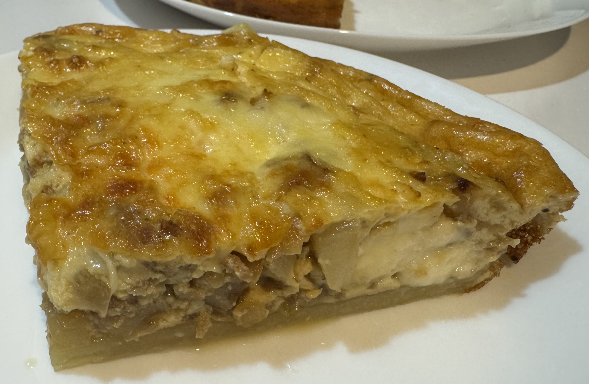

キッシュ、という料理をご存じでしょうか。
惣菜や冷凍食品としても売っていることがありますし、スターバックスでもベーコンとほうれん草のキッシュが定番商品として売っているため、知っている人も多いかもしれません。

とはいえ日本人にはあまりなじみがなく、家でキッシュを焼く、という人はあまり多くはないような気がしますが、作ってみると意外と簡単です。

個人的には、料理が面倒な時こそキッシュ、という感じなので、雑に作れるレシピをご紹介します。
作業時間だいたい5分くらい、作り始めてから焼き上がるまで大体40分くらいでできあがります。
焼いている間はつきっきりである必要も無いので、混ぜて、流し込んで、焼くだけの簡単レシピです。

材料はこちら:

* 冷凍パイシート 1~2枚 (容器に敷けるくらい)
* 卵 3個
* 生クリーム 100mL
* 具材
* 塩
* こしょう

塩、こしょう、卵はまぁ家にあるでしょうし、冷凍パイシートは保存がきくので、作る直前に特別買ってくる必要があるのは生クリームくらいでしょうか。

具材は適当な量を入れます。
ベーコンやほうれん草など、それっぽいものがあればそれで良い感じになりますし、生のほうれん草ではなく冷凍のほうれん草をつかってもいいですし、スーパーによっては冷凍のベーコン入りほうれん草ミックスを売っている場合もあり、そういったものをそのまま使っても良いでしょう。
わたしはキノコがダメなので入れませんが、キノコを入れてもよいでしょうし、ジャガイモやサーモン、ズッキーニ、ミニトマト、ベーコンの代わりにウインナーなどなど、案外雰囲気で適当なものを入れても美味しくなります。
汁気がなければ大体大丈夫です。多分。

チーズがあれば雑にたくさん入れるとなお美味しいです。
我が家は最近はモッツァレラチーズ、カマンベールチーズ、パルミジャーノレッジャーノ、ピザチーズ、あたりを常備しているのでこのあたりを適当に入れています。

今回は玉ねぎのみじん切りと挽肉を雑に炒めて、適当に味付けをして具材としました。

焼くときの型は、キッシュ型があればもちろんそれを使ってもいいのですが、油を塗ったり、型に合わせてパイシートを伸ばしたりする必要があり、多少手間がかかるかもしれません。
私のオススメは取っ手が取れるフライパンです。
私はティファールの22cmのフライパンを使っていますが、各社似たようなものを出しており、ニトリだと1,000円前後くらいで買えると思います。
テフロン加工でパイ生地がくっつきませんし、取り出す際にも取っ手をつけて取り出せるので、取り回しがしやすく便利です。

世間で売られている冷凍のパイ生地は11cm x 18cmくらいの長方形タイプと、18cm x 18cmくらいの正方形タイプの２種類がありますが、フライパンを使う場合はどちらでも大丈夫です。
長方形タイプの場合は2枚敷くとよさそうです。

冷凍パイシートは調理しはじめに冷凍庫から出しておきます。
割とすぐ溶けるので、事前に出して解凍しておく必要はありません。

また、この時点でオーブンを180度に予熱しておきます。

型に合わせて伸ばしても良いのですが、私は面倒なので、フライパンに押し込める程度に溶けたらグッと押し込んでソレでよし、としています。
サイズもなんか足りていない気もしますが、気にしません。

空焼きもした方がサクッと焼けて良い感じになるという噂もあるのですが、面倒なのでそれもしません。

何故か札幌では200mL以上の生クリームしか販売が見当たらなかったので計量をします。生クリームは多分100mL==100gでは無いと思うのですが、まぁ大差は無いだろう、ということではかりで量っています(洗い物が減るので)。
100mL売りの生クリームがあれば、割高ではありますがそちらが便利だとは思います。

卵を3つ入れます。
こちらもサイズによって違いはあるとは思うのですが、面倒なのでサイズを気にせず3個、としています。
特に困ったことはありません。

塩こしょうを適当に入れます。
あればナツメグも入れると良い香りがします。
塩こしょうは思っているよりも多く入れるとちょうど良いです。
特に冷めてからも食べる場合は、気持ち多めに入れておきましょう。

塩分が気になる人は、こしょうを多めにすると、なんとなく良い感じになります。

具材を入れて混ぜます。
私はあるものを適当に入れます。

ほうれん草なども、生なら生のまま、冷凍なら凍ったまま入れてしまいます。
火が入るのに時間がかかったりしているのかもしれませんが、なんとかなります。
ちゃんと火が通ってないとおなかを壊しそうなもの(挽肉とか)や、火を通さないと食感が邪魔になったりしそうなものは予め火を通しておきます。

ざっと混ぜ合わせたら、パイシートを敷いたフライパンに流し込みます。
テフロン加工フライパンなので、パイシートからはみ出ても大丈夫です。味には変わりありません。
見ての通り、パイ生地ものばしていないので、角がそのまま飛び出ています。

ピザチーズとかがあれば適当に乗せておくと良い感じです。

後は180度で20~30分くらい、卵液が固まるまで焼きます。
私は大体、雑にオーブンの最大時間にセットして、別途キッチンタイマーで20分くらいはかります。
上面が良い感じの焼き色になったら大体焼けているので、箸かなんかをさして、固まっているかどうか判別します。
固まっていなかったら適当に5分くらいずつ追加で焼く、という感じで、焼いている間は本を読むなどしています。

焼き上がったら皿に出して、包丁などで切って食べます。
面倒なら切らないで食べても良いですが、結構良い量になるので切るのをオススメします。
私はだいたい半分くらいを焼いた日にあたたかい状態で食べて、残りは冷蔵庫に入れておいて翌日の昼ご飯にします。

作ったら皆さんのキッシュの具材も教えてください。キノコ以外で。
