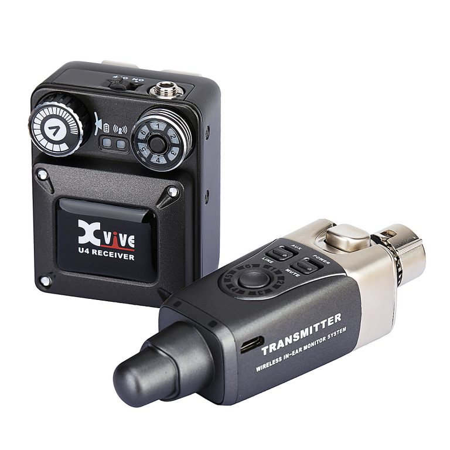

2025年11月22日に新宿SUNFACEで開催されたITエンジニアによるITエンジニアのためのライブイベントTech Rock Festival Day3に参加してきました。ハッシュタグは[#TechRockFestival](https://x.com/hashtag/TechRockFestival)でした。
そういえば、昨冬に配信ライブやったんですが、それのブログ書いてなかった・・・

イベント自体の開催経緯は[2023年のレポート](/tech-rock-festival-2023/)を参照のこと。

毎年出演希望者が増えており、今年はなんと3回の開催となりました。例年同様開催地は新宿である一方、現在私は札幌在住で、ギターやエフェクターを持って移動するのがなかなか大変なため、今回はギターではなくボーカルでの参加としました。

## 機材

今回は初めてのボーカル・・・ということで、あまりむやみやたらに機材投入ができなかったのですが、それでも唯一どうしても使ってみたかったのがワイヤレスインイヤーモニターです。
以前ボーカルに少しだけ挑戦したときはボーカル慣れしていないというのもあり、自分の声を見失ってしまって全然音が取れなかったため、イヤホンで確実に自分の声をモニターしたい！と思ったのでした。
プロが大規模な会場で使うような大型のものから、近年では小型・安価なものも複数販売されていますが、その中でも今回は[Xvive XV-U4](https://amzn.to/4oXasaR)を購入し、使用しました。

価格もそれなりに手頃(購入時点で34,100円)で、余分なケーブル等が必要無く、本番でも単に挿して音を流してもらえば良い、ということで選択しました。
モニタリングイヤホンはまぁ何でもいいかな、と思ったので、ある程度信頼できそうなメーカーのモニタリングイヤホンの中で価格が手頃だった[Sennheiser IE100 PRO](https://amzn.to/4oci0Fn)を選びました。

結果としては大満足で、PAさんには「ワイヤレスイヤモニを使いたい」ということを伝えていただけであとは当日合わせだったのですが、何の問題も無く使用することができました。
唯一の欠点はUSB micro-B充電である、という点ですね・・・

## バンドと演目

今回のバンドは、バトルプログラマーヨシセという名前で、アニソンやらボカロやらをやるバンド、ということで結成しました。
なんなのだこの名前は・・・
今回もキーボードあり編成で豪華でしたが、なんやかんやどのバンドにもキーボードがいる感じになっていてすごいな、と感じましたね・・・

面子:

* [nasa9084](https://x.com/nasa9084) (Vo)
* [takasp](https://x.com/takasp_2350) (Gt)
* [capytan](https://x.com/capytan_el34) (Ba)
* [Hano](https://x.com/featherplain) (Key)
* [うつぼ](https://x.com/japan_rook) (Dr)

曲目:

1. テレキャスタービーボーイ
2. アンノウンマザーグース
3. 月光花
4. 怪獣
5. ヒトリノ夜

## 次

打ち上げでも話をしたんですが、次はなんかこう、訳の分からん楽器で組んだ訳の分からんバンドをやりたいんですよね・・・
あと、打ち上げで、誰も知らないギターリフを弾いたらドボン、という闇のゲームに参加したんですが、全然指が動かなかったので、そろそろちゃんとギターも練習しないと何も弾けなくなるな、と思いました。
