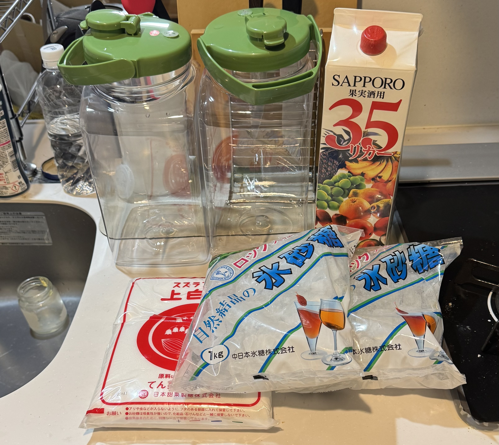
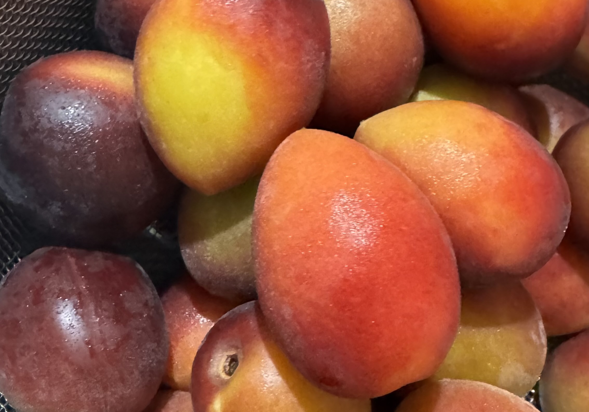
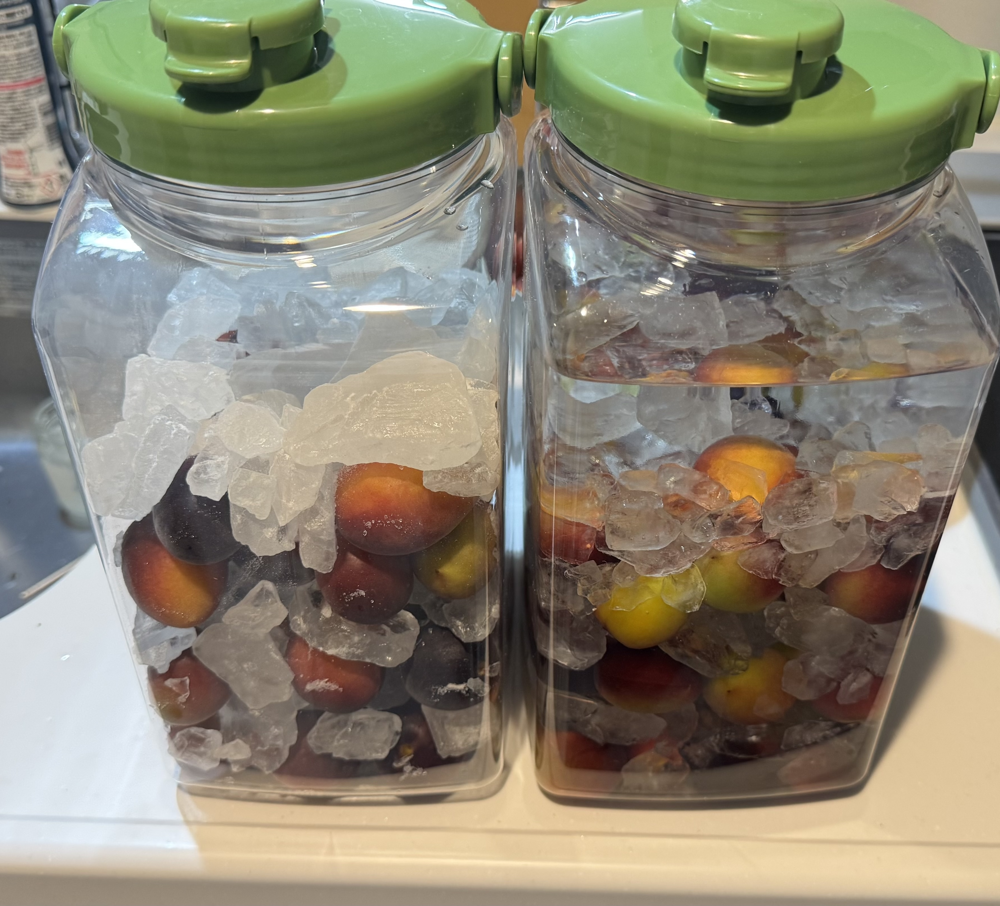
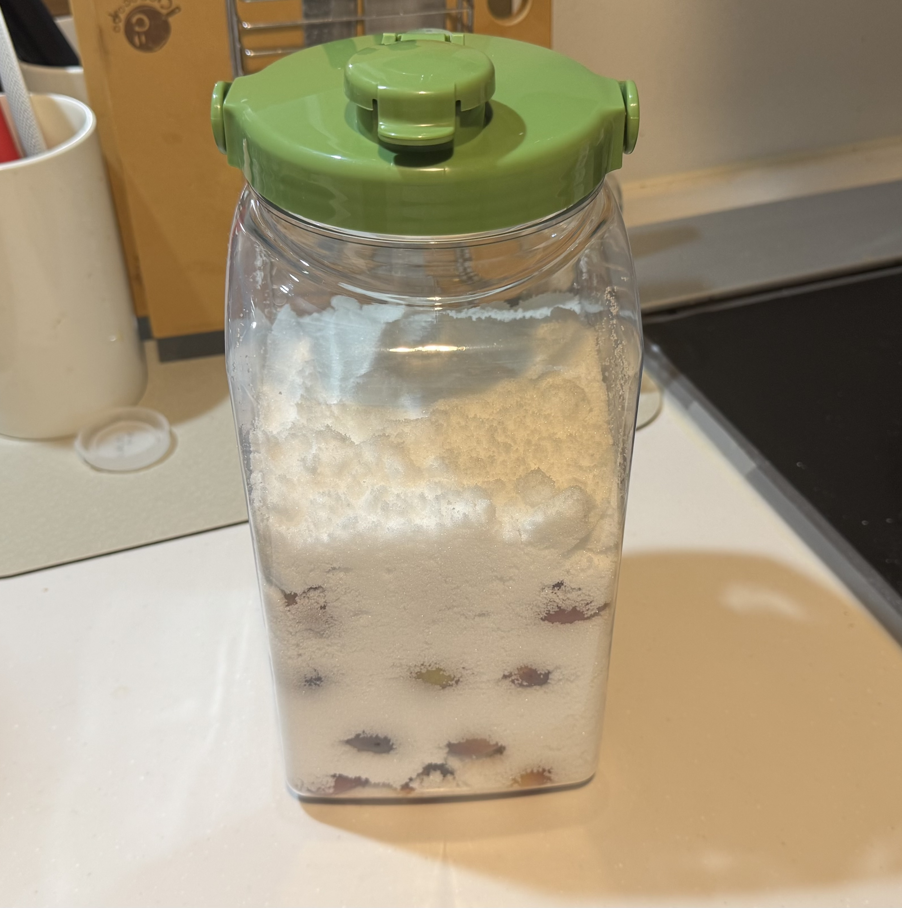
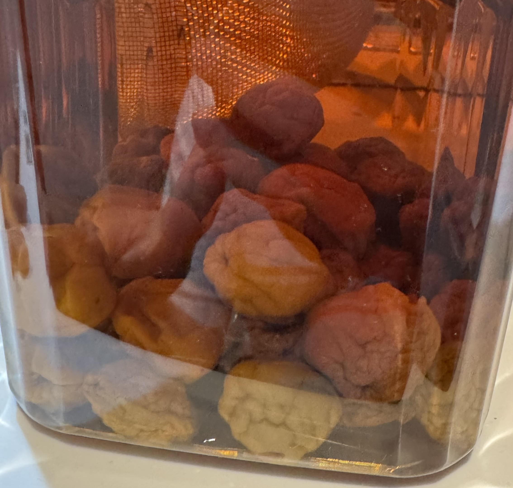
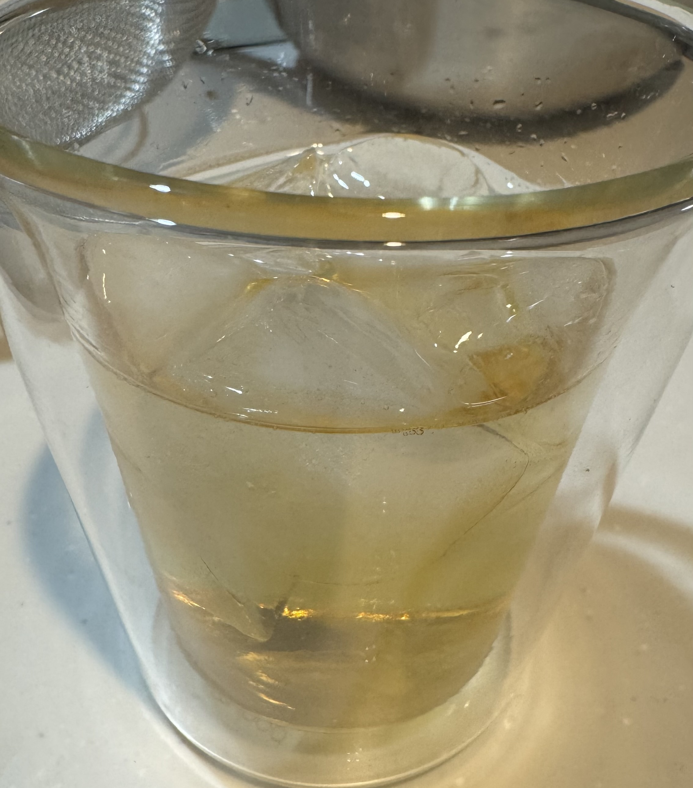

今年も梅の季節がやってきました。
なんかスーパーで全然梅を見ないんですけど、いまどきの札幌の民は梅仕事はしないんですかね？
今年はちょっと変わった梅の実を使いたいなぁ、ということで、[ふるさと納税で紫宝梅『ミスなでしこ(R)』](https://www.satofull.jp/products/detail.php?product_id=1606090)という、紫色の梅を手に入れました。
きれいなピンク色のシロップができるということで、楽しみですね。

1kgで寄付金額8,000円、4kgで寄付金額20,000円ということで、どうせ2kgは使いますから、4kgの方を選びました。
一応説明に寄れば大玉(M〜L)ということなんですが、結構小ぶり(M?)の実が多い様に感じました。
まぁ例年スーパーで買う青梅はLLのものを買うため、余計にそう見えた、ということもあるかも知れませんが。

スーパーで買うような物と比べて、かなり傷物が少なく、結局不安があってハネた実は1つという好成績でした。

今回使う梅以外の材料はこちら。梅の方に変化を入れたので、色がきれいにでそうな氷砂糖、上白糖、ホワイトリカーです。
梅酒を1瓶、梅シロップを2瓶作り、余った1kgは妹に分けてあげました。

瓶はPET正の果実酒瓶を選びました。[昨年使ったモノ](/ume-2024/)とは違うんですけど、同じく角形で収納に便利そうです。

実の形がまん丸ではなくて、すこしとがったような形をしています。

作り方は例年通り、洗って、拭いて、ヘタを取って、砂糖と積み重ねて、梅酒の方には酒を入れる、というだけ。
店頭にあった瓶の在庫の都合で2日に分けて作業しました:

例年、梅仕事をした後は以前に漬けた梅酒を味見しているので、今年も味見しておきます。

昨年の梅酒は何の影響か、すごくしぼんだ状態ですね。
1年くらいだと、多少しわが入っていることは多くて、その後また酒を吸って膨らんでくるんですが、ここまでしぼんでしまってもまた膨らんでくるんでしょうか？

ほんの少し水を足した、いわば水の梅酒割、くらいの割り方で割ってみました。
1年モノとは思えないくらい丸い感じで、コレはホワイトリカーが良かったのか、中ザラ糖が良かったのか、悩ましいところです。

そして1年越しに気づいたんですが、昨年のラベルが1年間違っていました。
上からマッキーで訂正しておきました。

また来年。
