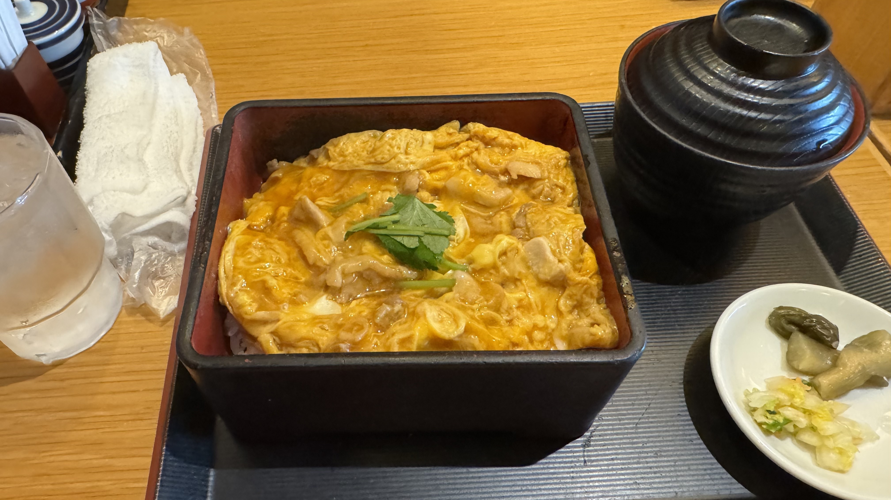
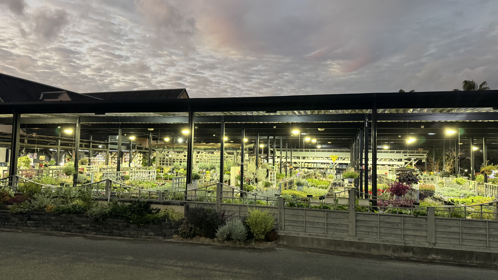
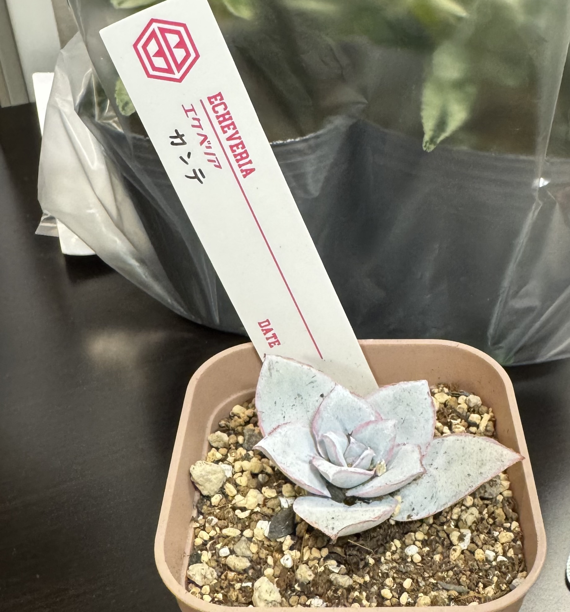
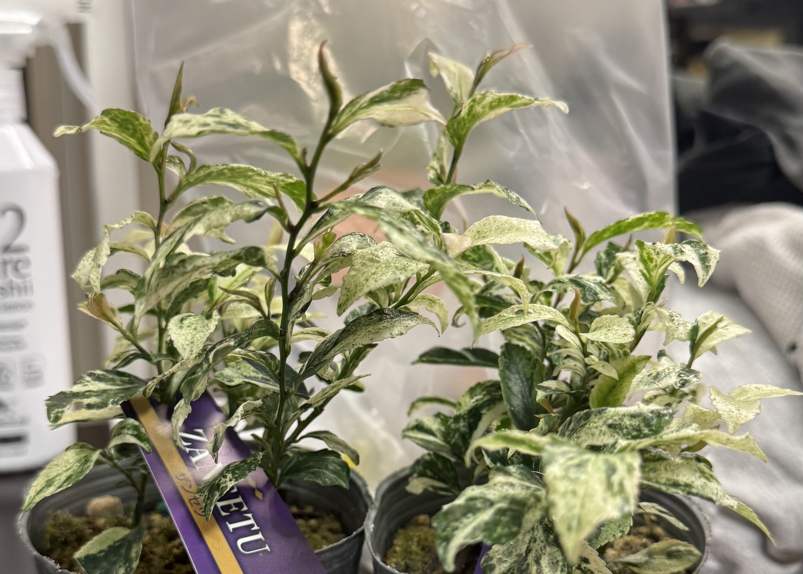
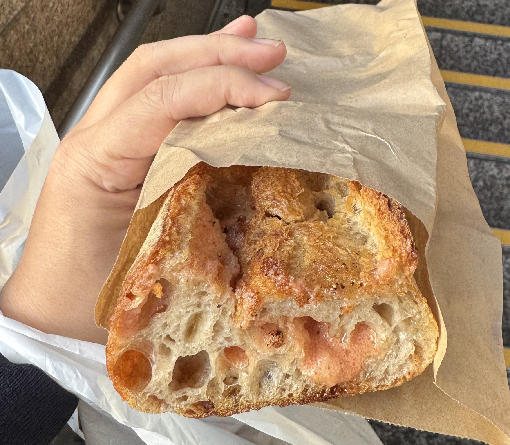
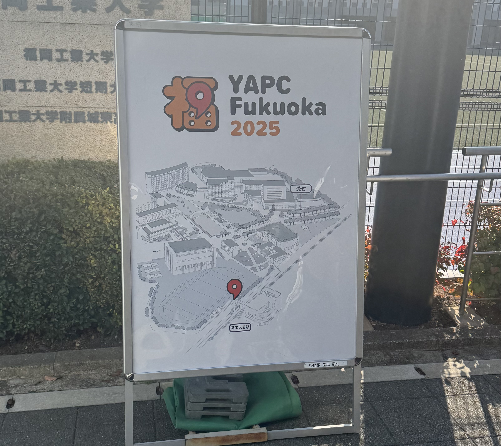
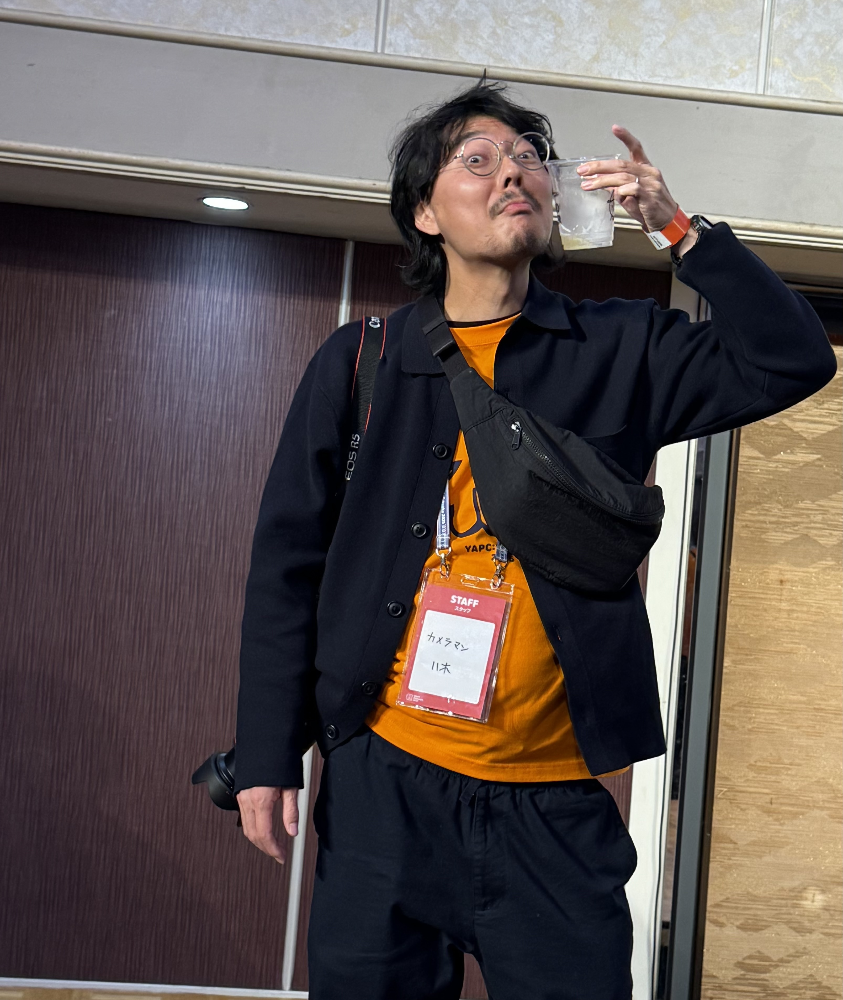
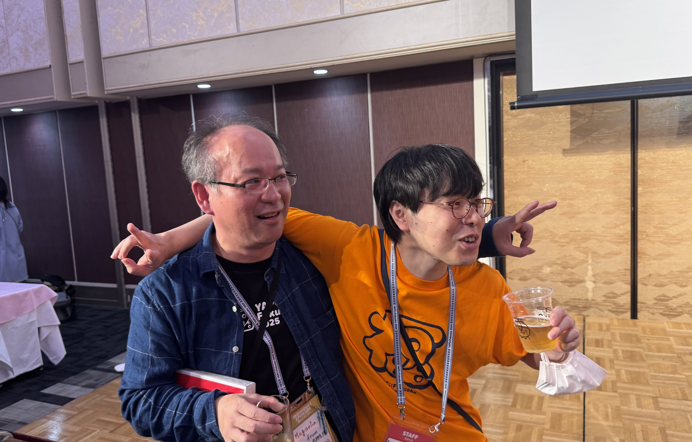

2025年11月14日〜15日に福岡工業大学で開催された、[YAPC::Fukuoka 2025](https://yapcjapan.org/2025fukuoka/)に参加してきました。
YAPCはPerlのイベントで、“Yet Another Perl Conference"の略です。Xハッシュタグは前回に引き続き[#yapcjapan](https://x.com/hashtag/yapcjapan) でした。

[前回の函館](/yapc-hakodate-2024/)から約1年ぶり、[福岡での開催は2017年以来2度目](/yapc_fukuoka_2017/)で、YAPC::Japanとしては初めての2日間開催となりました。

今回は2日間フルでの開催ということで、前日木曜日に博多入り、金曜、土曜とYAPCに参加して、日曜日に帰るというスケジュールで臨みました。

## 前日

普段の業務で実は福岡にいるメンバーとの関わりがあるのですが、現職に入社してこの方福岡に出張の用事が無かったため、福岡のメンバーと会う機会が無かったので、昼ご飯を一緒に食べました。

なんやかんや都合が合わなかったりして、全員と会うことはできなかったのですが、かれこれ数年オンラインでやりとりをしていた人と「初めまして〜」するのはなかなか感慨深いものがありますね。

その後、カーシェアを借りて、[FUKUOKA EFFECT](https://fukuoka-effect.jp/)に行きました。札幌はもう既に園芸店は冬期休業・時短営業に入っているため、普通に園芸店が営業していて、商品もしっかり並んでいる、というのはやはり暖地だな、というのを感じました。

アガベ、多肉、庭用の苗、プランター類が多い印象でした。札幌はプランター類が多い販売店は今のところ見つけられてないんですよね・・・

エケベリア カンテ、白丁花、ヒサカキ「残雪」を購入しました。白丁花もヒサカキも観葉植物・・・とはちょっと違うと思いますが、斑入りで観葉っぽいし、シェードガーデン用にも良い、ということなので室内でも育つでしょう。多分。

夜ご飯は[牧のうどん](https://www.makinoudon.jp/)で肉うどんを食べました。

## Day 1

扨、YAPC::Fukuoka 2025一日目ですが、朝からパンストック天神店に明太フランスを買いに行ったら遅刻しました・・・。パンストックが開店前から並ぶ店なのは知っていたんですが、平日なので多少マシかと踏んだんですが・・・結局1時間並びました。途中でYAPCのオープニングに間に合わないことは分かってたんですが、後に引くことはできませんでした。

パンストックのパン、何を買っても美味いので福岡に行く機会があれば是非。

その後パンをもぐもぐしつつ会場へ。最寄りの福工大前駅から、あちこちに現在地と受付までの地図を置いておいてくれたので、迷わずにたどり着くことができました。

一日目は以下のセッションを聴きました:

* [「正規表現をつくる」をつくる](https://fortee.jp/yapc-fukuoka-2025/proposal/8788e20c-bca5-4ff8-8c46-58673415f4f3)
* [なぜインフラコードのモジュール化は難しいのか - アプリケーションコードとの本質的な違いから考える](https://fortee.jp/yapc-fukuoka-2025/proposal/edd5ad15-3152-4f2c-9df1-6daad7944327)
* [「データ無い！腹立つ！推測する！」から「データ無い！腹立つ！データを作る」へ ― ゼロからデータを作り、チームで育てられるようにするまで](https://fortee.jp/yapc-fukuoka-2025/proposal/faef2cbb-9a07-4838-a67e-f8ce3615158e)
* [なぜThrottleではなくDebounceだったのか？ 700並列リクエストと戦うサーバーサイド実装のすべて](https://fortee.jp/yapc-fukuoka-2025/proposal/0b931b36-e916-4461-bbf1-886419280759)
* [Learning Scalable DNS Resolvers from Hyper-Scalers](https://fortee.jp/yapc-fukuoka-2025/proposal/67512650-017e-4fea-ac00-23833e4221fc)
* [SREのためのテレメトリー技術の探究 — モニタリングSaaS開発からAIOps・AIインフラまで](https://fortee.jp/yapc-fukuoka-2025/proposal/37827736-fba6-4e08-a9b4-a0abe131f65d)

近年はだらだらと廊下で知り合いと話していることが多くてあまりセッションを聴くということをやっていなかったのですが、今回は結構話を聴きました。

今回懇親会はDay 2の夜ということだったので、何人か捕まえて飲みに行きました。

## Day 2

二日目、もちろん遅刻しました。9時半は早いって。。。

二日目は以下のセッションを聴きました:

* ゲストゲストトーク
* [やり方は一つだけじゃない、正解だけを目指さず寄り道やその先まで自分流に楽しむ趣味プログラミングの探求](https://fortee.jp/yapc-fukuoka-2025/proposal/5b6d3e99-45db-4c87-a369-f1b78a30e327)

二日を通して、すぎゃーんさんの趣味プログラミングの話が良かったですね。近年は何かとコードを書かないことがうれしいと言われがちですが、個人的には共感できなくて、コードを書くのが一番楽しくてこの仕事をしているのに、コードを書くところを持って行かれたら一番良いところがなくなっているだろう、と思っていたのですが、すぎゃーんさんの発表では「コードを書くのって楽しいよね！」を主張してくれて、なんだか救われたような気持ちになりました。

二日目は懇親会があり、いろいろなひとと話せました。良かった良かった。ビールを飲むカメラマンや、次回のYAPCのco-organizerやろうよ、等と声をかけたりかけられたりする[@karupanerura](https://x.com/karupanerura] sanと[@magnoria_k](https://x.com/magnolia_k_) sanを眺めたりもしました:

来年のYAPCはビッグサイトだということなので、良い感じのプロポーザルを準備しておく必要がありますね。
