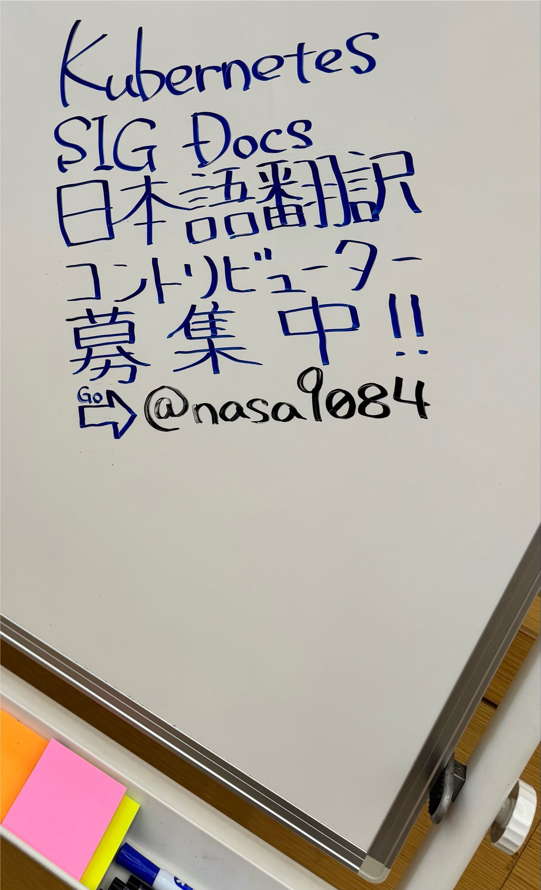

2026年7月29日/30日に開催された[KubeCon + CloudNativeCon Japan 2026](https://events.linuxfoundation.org/kubecon-cloudnativecon-japan/)に参加してきました。また、その前日28日にCo-located Eventとして[Japan Community Day](https://events.linuxfoundation.org/kubecon-cloudnativecon-japan/co-located-events/japan-community-day/)の一部としてDoc Sprintというイベントを実施しました。

KubeConは[Kubernetes](https://kubernetes.io)のイベントで、Cloud Native Computing Foundation (CNCF)が主催しています。国内外から参加者が集まる非常に大きなイベントで、今年は神奈川県は横浜市にあるパシフィコ横浜で開催されました。

## Doc Sprint

本祭の前日にCo-located eventとしてJapan Community Dayという、ローカルミートアップやCloud Native Community Japan (CNCJ)が主に主催となる小イベントが開催されました。Japan Community Day午前の部はCNCJ SIG Kubernetes Upstream Training及びKubernetes SIG Docs Localization Subprojectの日本語Approver共催という形で、Kubernetes Upstream TrainingとDoc Sprintを開催しました。

Kubernetes Upstream TrainingはKubernetesにコントリビュートをしたいひと向けのハンズオンセミナーで、実際にKubernetesへコントリビュートする時と同じようにbot等を使ってコントリビュート体験をしてもらう、というイベントです。Doc Sprintはそこに相乗り(?)する形で、実際にKubernetesのドキュメント(の、特に日本語翻訳)にコントリビュートしてみよう！というイベントで、私や、[@junya__okabe](https://x.com/junya__okabe)が日本語localizationチームapproverとして初めてのコントリビュートをサポートするという企画でした。
Trainingで座学+お試しをした上で、実際にドキュメントへのコントリビュートをして、approverがいるのでPull Requestのマージまで進むことができる、という企画でした。

今年は時間が短かったため、実際にその場でPull Requestを作ってマージまでいく、というのは難しかったのですが、[当日用に用意したgood-first-issue](https://github.com/kubernetes/website/issues/56641)には多くの人が挑戦してくれている様です。

## KubeCon本祭

本祭は概ね廊下でボーッとコーヒーを飲んだり、知り合いと話したり、あるいはブースを冷やかしたりしていました。今年のハイライトとしては、やはりKubernetesドキュメント翻訳関連のセッションが2件もあったことですね。

一本は近年日本語翻訳チームを引っ張ってくれている[@junya__okabe](https://x.com/junya__okabe)と、[昨年のKubeCon + CloudNativeCon Japan](/kubecon-japan-2026)以来コントリビュートしてくれている[@_a0i](https://x.com/_a0i)の共同登壇で、Kubernetes website日本語化の歴史と近況、@_a0iさんがどのようにしてコントリビューションを始め、そしてどういった結果が得られたのか、という内容でした。ドキュメントの翻訳を通してKubernetesの学びを得ることができ、最終的に[Kubestronaut](https://training.linuxfoundation.org/ja/resources/kubestronaut-program/)になる事ができた、ということで、単にコントリビューターになる、ということ以上のメリットがあることを示してくれた非常に嬉しい内容でした。
後から他の人の話を聞いたところによると、同様に翻訳を通してKubestronautを取ったという話を聞き、なんか、翻訳チーム続けてきて良かったな、と思いました。エモ。



もう一本は韓国語の翻訳チームのメンバーによる登壇で、どうやって翻訳やドキュメントへのコントリビュートを始めたら良いかというチュートリアルセッションでした。こちらでも日本語翻訳チームのことを紹介していただきました。また、言語の違う翻訳チーム間ではほとんどコミュニケーションがないため、挨拶できてすごく嬉しかったですね。



他のカンファレンスでもそうですが、やはり基本的にはソフトウェア本体にフォーカスがあたっており、ドキュメント、まして翻訳にフォーカスしたセッションがあることはほとんどないと思います。その中で2件もドキュメント翻訳にフォーカスしたセッションが採択されたという状況は非常に嬉しいことですね。私は新卒2年目の2018年、Kubernetes websiteの翻訳チーム立ち上げから関わってきているため、感慨深くなってしまい、2日間ずっとエモい気持ちになってしまいました。

なんやかんや当時一緒にチームを立ち上げた人はもう残っていないので、生き字引的な感じででかい顔をしていこうと思います。

また、今年もJob boardに宣伝を書いておきました

みなさんコントリビュートお待ちしています。
